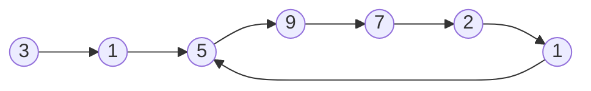
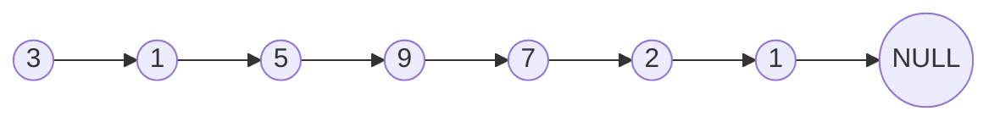

---
{"dg-publish":true,"permalink":"/coding/cracking-the-coding-interview/chapter-2-problems/problem-8-loop-detection/"}
---

# Chapter 2 - Problem 8 - Loop Detection
## Problem
Given a circular linked list, implement an algorithm that returns the node at the beginning of the loop.

**EXAMPLE**
_Input:_ 

_Output:_ 5

_Input:_ 

_Output:_ False

#### Solution in C++
Floyd’s cycle finding algorithm or Hare-Tortoise algorithm is a pointer algorithm that uses only two pointers, moving through the sequence at different speeds. This algorithm is used to find a loop in a linked list.

**How does it works?**
1. Create two pointers, FastPointer and SlowPointer.
2. Move FastPointer at a rate of 2 steps and SlowPointer at a rate of 1 step.
3. When they collide, move SlowPointer to LinkedListHead. Keep FastPointer where it is.
4. Move SlowPointer and FastPointer at a rate of one step. Return the new collision point.

```cpp
template<typename T>
class Node {
    public:
        T data;
        Node* next;
        
        Node() = default;
        Node(const T& value) : data(value), next(NULL) {}
};

template<typename T>
class LinkedList {
    protected:
        Node<T>* head;
};

template<typename T>
class Solution : public LinkedList<T> {  
    public:
        Node<T>* loopDetection() {
            if(!head || !head->next) return NULL;
            Node<T> *slowRunner = head;
            Node<T> *fastRunner = head;

            /* Find meeting point. This will be LOOP_SIZE - k steps into the linked list */
            do {
                slowRunner = slowRunner->next;
                fastRunner = fastRunner->next->next;
            } while(fastRunner && fastRunner->next && slowRunner != fastRunner);

            /* If fastPointer or his next are NULL then the list has no loop */
            if (!fastRunner || !fastRunner->next) return NULL;

            /* Move slowPointer to head. Keep fastPointer at meeting point. Each are k steps from the
             * Loop Start. If they move at the same pace, they must meet at Loop Start. */
            slowRunner = head;
            while (slowRunner != fastRunner)
            {
                slowRunner = slowRunner->next;
                fastRunner = fastRunner->next;
            }
            /* Both now point to the start of the loop */
            return slowRunner;
        }
};
```
- **Time complexity:** $O(N)$ (where _N_ is the size of the list)
- **Space complexity:** $O(1)$