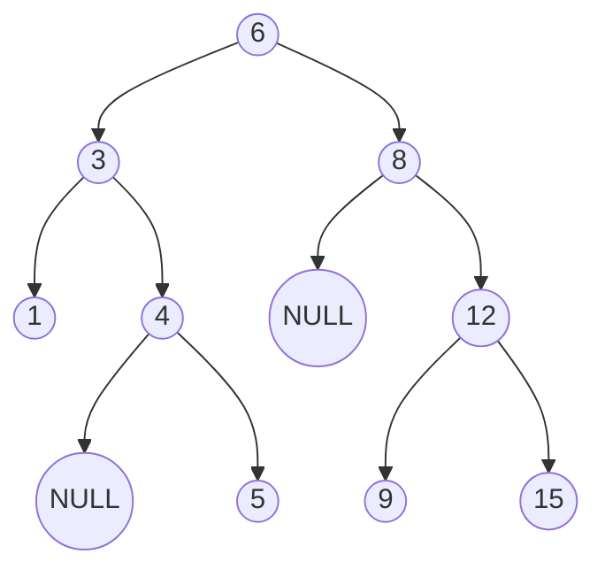

---
{"dg-publish":true,"permalink":"/coding/cracking-the-coding-interview/chapter-4/problem-5-validate-bst/"}
---

# Chapter 4 - Problem 5 - Validate BST
## Problem
Implement a function to check if a binary tree is a binary search tree.
#### Solution in C++ with array
Our first thought might be to do an in-order traversal, copy the elements to an array, and then check to see if the array is sorted. This solution takes up a bit of extra memory, but it works - mostly.
The only problem is that this algorithm cannot handle duplicate values in the tree properly, since we can't check if `n != n.right`.
However, if we assume that the tree cannot have duplicate values, then this approach works.

```cpp
template<typename T>
class Node {
        public:
            T key;
            Node* left;
            Node* right;
            
            Node() = default;
            Node(const T& value) : key(value), left(NULL), right(NULL) {}
};

template<typename T>    
class BinaryTree {
    protected:
        Node<T>* root;
    public:
        BinaryTree() : root(NULL) {}
};

template<typename T>    
class Solution : public BinaryTree<T> {
    private:
        void copyBST(Node<T>*& root, vector<T>& array) {
            if(root == NULL)
                return;
                
            copyBST(root->left, array);
            array.push_back(root->key);
            copyBST(root->right, array);
        }
    public:
        bool checkBST() {
            vector<T> array;
            copyBST(this->root, array);
            for (int i = 1; i < array.size(); i++) {
                if(array.at(i) < array.at(i - 1))   
                    return false;
            }
            return true;
        }
};
```
- **Time complexity:** $O(N)$ (where _N_ is the size of the binary tree)
- **Space complexity:** $O(H)$ (where _H_ is the height of the binary tree)

#### Solution in C++ using predecessor node
When we examine this solution, we find that the array is not actually necessary. We never use it other than to compare an element to the previous element. So why not just track the previous node and compare it as we go?

```cpp
template<typename T>
class Node {
        public:
            T key;
            Node* left;
            Node* right;
            
            Node() = default;
            Node(const T& value) : key(value), left(NULL), right(NULL) {}
};

template<typename T>    
class BinaryTree {
    protected:
        Node<T>* root;
    public:
        BinaryTree() : root(NULL) {}
};

template<typename T>    
class Solution : public BinaryTree<T> {
    private:
        bool checkBST(Node<T>*& root, Node<T>*& predecessor) {
            if(root == NULL)
                return true;

            // Check/recurse left
            if (!checkBST(root->left, predecessor)) return false;

            // If predecessor >= current then this it's not a binary tree
            if (predecessor != NULL && predecessor->key >= root->key) return false;
            
            predecessor = root;
            
            // Check/recurse right
            if (!checkBST(root->right, predecessor)) return false;
            
            return true; // All good!
        }
    public:
        bool checkBST() {
            Node<T>* predecessor = NULL;
            return checkBST(this->root, predecessor);
        }
};
```
- **Time complexity:** $O(N)$ (where _N_ is the size of the binary tree)
- **Space complexity:** $O(H)$ (where _H_ is the height of the binary tree)

#### Solution in C++ using min and max node
This approach is somewhat similar to the previous solution, but here we want to use the definiton of a binary tree (`left. data <= current. data < right. data`).

In short, we can pass down the min and max values. As we iterate through the tree, we verify against progressively narrower ranges.

**EXAMPLE**

We start with a range of (min = NULL, max = NULL), which the root obviously meets. (NULL indicates that there is no min or max.) We then branch left, checking that these nodes are within the range (min = NULL, max = 6). Then, we branch right, checking that the nodes are within the range (min = 6, max = NULL).
We proceed through the tree with this approach. When we branch left, the max gets updated. When we branch right, the min gets updated. If anything fails these checks, we stop and return false.

```cpp
template<typename T>
class Node {
        public:
            T key;
            Node* left;
            Node* right;
            
            Node() = default;
            Node(const T& value) : key(value), left(NULL), right(NULL) {}
};

template<typename T>    
class BinaryTree {
    protected:
        Node<T>* root;
    public:
        BinaryTree() : root(NULL) {}
};

template<typename T>    
class Solution : public BinaryTree<T> {
    private:
        bool checkBST(Node<T>*& root, Node<T>*& min, Node<T>*& max) {
            if(root == NULL)
                return true;

            if(min && root->key <= min->key) return false;
            
            if(max && root->key > max->key) return false;

            // Check/recurse left
            if (!checkBST(root->left, min, root)) return false;
            
            // Check/recurse right
            if (!checkBST(root->right, root, max)) return false;
            
            return true; // All good!
        }
    public:
        bool checkBST() {
            Node<T>* min = NULL;
            Node<T>* max = NULL;
            return checkBST(this->root, min, max);
        }
};
```
- **Time complexity:** $O(N)$ (where _N_ is the size of the binary tree)
- **Space complexity:** $O(H)$ (where _H_ is the height of the binary tree)