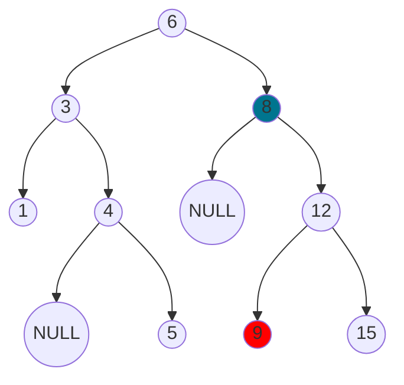
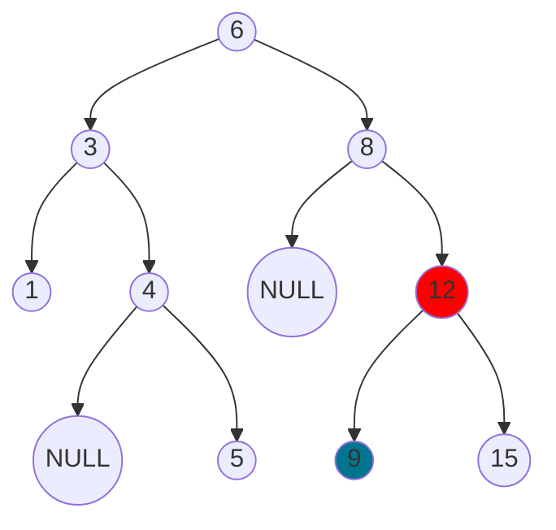
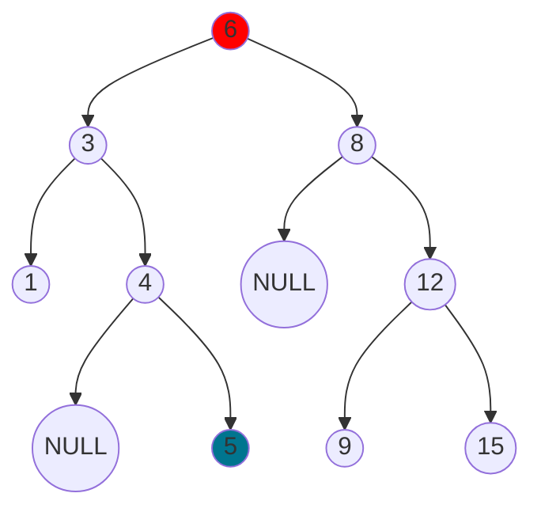
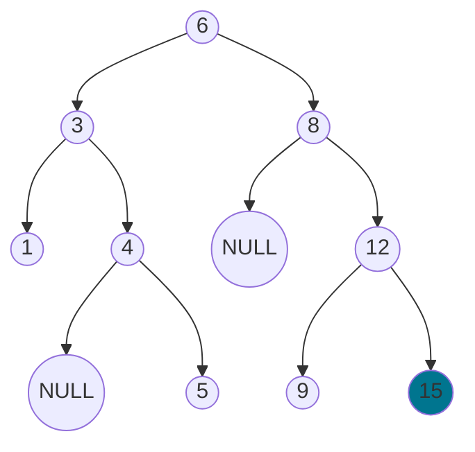

---
{"dg-publish":true,"permalink":"/coding/cracking-the-coding-interview/chapter-4/problem-6-successor/"}
---

# Chapter 4 - Problem 6 - Successor
## Problem
Write an algorithm to find the "next" node (i.e., in-order successor) of a given node in a binary search tree. You may assume that each node has a link to its parent.
#### Solution in C++
This problem is well explained in [[University notes (in Italian)/Algoritmi e Strutture Dati/3.3 Alberi Binari di Ricerca#Successore di un nodo\|3.3 Alberi Binari di Ricerca#Successore di un nodo]], in italian. Here's the translation.

There are essentially 4 cases that can happen when we want to find the successor of a node in a binary search tree.
In all the following examples, the blue node is the given node, the red one the successor.
#### Case 1

This is the easiest case, that is when the given node has a right child. We simply return the leftmost node on the right subtree.

#### Case 2

From this case onward, we want to find the successor of a leaf node. In this case, the given node is the left child of his parent (12). Then the successor will be 12. (since `left <= current < right`).

#### Case 3

In this case, the given node is the right child of his parent (4). The idea is to continue to traverse upwards from
the given node until we find a node that we have not fully traversed, that is, until we find a node that it's the left child of his parent (thus falling back to case 2). The successor will be the parent of that node.

#### Case 4

Same case of the previous example, but here the given node is the maximum of the tree, so there is
no in-order successor. We will continue to traverse the tree upwards until we find NULL, and we will return it.

```cpp
template<typename T>
class Node {
        public:
            T key;
            Node* left;
            Node* right;
            Node* parent;
            
            Node() = default;
            Node(const T& value) : key(value), left(NULL), right(NULL), parent(NULL) {}
};

template<typename T>    
class BinaryTree {
    protected:
        Node<T>* root;
    public:
        BinaryTree() : root(NULL) {}
};

template<typename T>    
class Solution : public BinaryTree<T> {
    private:
        Node<T>* leftMostChild(Node<T>*& node) {
            while(node->left != NULL)
                node = node->left;
            return node;
        }
    public:
        Node<T>* inorderSucc(Node<T>*& node) {
            if(node == NULL)
                return node;
            
            Node<T>* current = node;
            // Found right children-> return leftmost node of right subtree
            if(current->right != NULL)
                return leftMostChild(current->right);
            else {
                Node<T>* p = current->parent;
                // Go up until we're on left instead of right
                while(p != NULL && p->left != current) {
                    current = p;
                    p = p->parent;
                }
                return p;
            }
        }
};
```
- **Time complexity:** $O(N)$ (where _N_ is the size of the binary tree)
- **Space complexity:** $O(1)$