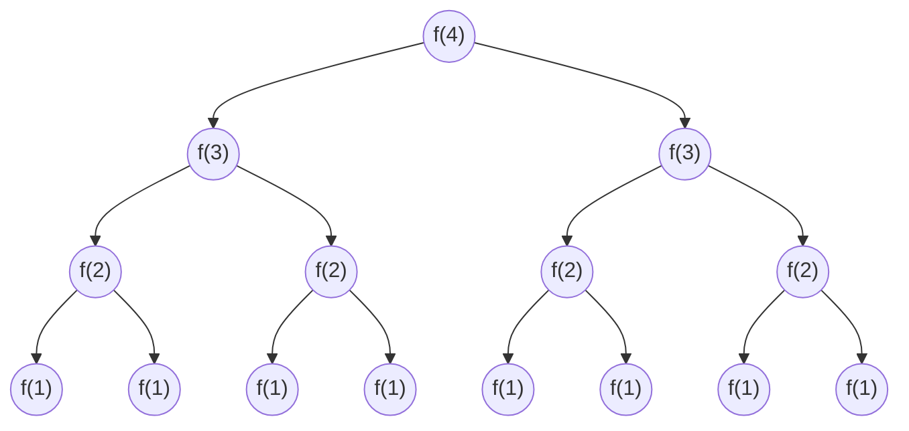

---
{"dg-publish":true,"permalink":"/coding/cracking-the-coding-interview/concepts/1-1-big-o/"}
---

# Big O

> Big O time is the language and metric we use to describe the efficiency of algorithms.

## ⏱️ Time complexity
$O(n)$ $\rightarrow$ The time to do the task increases linearly with $n$.
$O(1)$ $\rightarrow$ The time to do the task is always the same.

## 💡 Best case, Worst Case and Expected Case
**Example:** The Quick Sort

- **Best case:** If all elements are equal, it will just traverse the array once $\rightarrow$ $O(n)$
- **Worst Case:** If the array is sorted in reverse order $\rightarrow$ $O(n^2)$
- **Expected Case:** On average, we can expect a runtime of $O(n\log n)$

## 💾 Space Complexity
As well as time complexity, we might also care about the amount of memory or space required by an algorithm.
#### Example 1
The following code would take $O(n)$ time and $O(n)$ space.
```c
int sum(int n) { /* Ex 1.*/
 if (n <= 0) {
  return 0;
 }
 return n + sum(n-1);
}
```
Each call adds a level to the stack.
```c
   sum(4)
	-> sum(3)
		-> sum(2)
			-> sum(1)
				-> sum(0)
```
Each of these calls is added to the call stack and takes up actual memory.

#### Example 2
However, just because you have $n$ calls total, doesn't mean it takes $O(n)$ space.
```c
int pairSumSequence(int n) { /* Ex 2.*/
 int sum= 0;
 for (int i= 0; i < n; i++) {
  sum+= pairSum(i, i + 1);
 }
 return sum;
}

int pairSum(int a, int b) {
 return a + b;
}
```
There will be roughly $O(n)$ calls to pairSum. However, those calls do not exist simultaneously on the call stack, so you only need $O(1)$ space.

## ❌ Drop the costants
Big O just describes the rate of increase, so we drop the costants in runtime.
Like $O(2n) \ \rightarrow O(n)$.
We just need to accept that some $O(n)$ algorithm might be much faster than other, because we don't know how the compiler optimizes operations.

#### Example
- $O(N^2+N) \ \rightarrow O(N^2)$
- $O(N+\log N) \ \rightarrow O(N)$
- $O(5 \cdot 2^N + 1000N^{100}) \ \rightarrow O(2^N)$
- $O(B^2 + A) \ \rightarrow$ can't be reduced (without some knowledge about A and B)

## Add vs. Multiply
When do you multiply the runtimes and when do you
add them?

_Add the Runtimes: $O(A + B)$_
```c
for (int a : arrA) {
	print(a);
}
for (int b: arrB) {
	print(b);
}
```

_Multiply the Runtimes: $O(A \cdot B)$_
```c
for (int a : arrA) {
	for (int b : arrB)
		print(a + "," + b);
}
```

The difference is that on the left we do A chunks of work then B chunks of work, while on the right, we do B chunks of work for each element in A.

## Recursive Runtimes
What's the runtime of this code?

```c
int f(int n) {
	if (n <= 1) 
		return 1;
	return f(n - 1) + f(n - 1);
}
```
Suppose we call $f(4)$, this is the result:



The tree has depth $N$. Each node has two children, so the runtime complexity is $O(2^N)$.

> [!info] Remember
> When you have a recursive function that makes multiple calls, the runtime will often (but not always) look like $O(branches^{depth})$ where branches is the number of times each recursive call branches.

The space complexity of this algorithm will be $O(N)$. Although we have $O(2^N)$ nodes in the tree total, only
$O(N)$ exist at any given time. Therefore, we would only need to have $O(N)$ memory available.

## Another example
What is the runtime of the below code?
```c
void printUnorderedPairs(int[] array) {
	for (int i= 0; i < array.length; i++) {
		for (int j = i + 1; j < array.length; j++) {
			System.out.println(array[i] + "," + array[j]);
	}
}
```

The first time through $j$ runs for $N-1$ steps. The second time, it's $N-2$ steps. Then $N-3$ steps. And so on.
So the number of total steps is
$$(N-1) \ + \ (N-2) \ + \ (N-3) \ + \ ... \ + 2 + 1$$
$$= \text{sum of 1 through } (N-1)$$

The sum of 1 through $(N-1)$ is $\frac {N(N-1)}{2}$, so the runtime will be $O(N^2)$.