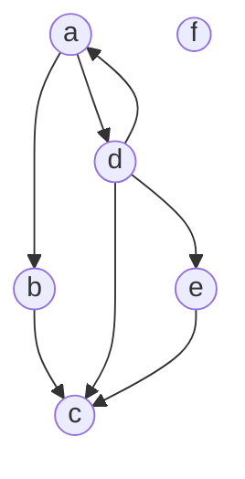
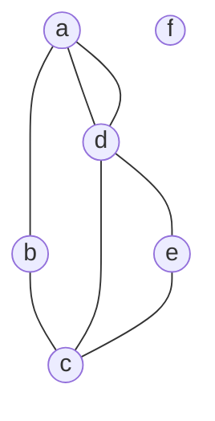
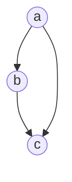

---
{"dg-publish":true,"permalink":"/coding/data-structures/graphs-in-italian/"}
---


<div class="transclusion internal-embed is-loaded"><a class="markdown-embed-link" href="/university-notes-in-italian/algoritmi-e-strutture-dati/4-grafi/" aria-label="Open link"><svg xmlns="http://www.w3.org/2000/svg" width="24" height="24" viewBox="0 0 24 24" fill="none" stroke="currentColor" stroke-width="2" stroke-linecap="round" stroke-linejoin="round" class="svg-icon lucide-link"><path d="M10 13a5 5 0 0 0 7.54.54l3-3a5 5 0 0 0-7.07-7.07l-1.72 1.71"></path><path d="M14 11a5 5 0 0 0-7.54-.54l-3 3a5 5 0 0 0 7.07 7.07l1.71-1.71"></path></svg></a><div class="markdown-embed">


# Grafi
## Indice
- [[Coding/Data Structures/Graphs (in italian)#➡️ Grafo orientato (directed)\|➡️ Grafo orientato (directed)]]
- [[Coding/Data Structures/Graphs (in italian)#↔️ Grafo non orientato (undirected)\|↔️ Grafo non orientato (undirected)]]
- [[Coding/Data Structures/Graphs (in italian)#⚙️ Proprietà dei grafi\|⚙️ Proprietà dei grafi]]
- [[Coding/Data Structures/Graphs (in italian)#⌨️ Implementazione\|⌨️ Implementazione]]
	- [[Coding/Data Structures/Graphs (in italian)#Matrici di adiacenza\|Matrici di adiacenza]]
	- [[Coding/Data Structures/Graphs (in italian)#Liste di adiacenza\|Liste di adiacenza]]
- [[Coding/Data Structures/Graphs (in italian)#🔎 Visita di un grafo\|🔎 Visita di un grafo]]
	- [[Coding/Data Structures/Graphs (in italian)#Visita in ampiezza Breadth First Search (BFS)\|Visita in ampiezza Breadth First Search (BFS)]]
		- [[Coding/Data Structures/Graphs (in italian)#🔢 Numero di Erdos\|🔢 Numero di Erdos]]
	- [[Coding/Data Structures/Graphs (in italian)#Visita in profondità Depth-First Search (DFS)\|Visita in profondità Depth-First Search (DFS)]]
- [[Coding/Data Structures/Graphs (in italian)#📝 Definizioni\|📝 Definizioni]]
	- [[Coding/Data Structures/Graphs (in italian)#🔄 Cicli\|🔄 Cicli]]
	- [[Coding/Data Structures/Graphs (in italian)#📶 Ordinamento topologico\|📶 Ordinamento topologico]]
	- [[Coding/Data Structures/Graphs (in italian)#🔗 Componenti connesse e fortemente connesse\|🔗 Componenti connesse e fortemente connesse]]
## ➡️ Grafo orientato (directed)
È una coppia $G = (V, E)$ dove: 
- $V$ è un insieme di nodi (node) o vertici (vertex) 
- $E$ è un insieme di coppie ordinate di nodi $(u, v)$ dette archi o lati (edge)

### Esempio
_Input:_

$V = \{ a,b,c,d,e,f \}$
$E = \{ (a,b), (a,d), (b,c), (d,a), (d,c), (d,e), (e,c) \}$

_Output:_

## ↔️ Grafo non orientato (undirected)
È una coppia $G = (V, E)$ dove: 
- $V$ è un insieme di nodi (node) o vertici (vertex) 
- $E$ è un insieme di coppie non ordinate di nodi $(u, v)$ dette archi o lati (edge)

### Esempio
_Input:_

$V = \{ a,b,c,d,e,f \}$
$E = \{ (a,b), (a,d), (b,c), (d,a), (d,c), (d,e), (e,c) \}$

_Output:_


## ⚙️ Proprietà dei grafi
- $n = |V|$: numero di nodi 
- $m = |E|$: numero di archi 

Alcune relazioni fra $n$ e $m$:
- in un grafo non orientato, $m \leq \frac {n(n−1)} {2} = O(n^2)$ 
- in un grafo orientato, $m ≤ n^2 − n = O(n^2)$
- in un grafo orientato aciclico, il numero massimo di archi che possono essere contenuti senza creare un ciclo è $\sum_{0}^{n-1} \ i = \frac{n(n-1)}{2}$

Complessità di algoritmi su grafi:
- La complessità è espressa in termini sia di $n$ che di $m$ (ad es. $O(n + m)$)

## ⌨️ Implementazione
### Matrici di adiacenza
Utilizziamo una matrice per implementare il grafo, ogni cella ha la seguente regola:
$
m_{uv} =
\begin{cases}
1 &(u,v) \in E \\ \\
0 &(u,v) \notin E 
\end{cases}
$
#### Grafi orientati
Utilizziamo l'intera matrice, lo spazio utilizzato sarà $n^2$ bit.

#### Grafi non orientati
Utilizziamo metà matrice, lo spazio utilizzato sarà comunque $n^2$ bit, ma quello realmente utilizzato è di $\frac {n(n-1)} {2}$ bit.

#### Grafi pesati
- Gli archi possono avere un peso (costo, profitto, etc.) 
- Se non esiste arco fra due vertici, il peso assume un valore che dipende dal problema - e.g. $w(u, v) = 0$ oppure $+\infty$
- Al posto di $1$ nella matrice si mette il valore del peso

### Liste di adiacenza
Utilizziamo un vettore di liste per implementare il grafo, ogni cella del vettore corrisponde ad un nodo del grafo, che a sua volta contiene la lista di nodi adiacenti. Quindi $v[u] = G.adj(u) = \{ v \ | \ (u,v) \in E\}$.

#### Grafi orientati
Dobbiamo inserire gli archi tra i nodi una solta volta, lo spazio utilizzato sarà di $an + bm$ bit.

#### Grafi non orientati
Dobbiamo inserire gli archi tra i nodi due volte, lo spazio utilizzato sarà di $an + 2 \cdot bm$ bit.

#### Grafi pesati
- Gli archi possono avere un peso (costo, profitto, etc.) 
- Se non esiste arco fra due vertici, il peso assume un valore che dipende dal problema - e.g. $w(u, v) = 0$ oppure $+\infty$
- Nella lista di nodi adiacenti avremo anche un campo _peso_ in ogni nodo.

**Per riassumere**

| Matrici di adiacenza                                  | Liste di adiacenza                                        |
| ----------------------------------------------------- | --------------------------------------------------------- |
| Spazio richiesto: $O(n^2)$                            | Spazio richiesto: $O(n+m)$                                |
| Verificare se u è adiacente a v richiede tempo $O(1)$ | Verificare se $u$ è adiacente a $v$ richiede tempo $O(n)$ |
| Iterare su tutti gli archi richiede tempo $O(n^2)$    | Iterare su tutti gli archi richiede tempo $O(n + m)$      |
| Ideale per grafi densi                                | Ideale per grafi sparsi                                   |

## 🔎 Visita di un grafo
Dato un grafo $G = (V, E)$ e un vertice $r ∈ V$ (radice, sorgente), visitare una e una volta sola tutti i nodi del grafo che possono essere raggiunti da $r$.

| Visita in profondità Depth-First Search (DFS)                                                                     | Visita in ampiezza Breadth First Search (BFS)                                           |     |
| ----------------------------------------------------------------------------------------------------------------- | --------------------------------------------------------------------------------------- | --- |
| Per esplorare un intero grafo, non solo i nodi raggiungibili da una singola sorgente                              | Per esplorare tutti i nodi raggiungibili da una singola sorgente                        |     |
| Per ogni nodo adiacente, si visita ricorsivamente tale nodo, visitando ricorsivamente i suoi nodi adiacenti, etc. | Prima si visita la radice, poi i nodi a distanza 1 dalla radice, poi a distanza 2, etc. |     |
| Utilizzato per l'ordinamento topologico, componente connesse, componenti fortemente connesse                      | Utilizzato per calcolare i cammini più brevi da una singola sorgente                    |     |

### Visita in ampiezza Breadth First Search (BFS)
Obiettivi:
- Visitare i nodi a distanze crescenti dalla sorgente 
- Calcolare il cammino più breve da $r$ a tutti gli altri nodi

#### Implementazione
Utilizziamo una coda per inserire i nodi che scopriamo ad ogni iterazione. Visto che è una coda, quando inseriamo i figli di un nodo, finiscono in fondo alla coda. In questo modo vengono analizzati prima tutti i nodi a distanza $k$ dal nodo di partenza. 
```cpp
void BFS(vector<vector<int>>& graph, int root) {
    queue<int> queue;
    vector<bool> visited(graph.size(), false);
    visited.at(root) = true;
    queue.push(root);
    while(!queue.empty()) {
        int v = queue.front();
	    queue.pop();
	    cout << v << " "; 
        for(int adj : graph.at(v)) {
            if(!visited.at(adj)) {
                visited.at(adj) = true;
                queue.push(adj);
            }
        }
    }
}
```
- Time complexity: $O(m + n)$ (_n_ è il numero di nodi, _m_ il numero di archi[^1])
- Space complexity: $O(n)$ 
#### 🔢 Numero di Erdos
> Il numero di Erdős è un modo per descrivere la "distanza" tra una persona e il matematico ungherese Paul Erdős in termini di collaborazione in pubblicazioni matematiche. È stato creato dagli amici di Erdős come tributo scherzoso all'enorme numero di pubblicazioni da lui scritte in collaborazione con un gran numero di matematici diversi.

Nel nostro caso calcoliamo la distanze tra un nodo e tutti gli altri nodi e li memorizziamo in un array. Il principio è lo stesso del DFS.

```cpp
vector<int> distance(vector<vector<int>>& graph, int node) {
    vector<int> distance(graph.size(), -1);
    queue<int> queue;
    distance.at(node) = 0;
    queue.push(node);
    while(!queue.empty()) {
        int v = queue.front();
        queue.pop();
        for(int adj : graph.at(v)) {
            if(distance.at(adj) == -1) {
                distance.at(adj) = distance.at(v) + 1;
                queue.push(adj);
            }
        }
    }
    return distance;
}
```
- Time complexity: $O(m + n)$ (_n_ è il numero di nodi, _m_ il numero di archi)
- Space complexity: $O(n)$ 

#### Cammino tra 2 nodi
Modifichiamo leggermente la funzione precedente e aggiungiamo un vettore per memorizzare il padre di ogni nodo. In questo modo possiamo ottenere direttamente il cammino tra 2 nodi "risalendo" tutti i padri.
```cpp
vector<int> distance(vector<vector<int>>& graph, int node, vector<int>& parent) {
    vector<int> distance(graph.size(), -1);
    queue<int> queue;
    distance.at(node) = 0;
    parent.at(node) = node;
    queue.push(node);
    while(!queue.empty()) {
        int v = queue.front();
        queue.pop();
        for(int adj : graph.at(v)) {
            if(distance.at(adj) == -1) {
                distance.at(adj) = distance.at(v) + 1;
                parent.at(adj) = v;
                queue.push(adj);
            }
        }
    }
    return distance;
}

void printPathHelper(int from, int to, vector<int>& parent) {
    if(from == to) {
        cout << from << " "; 
        return;
    }
    else if(parent.at(to) == -1) {
        cout << "The node " << to << " is unreachable" << endl; 
        return;
    }
    else {
        printPathHelper(from, parent.at(to), parent);
        cout << to << " ";
    }
}

void printPath(vector<vector<int>>& graph, int from, int to) {
    vector<int> parent(graph.size(), -1);
    distance(graph, from, parent);
    printPathHelper(from, to, parent);
}
```
- Time complexity: $O(m + n)$ (_n_ è il numero di nodi, _m_ il numero di archi)
- Space complexity: $O(n)$ 

### Visita in profondità Depth-First Search (DFS)
Come detto in precedenza, è utilizzata per esplorare un intero grafo, non solo i nodi raggiungibili da una singola sorgente.

#### Implementazione ricorsiva
```cpp
void DFS(vector<vector<int>>& graph) {
    vector<bool> visited(graph.size(), false);
    for(int i = 0; i < graph.size(); i++) {
        if(!visited.at(i))
            DFSHelper(graph, i, visited);
    }
    cout << endl;
}

void DFSHelper(vector<vector<int>>& graph, int root, vector<bool>& visited) {
    visited.at(root) = true;
    cout << root << " ";
    for(int adj : graph.at(root)) {
        if(!visited.at(adj))
            DFSHelper(graph, adj, visited);
    }
}
```
- Time complexity: $O(m + n)$ (_n_ è il numero di nodi, _m_ il numero di archi)
- Space complexity: $O(n)$ 

Tuttavia, eseguire una DFS basata su chiamate ricorsive può essere rischioso in grafi molto grandi e connessi. È possibile che la profondità raggiunta sia troppo grande per la dimensione dello stack del linguaggio. In tali casi, si preferisce utilizzare una BFS oppure una DFS basata su stack esplicito.

#### Implementazione iterativa
Il concetto è simile al BFS ma ora inseriamo i nodi in uno stack. Inoltre controlliamo se un nodo è già stato visitato all’estrazione di esso, non all’inserimento, altrimenti torneremmo su nodi già visitati.
```cpp
void DFS(vector<vector<int>>& graph) {
    vector<bool> visited(graph.size(), false);
    stack<int> stack;

    for(int i = 0; i < graph.size(); i++) {
        stack.push(i);
        while(!stack.empty()) {
            int node = stack.top();
            stack.pop();
            if(!visited.at(node)) {
                cout << node << " ";
                visited.at(node) = true;
                for(int adj : graph.at(node)) {  
                    stack.push(adj);
                }
            }
        }
    }
    cout << endl;
}
```
- Time complexity: $O(m + n)$ (_n_ è il numero di nodi, _m_ il numero di archi)
- Space complexity: $O(n)$ 

## 📝 Definizioni
- **Sottografo:** $G'$ è un sottografo di $G$ $(G' ⊆ G) ⇔ V' ⊆ V$ e $E' ⊆ E$
- **Massimale:** $G'$ è massimale $⇔ \nexists$ un altro sottografo $G''$ di $G$ tale che $G''$ è connesso e più grande di $G'$ (i.e. $G' ⊆ G'' ⊆ G$)

&nbsp;
- Un grafo $G = (V, E)$
	- **non orientato** è **connesso** ⇔ ogni suo nodo è raggiungibile da ogni altro suo nodo
	- **orientato** è **fortemente connesso** ⇔ ogni suo nodo è raggiungibile da ogni altro suo nodo

&nbsp;
- Un grafo $G' = (V', E')$
	- è una **componente connessa** di $G$ (**non orientato**) ⇔ $G'$ è un sottografo connesso e massimale di $G$
	- è una **componente fortemente connessa** di $G$ (**orientato**) ⇔ $G'$ è un sottografo connesso e massimale di $G$

&nbsp;
- **Ciclo:** In un grafo orientato $G = (V, E)$, un ciclo $C$ è una sequenza di nodi $u_0, u_1, ... , u_k$ tale che $(u_i , u_{i+1}) ∈ E$ per $0 ≤ i ≤ k − 1$ e $u_0 = u_k$
	- in un grafo **non orientato** un ciclo ha lunghezza $k  >  2$
	- in un grafo **orientato** un ciclo ha lunghezza $k  \geq  2$

&nbsp;
- **Classificazione degli archi** in un grafo:

| Tipo di arco            | Definizione                                                                 | Implementazione                    |
| ----------------------- | --------------------------------------------------------------------------- | ---------------------------------- |
| Arco dell'albero        | Ogni volta che si esamina un arco da un nodo marcato ad un nodo non marcato | $dt[v] == 0$                       |
| Arco in avanti          | Se, dato un arco $(u, v)$, $u$ è un antenato di $v$                         | $dt[u] < dt[v]$ and $ft[v] \neq 0$ |
| Arco all'indietro       | Se, dato un arco $(u, v)$, $u$ è un discendente di $v$                      | $dt[u] > dt[v]$ and $ft[v] == 0$   |
| Arco di attraversamento | Un arco dell'albero tra 2 nodi già marcati                                  | Tutti gli altri casi               |

&nbsp;

- **Ordinamento topologico** di un grafo:
	-  Dato un **grafo orientato aciclico** (senza cicli) $G$, un ordinamento topologico di $G$ è un ordinamento lineare dei suoi nodi tale che se $(u, v) ∈ E$, allora $u$ appare prima di $v$ nell’ordinamento. 
		**Nota**: 
		- Esistono più ordinamenti topologici
		- Se il grafo contiene un ciclo, non esiste un ordinamento topologico.

_Esempio:_

![TopologicalSort.png|700](data:image/png;base64,iVBORw0KGgoAAAANSUhEUgAAAkQAAAErCAYAAAA/qpxIAAAAAXNSR0IArs4c6QAAAARnQU1BAACxjwv8YQUAAAAJcEhZcwAADsMAAA7DAcdvqGQAAIsPSURBVHhe7Z0FQFTbFoZ/u7u7O1Hs7u7uRrC7uwNbEcXu7u7EAkRssbu7g3nzbw9er0+9TDAMzPruO2+YdY4wZ+bM2f9ee0UonR4IgiAIgiDYMKG1R0EQBEEQBJtFBJEgCIIgCDaPCCJBEARBEGweEUSCIAiCINg8IogEQRAEQbB5RBAJgiAIgmDziCASBEEQBMHmEUEkCIIgCILNI4JIEARBEASbRwSRIAiCIAg2jwgiQRAEQRBsHhFEgiAIgiDYPCKIBEEQBEGweUQQCYIgCIJg84ggEgRBEATB5hFBJAiCIAiCzSOCSBAEQRAEm0cEkSAIgiAINo8IIkEQBEEQbB4RRIIgCCGcZ8+eoV27dogdOzZChQqlHvn8+vXr2hHGw9/HLag4cuSI+vvly5fXLIJgHCKIBEEQQjAUQxQLM2fOVM/LlSunBBGf29vbm0UUCUJIQASRIAhCCGbgwIHw8PBQQsjX1xc7duzA1atX4eTkhBcvXqBfv37akYJg29icIBo3btwPF+/vNu63NsQlLAiCsaxYsUI9uri4IE6cOOpnMnz4cPW4cuVK5UUivMfwXsN7zs/8ave/J3Hzx/+5//bzvfTnf8+lOv9j8uTJgzNnzmhHfcd/36/8ave/lxcpUkQ937lz549j/Ldfz0MQ/obNCaLkyZOrmRK3NGnSKBsf/W3cLwiCEBKg2KAXiPe41KlTa9bvUBzxnkcuXryoHgNKtGjRftwz/fF/7r/97l46ffp0JdC4n6+JnqsSJUoYtWznfy/nsh+JFSvWv/4+N75OQQgwOhtm7NixOr4FfLRmDh8+rF6n/guuWQRBEP6b/7p39OvXT+13dXVVz3kcn/Pf/cyf7IR2bn/D/9/rRZDu6dOnmlWnq1evnrI7OTlplj//vj/Z5f4omAuJIfoL/i7ZWbNmoX///j8yNOjm3bZtm3bUd34+lj/7H5s2bdofLmt/aOf2K7/axSUsCEJgEiNGDPX46tUr9RjY9OzZ81/LdqNGjVKPu3btUo+CEJSIIAoA69evV1/cvHnz/nDzVqpU6bdu3v3796N3797qWLpyr127hgYNGvyfgAoI4hIWBCEw8RdC/sIosMmSJYv203f8l/F4nxSEoEYEUQA4efIkvL29f2Rn1KtXT9nXrFmjHn+GAYr+x546dQqurq7K3qlTJ/VoCPXr11e/Z9KkSeo5RRaf/7zlyJFD7RMEQfgV/wmTf9D0r3h6eqrHX4WKINgiIogCAIXJz8IjV65c2k//D8XSz8e2bdtWeZU4A5J6H4IgWBLei+hZplf71/sPRRIneyRTpkzq0RjoqSYBub+dP39e++k7/v+Gr9FYChcurB45WRUEUxBBFABSpkyp/fTf/E4sMY6I3L9/Xz0KgiBYCk7oCOsN/ewpYn0iZqBR0PjH9ZQsWVI9MhvMH2aqMX7xT8SMGVM9/s5j/ivjx4//12twdnZWj/6vkfgLLMZj+vPzz7+DgoqTTompFExBBJEgCEIIhvWGKBi4nJ8uXTpVE4iTNFaqpn3s2LHakf+IER7L5BEey7R4FnEkXbt2/T9x0rRpU/XI2En+Xv4bbj+LHH8YD/nrayD0pPtTo0YN9ejo6KiO4+tgHKd/LCVtvwof/9fHBBT/182NiSmCEFBEEJkZLy8v7ad/8HflGhsALS5hQRCMhd4fVqj2Fw309jx//lwt73Mp7eclfv68devWH8kjvOcsWbLkh5ecNoqTn6lYsaL6NxRT9NLw9//Jo0TxRKHE/TyWIufw4cP/F2ZAkUaxxuP4+vnc34tFm7u7u/rZn5EjR6pj+Pv4Gv1fg6WCxYUQgpZ+b5Ow/hDfAj7+jj/t/53d38bN29tbs+p0y5cvVzbW3/BHf+NQNv/aH4Q/+//736G/Oah9v6sDIgiCYM343/Pk/iVYMzbnIWJNIH936uzZs5WNj/62X2sGGQpnXTlz5lS/i65bptwT1t/wR1zCgiAIgmBd2Jwgun379g93qn/ti5/dvNxvCgyqHjt2rMreoOuWrmem3v+8Ri4uYUEQBEGwLkLRTaT9LJgAPTUMKqRo6dWrl2YVBEEQ6M3mBI7xQv4xkYJgbUhQtSAIghCosIgs594ihgRrRgSRIAiCIAg2jwgiQRAEQRBsHokhEgRBEATB5hEPkSAIgiAINo8IIkEQBEEQbB4RRIIgCIIg2DwiiARBEARBsHlEEAmCIAiCYPOIIBIEQRAEweYRQSQIgiAIgs0jgkgQBEEQBJtHBJEgCIIgCDaPCCJBEARBEGweEUSCIAiCINg8IogEQRAEQbB5RBAJgiAIgmDziCASBEEQBMHmEUEkCIIgCILNI4JIEARBEASbRwSRIAiCIAg2jwgiQRAEQRBsHhFEgiAIgiDYPCKIBEEQBEGweUQQCYIgCIJg84ggEgRBEATB5hFBJAiCIAiCzSOCSBAEQRAEm0cEkSAIgiAINo8IIkEQBEEQbB4RRIIgCIIg2DwiiARBEARBsHlEEAmCIAiCYPOIIBIEQRAEweYRQSQIgiAIgs0TSqdH+1kQBEEIBvC2/eHDB7x69Uo9jxs3LsKFC6d+FgTBOEQQCYIgWBm8Ld+7dw+enp5q8/Lywv3795UA8t++fv2qHf2dWLFiIV68eGqLHz8+kiVLhvz586NgwYJInjw5QoUKpR0pCMLvEEEkCIIQxPA2fPbsWaxbtw4nTpxQIujJkydKxGTIkAG5c+dGypQpESNGjB9b9OjR1SPhsY8fP/7X47Vr15SQ+vLlCxInToxChQopcVSkSBHkypVLBJIg/IIIIkEQhCDi/PnzWLVqFVauXInLly8rT06xYsWUAKJoyZkzJ6JFi6YdbThcVqO4cnd3/7FRLKVPnx7NmjVDkyZNlCdJEAQRRIIgCBblwYMHmDNnjhJBFERJkyZF3bp11ZY3b95A9dzwdu/t7Y1FixZhyZIlePbsGUqVKoXmzZujRo0aiBw5snakINgeIogEQRAswPXr1zF+/HjMnz8fMWPGRL169dTGOJ/QoS2f8MultO3bt2PBggXYsmULIkWKhC5duqBbt24/luIEwZYQQSQIghCInDt3DmPGjMGKFStUHFDv3r3RtGlTRIgQQTsi6Hn69Cnc3NyUYKOHiq+xQ4cO4jESbAoRRIIgCIHA6dOnMWTIEGzatAnZsmVD3759UadOHYQNG1Y7wvp4+fIlJk6ciEmTJiFq1Kjo378/2rRpY1XiTRACCynMKAiCYEaYEt+xY0fY29vj0aNH2Lx5M86cOYMGDRpYtRgiXMobNmyYWt5r2LAhevToobLctm7dqh0hCCEXEUSCIAhmgM72ZcuWKQHBgGnGCh07dgyVK1cOdinurGU0YcIElbrPNH2eQ4sWLZQHSRBCKiKIBEEQTOTSpUsoXbo0GjdurLK1mELPOKHgXusnSZIkWLx4sVr227FjB7JmzaoCsQUhJCKCSBAEwUiYqTVw4EBkz55deU+OHz+OmTNnqqrRIYkqVaqoEgHFixdHxYoV0bJlyx9tQwQhpCBB1YIgCEZw69Yt1K9fHz4+Phg7diycnJwQJkwYbW/IZePGjWjbtq3qncalQVa/FoSQgHiIBEEQDISiwM7ODm/fvoWHh4dKUbcFMUSqVaumvEWspF2iRAnMmzdP2yMIwRsRRIIgCAHk8+fP6Nq1K6pXr45atWqpvmOZMmXS9toOceLEwfr169GrVy+0atVKvSe/NpsVhOCGLJkJgiAEgBs3bqjK0hcvXsSsWbNUWroA1YuNrT8KFy6sltBCWvyUYDuIILIAbLDIOAMWavPw8MTjR0+0PUCEiBGQI0c25X7mljBhQm2PIAjWAjOsGC/EStMUAGyOKvwD721cSmMBR2ak2aLXTAj+iCAKJPi2njp1CjNdXLF27RokT5YGmdLbIVM6O8SPlxih9P+R9x/f4cpVH1zyPY2zFzyRUX8jadfOUVW0ZW8hQRCCFjZidXR0RKNGjZRnKGLEiNoe4WdYhJLLiJz8URQxI00QghMiiAIBd3d3tG/XAc+fv0Sdqg6oVaUF4sSOr+39M1yDP3B0K1ZucMW5ix6qSmzPnj2svrqtIIREeGscPHgwhg8frh65Bfe6QoHNp0+f1PIZg865lSlTRtsjCNaPCCIz8u7dO/Tt2w8rV6xC3y6TUb5UbaO7WN+6cxXDxrfDu4/PsXDRAtULSRAEy8DgafbwWrp0KWbPnq3q7ggB49u3b+r9YjzRunXrVN0iQQgOhBnC7oOCyfj6+qJQwcKIGCYOXMZvQvYseUyaTcaMERtVyzfWT1PDom37JogRPTrs89hrewVBCCxYcJBZZLt371ZeDi5fCwGHk0DGE92+fVs1tOVkLmPGjNpeQbBexENkBs6dO4cypcuifcshqFujjWY1H7fvXkOrTmXRroMjevfupVkFQTA39+7dUx6NJ0+eYNu2bciZM6e2RzAUPz8/dOrUCa6urqrHW926dbU9gmCdiIfIRNj8sGSJUujRfjxqVmmuWc1LjOixUbZ4LfQb3AFhw4ZGvnz5tD2CIJgLVp4uWrSoKrB44MAB1aRVMB56yCtUqIDXr1+jZ8+eSJMmjWpxIgjWiniITIB9jPLmyYdKpZqhaf1OmjXwuHPvBuq3KYCtWzcjb968mlUQBFPh8g6zoqJHj469e/eqwoOCeeAQM2DAAIwePRrLly9XtZwEwRqRStUmMGbMWESNHBdN6nXULIFLsiSp0K/LZDRr2hwfP37UrIIgmMLdu3dVC4po0aJhz549IobMDD1FI0aMQLdu3dCkSRMVm+UPg9ffvHmjPROEoEUEkZEwbmjypMkY3tfNoqm4FcvUQ/IkGTB0yFDNIgiCsTBmiJ6hyJEjKzEUN25cbY9gTniPHDdunCpuWaNGDdX/jXFaJUuWxNatW7WjBCFokSUzI6lTuy7SJM2Hlo26aRbL8fjpA1Sslwk3blyX2awgGMn9+/eVGAofPjz27duH+PH/u1aYYBoMM2AG2rFjxxAlShQlSJ2cnODi4qIdIQhBh3iIjIAVWXft3oU61VppFkN4j0cX92DP/k047vsQnzWrIcSPmwgli1TBggULNIsgCIbw4MEDtUzGoqeMGRIxZBnChQunmsGyZhvFEDl8+LB6FISgRjxERjBq5Ch4n7qGEf3naJaA4ffyAGb0b4xZp+7ji7JERJJCgzBuSC/YxzBMm3r5uGPAqOa44nvZ6OKPghDceP/+vWoNwbpf/rcuLsekTp0aOXLkQNSoUZXtb3CphtlkZP/+/cGmfyBfN3uGPXz4ULNAebeyZMmieocFh4r2EydOVBlnTMn3h5/f06dPETt2bM3yb/g5X79+HWfOnMHbt281KxAjRgzY2dkhWbJkFg1bsCSMsTp//rxqKMxOBv4kTZpUnXtIbqTLemDe3t4q+9MfZoCyplXWrFlV3zxzI4LICLJly4G+nabDPmdhzRIA/J5gx9DicPlSG03K5kecD6exfdFYbL72DvHKLsW6YfUQzwBdw4+tYr2MWL12hWoKKwghlQsXLsDVdRZ27dqtvzneQLo0mZEqeQb9zfG7APDz+4abt6/gytXz+oEimYpLcXRq+9saQhxQuf/58+fKM5EoUSJtj/VB0cAAZDe3uTjm7o63794iS0Y7JIiX9IcA+Pjpvf68z+L+gzvInDkratasjlatWyFBggRqvzXB81mxYgWmTp2KEydOaNbvbNiwQS2l+cPPibWLli5Zrh8UvfRCNzoypc+J6NH+EQAvXz3F+Uun8fnLJ9jnzoOmzRqrIprBvdccMx7dZrth06Yt+gnvJaRIlgZpU2dB+HDfBQDv/fce3MCFy2cQJ3YcFClSBA5t26jH4CwMeV7Hjx/H7FluOHjwIB49eohMGXIgaZLUCB3q++D45etnXLtxATdu+SJN6nSoVKkC2jq2VRMicyCCyECY3RUzZkyc2vNCr1AD/sXzezofo5cmQvuO5RFTEz5+z9ejT9M62Pi6HIZv2Iy6sQ3z9PQZ1gwVqxVF69atNYsghAx4W+Ig6ew8EVd9r6JW5ZYoW7KWNjCE1476N1++ftHfLC9iz8ENWLt5DhInToxu3buoQF4OFP7xKwzoZQwL6+JYI7zHTJk8BTNnuiJqlJioW60tCuUri6SJU/5xwHv3/q1eHHhi844l2LFvDcqULoN+/fta7WTp5MmTShitXr1aeUGYgTZhwgTcuXMHI0eMwoqVK5DHrihq6j93u+wFETvmn4Pdnzx9CA/vw+ozP3/ZC02bNkW/fn0RL1487YjgAQX66NFjlfitUr4RKpVpgIzpcyBSxMjaEf+GApMtng66b8OqjbMQNmwodOzUAW3btg1W/S/Z6mXevHmYOmUa3r55jzrVHFCiSBWkTJZOeYR+x6dPH3H5qg+27VmJjdsWwU5/nffp0wulS5fWjjAOEUQGwptp08YtsWHxGc0SMPxeXsEtv7RI9S/R8wmHRqVB283J0XXFYTik+P2H/ycWrpiCZ28vw3XWTM0iCMEfLgk5tnXC+XOX0MlhOEoWrYpwYcNpewMGb7KH3LdjqttAJE2WELPdZoE1aDkAs+iivb11tsGhUGverAVSJM0Ih2b9kC2TvcGz/jdvX+kHicWYOX84WrVqiSFDh1it14Sf9cyZM+Hp6YkqVarohUx/1KnaBo1qt0eC+Em0owLOnXvX9ffFyXpRuEovuKaomkfW7jVh2YGePXph48ZN6NhmGCqVrf9HEfQnOIx7nD4Ml/nD8OHTy2DT//LSpUto0bwlvn4OjfathiC/fQmDQ0AojjgJmDp7IEqWKo7JkycZvZRo2F8W1Dp2hrQ5tGcBJ3TM9L+IIRIKkfUXfuiYGZAmgWFiiNCF7O1tmDATBGtm1apVyJo1GxLFyYT1i06jXMlaBoshwplliSKVsWreSWROWxh2drmVEFqzZo1ViiHGh3Tr1h3VqtZAuxbDMH3semTPbFw/xGhRY6Bx3Q7YuMQH3p6+yJ4th4o9skYYv8Uss7dv3sFl+hwsmnEA3dqNMkoMkWRJUmNA96mYMXYjBg0YhurVauDly5faXuvj0KFDyJwpC54/+ozNy86hdtWWBoshwuskT66imDd1N2pWdETxYiUwfPgIJZSsEb6uCRMmomCBQihTpAEWzzyIgnlLGRUPy5WaahUaY9PSs/j2MYp6P3fu3KntNQwRRAby4cMHRIkcTXtmIn73cd73AZKWaYGCRkzg+Dr4egQhJDBt6jR06dwNsyduR1enkQgf3vSgSYoppxb9schlP/y+hoKXl/UJg0+fPqkyHifdz2DTsrOoUNo8zWTjxkmAqaPXoG3TQarXojVmc924cUMNilnSFcby2e5IlyaLtsc0cmTNh3ULvRAtYmIULVJMBaRbG2wcXLNGLQzqMVMl6ESPFlPbYzwURnWrt1aTiTWrNsLBoa3ylloTFENdu3bDnNkLsHr+KSXezZEYFCVyVP17OR1jBy9B40ZNVLyaoYggCkI+X5qDDQ9roFuzwoik2QTBFpnpMhPjxk3QzxQPIWum3JrVfKRPkxVLZh3GXLcFqsK8tUDPUP16DfDutR9cJ2z5a6yMsVQp3xDOw5YpbwmX5KwFVRSzWAk0qtUZndsOM3vcCwX1QP0AWShPJdVv8sWLF9qeoIfFKFu3aoNZE7ehWKGKmtV8JEyQFPOn7cUZr4twdHSyGk8RXwc9oQf2HtVPUg6o7gvmhstu86fvRccOnZVH2BBEEAUVX87qL4i9yNVzEsrEMe5jsFZ3qCAYwq5duzB06HD9DXxPoNwg/UkQLzEW6G+UM6bPNPhGGVj06tUbTx+9wcThK8ziEfsTBfOWxpjBi1C1arUf9X+CEgZSVyhfEXWqOQZq6yN6TLo4jkCenKVRo3rNf6X7BxXMmmzapBmmj92AbJkDb/k2apRoepG9FSeOeWHs2HGaNWhxnemKbVt2Yfak7YgRPfBKBnACNGfyDhWLyPi0gCKCyEBY2v/JswfaM2N5gROz++J8qXnoXTCO0R/Ck6cPpNWAEKxhJ/RWLVtjZP95SJ408LO+GJsyfuhStG/fQdW+CUqOHj2KJYuXwnnY8kAVQ/4UK1gB9ao7ok1rhyCfTI0YPgLxYidDmya9NEvgQVHUs8M4vH75QXkigxJ6BNmLksHTdtkLaNbAg6Jo8sjVGKcXRKxlFJRwebT/gAGYPGo1Ysb4fc0pc5IpQ0707jxRvd8U4AFBBJGBMI31wmVT4hDe49KqzlgRbSCG18iE3ycQBwy+Dvs8UoNICL706N4TBezLoEiBcpol8MmVvSAqlWmI9u06aBbLw9g/3qgH9ZyBWDEt137HsUV/XL92G4sXL9YslocB3i56YTKk9yyjgsaNgUH2IwfMx8BBg9TAHFQwkDhs6CioX7OtZgl8WK6B2Zq83oIqnoieOWaTtW7cG2lSZtSsgU/V8o2QMF5KJcADgggiA0mbNi1evnyGl6+eaxZD+IirGzph1utWGNw4H/6pqfsWF08cwiMDvbkXr3ohd27zx1sIgiVgFdpNmzbrZ3ETNIvl6Nx2OI4fP6kKwAUFEydOQrrUOVC2RE3NYhlYw2n0wAUqjiOoEjI6duiEbu3GqCVMS8KBuEXDHujerYdmsSwM7B49ejRG9Jtj8e4CFGChdBGCrN0Tl6ifP32tf/8t2/uTgntwL1dMmzZdFbz8L0QQGQgvZHv7vDjusU+zBJR3uLSmPpyW3EGUt5vhOq0HxkzRb5M6oFfHfOh/VIdYBnwanz9/gpf3UeTNm1ezCELwYvr0GfobtZNKEzeOz3h80QO3P2lPDYCpzU3rdsGM6ZZvKspZOmMp2jTpo1kM4SMeX96LPfs348S1x0b1QsySMZd+y42VK1dqFstx9uxZXL16DdUrNtUsloX1jfbt36ca+1qaeXPnoVTRaqo0gKF8eOwJ94PrsNfDB0+M+NA5brXWX29Bcb2T6dNmoFXj3n8stBgw/PDyyjbsPHMLhvi5KLxZ6HL2rNma5c+IIDKCVq1bYPWm/35z/+Ebrq2pi1bOm/QqdTdWL5uI+Uu1bbkLNnp8Rd5SBQxaPtt9YD2yZsuGlClTahZBCD6wTxGLJNauakyD5I+4d2oGhrXPhHJt+uDQG+MCZatVbIKdu3aqZs2WZMeOHYgdK4Hh2XSfz2Nl32yo0KYauvSphqYN06HmyFW4Z8QqSP0aTpjp4qo9sxxcKqtTrY1xGWXfrmBe26jIkDf0jy1L7e7wMEAQM6amYul6cHMzrA+lqXDJiO1n6tdw1CwBxO8ZTriVQdkaedCiZ220a5cTpepUxizv53p5YBiF85XFkyfPVHFhS8LYpYuXLqFUsX9asxiD37P1GNW9Gvosczd4IlCvelvMmTtXVav/GyKIjKB27doqfodl0wNGGKSpvRVHj/vh8snfbMcuo08Ow6KJVm5wRfv2TtozQQhesAAjC7HFj2t4L7Gvd47C+00MhHn7AO9NSBpi3ZcyxWtYPJ5mjttc1Y7DMN7Da4kzbpTYiAMH3sJr/Wa0yhoaVzd1wuRDr7RjAk6xghX1k7M7KuPJUjCwlf3J6lQ1rtXQe8/pOBCxCVo06qZtPdG9W3fkMjAevW51B8ydM1d7ZhlYgDFSxGjInsUQj74fnu/viqEHYqNOr3WYPWERupbPirAPt2Fyvw7Y/tSwi5/eGVYBd5ttWTFIzxhb7/yp5U6A8HuIXdN668/ZuBgo1rdKljg1tm/frll+jwgiI2AZ/FYtW2LOkqBJZTztcwy37vqievXqmkUQghfuR48hX65S2jPDCJusFCqVrIuy2ZPopxqmkT93Kbi7H9eeWQbWAiqQx8Bz/3oXfnZD0bNsZkTT37XDJ66Ezo4NkTjUc9y69dCgJQRCD03e3MVVM01LQfEVP14iVSPHYPxuYePqqyjSdTr6dHbWtrFoWTCxwYMYK/wzu/HBA1OzhQOOu7s78tuXMiyI3O8x9nsnQB+X5ehUrTqKFWkMxyF7MLaC/v17ugkbjjw12EvE6+7YMcte70f133Weu/H44cm+vlgWtiZK+jcCNQLeb/6rDpcIIiPp178fjhzfjmOnDI0lMo2PHz+g38gWmDJlMsKFM7ylgSBYA6wYzVgWUwgXzvRCfnwNp728tGfmgYHaa9eu/W1qOwdhNm9NkiiFZgkgYdPD3i75vwRgmJhxET1cer2wSWWUMMyULhc8Pc177nPmzFHtjX4Hs8syZzDuM/90dhqW3oqHGM+v4uVXzWgkFCVZM+k/dwu2M/H08ELm9Iaeezjkqt0ThWP8NEyHjo9iZcsjbujPeP3qJQwtnpAhbXb4Xr2sqqObCy6Jubm5/XY5ikuFZ8+e0X/udprFcPyeroHz2iho5Vjsp0Qkw8ms/657evz9MxdBZCTseD9rtisGjm6tOk1bimlzhiBnzmyoW7euZhGE4AWXTq74XlI356AmZfL0ePz4kVmrGN+8eVMtq+fIkUNl1/wsjDgIczA2Pd38G+57nkbketPhkM24pQiKQY9TAS9aFxD27NkDOzs71KhRQ2UR/oyHh6cSYQbj9wDbly7A1ZuLMdAxM4pWK4R+yw/hiQkZ5Jn04sSSsTReetFt8AQgdBykShH//wfpSFEQKZR+X6qkBgvhiBEjIUWyNDh37pxmMZ3nz5/DwcEB6dKlw+zZs/8ljK5evYoYMWIbX3eIn/10V0RpMhzFopn2neH773X679e7CCITqFy5MkqUKIb+I1tapL7DnoMbsWnHIsx0DZpMAUEwBwyoZpYXb85BDeMq4sZNEChFGplRVadOHWTPnl0FkFMYMfU6rhFxU//mPW7v74WeK57rf3dyGFvSMX7cxPrzNn+PL57nhg0bVM02Luv7e2IeP3piVMwYEBl5Wm3E3DFu6F6vGlJ+PoW1k8qhwZDFuG2ktyie/twfP7ZcfzO+z/FM/tyJHx5fPoMnSeqjVl7Dm8CS+PESB0pvt1u3bqFt27ZKGM2aNUtNfPh3uExqHH54tKc3Vkbpjc4FTa9qzev92bO/f89FEJkIvUTvPz3DgFGtA1UUHT62U/2NESOGI378+JpVEIInpntIzAdfS9OmTZU4MsfWokUL7Td/h7NxenQpjB4/foxQ+v+M5tMFbHdtiW7jZ+LMfXfM710U3TZdMziGiPC86bz63TkYu/2cyk9hxAamFEaNGjWCn87PuM89dAwkyVAIhUq2gkP3dVi/fAc65I6Oe7s6YeiGG0afu6Uxy9/87InVW2+jTLs+yG1EQ3DC1zFlypTffn7GbEWKFNF+83cojBwdHZUwOn/+vNHn7fd4JZzXx9SLrHIwtjDHzwTkdYTSX7RBW8M9mMIiT5wFrV+/XrnGfc6cRfgwMTFqwHyV2mku1E1l+xKMn9YDRYsVUVHymzZtQunSpbUjBCF4wVljxgyZcGynKbPUz/CemgMNVyRBv0270Diu8XO7srXTYsTIoYgQwTztMw4cOAAXl3+8uLwR16xZE4MGDVLekg2r92Ds4EXaXiP5ch8nVjiht8tmPIrbFnPXzkRBA1fObt72hWPPihg7drRmMZ3JkyerAGJ/okaNivbt26NHjx5wcmyPgnbVUalsfW2v8fi92Ij+zWphc8Kx2D6zO5IZuHa0cMUUvPp0DdOnT9MsgUu0qNFwYPMdE2pukc+4vLgyBj7qhlndyhtUt+5n2nQtj1p1KyFRInN4rIBLly6pa/tnSpQogcGDB6vg/U4demD57H+uiQDhdw+bhzTBmUrrMCBfzO+2T9vQv3pVbMu+GO5jGxjcEJ3xTJnyh1Vj6p8QQWQAzJKgAOL2c8O4U6dOIVu2bHByaoedO3ZjWJ/ZZmlF8OTpQwxzbodbdy9h1eqVyJw5M1q2bKlSltetW4eKFc3fJVkQAhtm+CRMkBBeB96YULHXfIKoUIUEKrYgWbJkmsU0Fi5ciObNmyshVKtWLTVY8P5A6EGZN3sFpo1Zp56bxjNsG5AV3famRa81B9AyiWGq4PwlL/Qf3Ux/XzNfPEn9+vXVOVIIdejQQQmhOHG+tyZhQ9P0yQujbnXj0u7/zVdcmGWPujuLY/7KychjYH6Jy9wRCBftNcaPH69ZApe4ceNh/cLTqpeesbzy7Iee61Ki9xAHpDEhn6ahQyE4TxqF4sWLaxbTYE++woULq59LliyphFDRokXVc46TjRs2x8YlPup5QHl3uBUqT7iFQkWy/iN8dHdwYvMGXItXEfUKZEDa0kPQMEfAw6zfvH2l/64nVEkNf0KWzAIIA/DYJmPAgAH/EkN0C9rb26vZ5bx5czF/wRwMHd8WfYY1x7UbxjXTe/v2NZasmo7qTXIgd95M8D5zWrnbqbbnz5+PJk2aqLV5eqgEIbgRPXp0xIsX34A6XoHH46cP8OXrFyRNakQq+B+gyGPskI+Pj4od8hdDhN/jS76/z8IynDgokj8fIoSNiqiRDc8z4+ugd9uc8LPt27evCixnmwp/MURy5MyOy1fNde5hkTRhEoSPnRQJjBjFrlw/g5w5c2rPAp9sWU373D/4TsfIdTHRvp9pYohekku+Z9V1aC4o/EuVKqVqLe3du/eHGCKcxN+45as6KxiCLkxSZE4dGU/vXccd/+3+A7z9ptO/GQ9xV//8yVvDAsguXTmj/xz+fr2LIAogFD30DIUP/2+/dIMGDbSfvlO2bFmc18+4suRIjhYdS6GxY1G15MUb79/48PE9PLyPYNBoB5SongLnrx3Ezl07MGr0KFX3yB+u2TJgjVH9zGQJivL7gmAqOe3scOGyeVO+jeHi5dOwy2mOrK9/YLwMvbhZs2bVLP+QPn16PH36CK/fvNQspuCH9+/eIFzm0sgTXTMZAN//3LmNT4f+Ha6urhg1atS/hJA/jCW6eMVcn/lHXLr2CLnL14KBjjEFvWN8PZbC3j6X+pvG8On6HIxY8By1e/VAjiiaUc+7y7tx6olhlYg4CYkdKzZixzZft/n8+fOr7MJfY4lIpEiRkCpVGvheP69ZAkbUgkMxY+ImuP68jR6AAtFCI3zWbpgycR06F9KW0gLIef31nivX3693EUQGkClTJnUh/ezmb9iwofbTP0SLFg3DRwzHnbu30btfF+w7tgJVG2VD4YqJ0LZbRQwc3UYJH249BzdClYZZkb9sXIyb3hlZc6XE5cuXsHbdmj9+Yfn3p02bhi5duqi/Txe9IAQn8uTJDe9zphWI+/qFM8Sv+sfvz43hzLkTarAyJ39bBuSEJnv2nOrvGsZHPL5xFnff/BNC/PXhBkzd+gGNnRyQyghR4HPhhNmbQ//t3JmOf+mKDz59+vOSxe/4fHEG+vfrgCXej7QA6q94cHQQ5j9vjT7VDK/B9PzFEzx79liJU0thn8de/34bfr2/v+KCrj3G40GUV9i3oNf3/pdTumHYkHKoM3IbdD/XKAoAZ86fgJ2ZheDfPnNir7/GTP2um4Oz+uvdXn/f+RsSQxRArl27ptZHWX+IQoQeGrodf14++xt8m+/evavqUTDTxB8utfH30LX4q/fpv+DvZHzCyJEj1cyMr0kQggOXL19GoUJFcGDjbf11b1gws99rHxw8uBWbFg7FtjuRkL3GEDQuWw2V9JMJQ0o1MiuUAdXrN6xRHmBLwcDjfTtPwHnYMs3y33y7PgYNm/XDGSRGphz5kDzSWzx9nxClWo9Hc7vf1Kr5D65cO4fWXcrizp3bFi3wWrp0WZQt0hjVKzbRLP/NB69eqNPZGb5fYyF1zsJIFUmHKGmbwqlVbaQ2Ig5+7hJn3H92FouXmBjYbgCMm0uWLDm2rrgQ4NID327OhKNTRxx69jsvUBikbHgAm7sUMqgHZvMOJdGxi8P/rWwEJlu2bEH/vkOxet5JzWIkJgRVv3r9AqVqpMLVq75/zdIWQRQAePOmGEqcODF27typvEQrVqzAw4cPlTgKaiiIGNs0depUdOzYUbMKgnVTvHhJVCvTxixZR8Zw0H07Zi4Y+J/F2swNi0CmSJESO1dfQZzYAS2h4Yc3907C++oDfAwbA/GT5kSWFLENEoA/M9y5I1Kmi6U82ZaEcY8jho7DstlHNUvAeP/wFE5fuY+vUVMifaYcSGRkCSvG0FSomwHLVixGgQIFNKtlaN26DaKGS452LQdoFsty7eYlNG1XDPfu3TV48m0KnHikTJEKU0atM7yhsZlgVuG1uyewYuVyzfJ7RBD9B6whwhT31Km/N4aLEeOftEm+deaMPTCFCRMmqIyOcePGoWfPnppVEKwXBhyPGTUJy2YdCZLvkUO3imjUtCbatGmjWSxHs6bNETtKWji17K9ZLAezbThb9vE5g+TJk2tWy/D161ckT5YCM8ZtMrl1izFQBE916wOfs2csfs1xNaFqlep6IexrsFfUHFAEJ0kZFWPGjtEslmP48BHwPnUVowfO1yyWg9dclUZZMX+B278Cvn+HoZ5Wm4I1Q5iamDFjRuUZ+lkMEWsRQ6R79+6YPn06evXqpb/4hv+11oIgWAPMlPzm9wHrtizQLJZj5761uPfgGho3bqxZLMuAgf31s9ZJuH33mmaxHGOndEfdOnUtLoYIM2WHDB2MwWPbqoHKkjBxZeSEjhg+YliQ3LsZr2Vvnxsz5g7TLJbj7AUP7Ni3Cl26Bs2KRocO7eF+chdOeR3SLJZj3lJnpEyZ7LdB378iHqI/cPLkSZQrVw558uRRbt7IkY0rk25p2FyRsURMfR0xYoRViTZB+BU2Ai1ZohTWLzptXBd0I3j+8imqNsyGDRvXoWDBgprV8jiPd8aaVZuxYPq+/wxMNReseM+yIOfOn1Up8kEBh5zSpcogZ+ZSaNusj2YNfEZP7oqP3x5j+YqAx26ZG4ZZZM2aDbMnbrfY8hFT3mu1sMfAQX2CbAJAOI526dQdG5f6qNY9luDq9Qto7FQUp097IUWK/26oHGaIHu1nQePIkSNKDFFRMtWeqYPBBWampUmTRi2fsWcUywCIKBKslYQJE+L9u3eYM38aKpZtgDChjUiXMgDGkPQe0gTFShRE27ZBm4SQL38+zJ07Gy9evESuHIU0a+Dx9NkjtOtRBfPmz1FJHEEF70fFihWFU4fmyJe7JBLES6ztCTyOntgN14UjsHXrliCd3LJgJStEDx7eA1XLNbbI0tn46b0RMbIfRo8ZHaRjAVdaTpw4gcPu+1G8UOVAfy30CLbvWRW9+/YIcGcHWTL7hX379ikxVKZMGVUN+ucaQMEFzgIY9M3UfJbN5yAgCNbKgIEDED1WBPQd1jxQ+wHyezB0XDvcvn8Ze/buVi0HghKm4LMC/bK107Buc+AuG7589RytOpdFa4dWapIU1KRMmVIvBufASS/QOIsPTLzPHlflTVatWvnb+kiWhNc3i2Fmz5EFTj2r4P2Hd9qewMFt8TgcPbkN8xfMs4qJMRuTX/Q9iamzBwdqWAdLO3TsUxM5cmVRDWcDigiin9ixYwcqVaqEatWqqYKHlozENzeslLtmzRr9TWeuChoNzIFGEEyBad+su/Xu02N0G1jf4Kq2AYHxKv1HtsKNuz5Yv2GdKp/B5XB+R4ISuvEpzqa6DcDSNf/0PzMnLArbxKkYKlUphyFDBmvWoKdGjRqYOMkZzTuUwrmLgZPpd+zUPrTrWRWLFi/8z4Bac8MB/8qVK1i2bBm6du2q2ltwmZKCqI1Da2TKmgatOpVVKeHmhn97uttQrNvihr379iBevHjanqCF37vde3Zh/9F1cJ7eO1BE0dt3b+DYozLiJ4yO+fPnGbQcLYJIg12ZKYTYi2fx4sUq+C+4w/PhefEL2axZM4sHMQpCQOGy9LbtWxEleijUaZnX6Kq+v8P32nk0cCiID1+eqMGBrvuDBw+qrvScODAh4csXE6o7mghfz5Gjh7Fs7RR0H9RQxTiZix1716Bm01xo1qIRxo8fZxVegp+hN3vW7Jlo06U85iweb7Z7FEX1pJn99e9nfSW2g6Lv47Bhw5AhQwZVuZy1p9jz6/3796rmFb10bPVUrGQB1GhqhyPHd2n/ynQeProLx+6VceTUZrgfO2rWtjTmgHWAeL2f93VHy05lcOfeDW2P6Zz0Oqi/3u2QNXs6rFy1wuBxXASRHqb/sg0Gb5D0qNCVHVIoX748tm7dqmKhWIzr8+fP2h5BsC5YpHT1mlXo278HHLpVUAOaKUsKdJu7zBuBpu2Lo12H1ti6bQuiRPne+4DeX9bt4mSBRU1ZZ4yFU4MKlvU44+ONtBkTqYDvrbtXmrTU/ejJfXTqWxsz5g3Exk3r0a9fX6sTQ/7QU+TheQqnfHYo4cqeU6bg5eOuRMb9pxdw9qwPihUrpu2xLKwNxx5fv9Knz/dAcnouJk6cgHnz3TBknIPyYL54+UztMwaKyVXr3dS5Fy+dH8dPHEOCBAm0vdYFa/kdOnwQVaqXRZ0WebB45TTVU9BY2Apn2Pj26DWkEaZMm6gX2a5GjeM2L4iWLFmivEKMtZk5c6bFsj0sCW/2LBvAjcLv0yfzL0kIgjngoN20aVM1kD17cw0lqibHMOcOuHz1rHbEf8MCdKMnd0OxKklx/a6HyjBhHMHvBAEnCcwoffbsmWrCunz53wu3BSYM9p00aaISMAtXjkX5uunhtmgcnj3/p7L936CAcj+5B5371UblBllgZ59eiSxLFyA0hlSpUmHf/r1KuLbuWg5N2xXH1l0rArx8SuG8ZtM81G2VDz0G1cfwkYOxYeN6FcAcVHAsYTzqz5XA6TGiAPwZ//6X8RNHRplaadB7aFN4njka4OUkeoSmuQ1B6ZqpsOPgYhw4uB+DBw+y+pAPem/69OmNY8fdcdRzo/quT545APce3NKO+Dt8f3zOn1RCknW1IkT7rN5HrowYi02n3fvH17B2DzszW+sMylwwwp8eo3z58qmA8eBSSkCwXe7cuQM3NzfMcZuLSBGjIFMGO2RKlwupU2ZE2DDf3eHf/L7h5q0ruOjrhQtXTuPV6+do2aIFHNo6KM9LQPjw4YOaudNrxAmSi4sLYsWKpe21PLwtU6jNdHHFuvXrkCpFOv156889fS4kSpDsx72KmTSXr/rgku9pFYcTP0F8ODm1VUtRQZVWbyr0YnOp30V/7l5ensiaKZf6zDOmy4kY0f/5TNiTjJ/3pauncfHyGRQpUhTt2jmqe1xQe/lfvnyJ1q1bK888H9lvkhNRjjktW7bUjvp/KMwXLFgA15mz8P79B2TJmFude/o0WX9kpPHaYPf3i/rP/KL+/CkgKOydnBzN2sXe0ly4cAGurrOUk4KZh5kz8DO3Q/IkaX44Kj5/+Yyr18+rz5zL6mHChFLZoi1btfxrS46AYrOCaMaMGejQoQNYdYD9wEK6GPKHvdQ4I+EXZ9OmTSoNVBCsHS4HMCuMxVI9PDxx5bLvjyUlfnfTpkujit6xgShTyo3tz7V79240b95c/U4OTAFN1w1M3r17p+o1sdKxl+dp3L//QNvzfekve46squgfz53ZWyHpXvbo0SP1mfPcT3t5482bt9oeIGasmKpbP0uN8NyDOoPMHwrZevXqKQHEJVkW9+W1NHDgQFy/fj1A1yaH5atXr34/d/31fu7chX/FVyVPkezH9c57eXDMhv4TfN/YIYJjlaeHF27cuKnt+Z6ZmTlzRuTWzp0Nes26qkNBZGtMmDCBIlA3evRozWJbnD17VqdX07pChQrp9DMZzSoIAtHP0nX6AU3dIzp16qR7//69tkcQ/sy3b990zs7OurBhw+oqVKige/z4sbbnO/pBXvtJsFZszkM0atQo9O/fH5MmTbKKxqxBBWfbDPhLkiSJii0KyuUBQbBGGE/k5OSkmjrTjU9PhCD8DnpzWrVqBXd3dzXGMHMxJMajhnRs5hOj7qPLkmKIwdO2LIYIU30PHTqkXNIMun7y5Im2RxAEwriMs2fPqsBcxt1xoJPSFcLPsL7bxIkT1bLVmzdvcOrUKdVcW8RQ8MQmPEQ8RQZOsyM8g9qYXi9859atW0oQsQ7Mnj17VCsFQRD+gbFKDLZm0DVjdWbPno0sWbJoewVb5eLFiypAmrEujEPlGGNs7JpgHYR4GcubWadOndQSGd3eIob+DSvl0lPEmS/rdQRlLRZBsEY426dHmYG9LOCYM2dO5QWgR0CwPXivZFYyrwOOLxREXHkQMRT8CdEeIl6sjo6OKsKf8QC1atXS9gi/wqUzZtQwo4X93JitIgjCv+E9hV5meouY2cPlkrp169pMlqqtw2w/eoWYIj58+HDVkiMkFfK1dUKsh4gqnumzrP/Amjsihv4OK5ru379f9Zphzx8GCQqC8G/oLWLtMvaoqly5sooz4kSCyydCyIW1kViihW03WL+NwqhHjx4ihkIYIVIQ0a3N/jFs3Lh582Z14xL+m7hx42Lv3r0qiJSiKKi7gQuCtcKaN7NmzcLx48fx+vVrFVTbu3dvvH37T50cIfjDBRS2PuLymLOzswq9YB881r8RQh4hThCxqBMbNvIi3rZtmypCKAQcpt+zOB0r/DKmiFk2giD8nrx58ypRNH36dFVRm9mb7I1oA7kqIR5vb2/l/eOEmm1dWCyQxXwlgyzkEqI+WZbfZ58YLv3s2rVLVQgVDIcl/3fs2KEyafgeMmhQEITfw2UT9krjMlqFChVUTBEHUlYsFoIf9+7dU8k3rDvF7vSsLbRy5UqJq7QBQowgYjBwlSpV1GyNyz4FCxbU9gjGwJYe9LJxBsy0fPZB8+fAgQNqmUAQhH/gkjO9RMeOHVOeatYuoneB2WmC9cPlzsGDB6vlMC6LrVixQomh4NAcVzAPIUIQMf2VMzMGutE7xMA3wXRYm2jDhg1q6Ywz3sOHD+PIkSPqJs+mhYIg/D/58+dX3xVWgH/69Km6H1WvXl0twQjWB4srzpkzB+nSpcOUKVMwdOhQFSQv2YO2h0XS7vknOEui58bDwwvep0/jxs3rP9bZedGlTp1WNWuzt8+FMmXKqCC2gMCuwhRDN2/eVL+fjR2tCQZ488bImYanx2l4nzmtv0n+UxU6QoQIyJyJzRlzwT5PbuXlsrbiiP5B6mwGy+UBupEZm8Xz+hvPnz9X/+bUKQ/VlPLcOR+8//Be2wvEjBkLOXPYqQaN+fLnQ6VKlUJUk0JB4D2Oy88s3Ofh4YGaNWuqbCXGpAhBC4UQJ3z+Aqhdu3aqmwE9fYJtEqiCiC7IpUuXYubMWXj+7AVKFqmmWvpnzmCHlMnTI0zo7ymL3759xfVbl3Hx8mmcv6wXToc2IFHiRPoL1BH169dXaY6/49mzZ2pgfvz4saqdQ4VvLbACtNtsN/3MYy6SJU2D/LlKIZP+vHnu8eMm/jHz+PDhHS5d9VHn7nPxBA4c2YrSpUqjXXsnlChRwmoC+LgUydfz8eNH9ZzC6P79+4gfP7567g8vJx7rMmMmNm7aiML5yiB7lgLqvDOmy4FoUWNoR+o/vxePv3/ml7zgceYgLl7xRtOmTeHo2BYZMmTQjhKE4A+/F1u2bFFLMuxgTu8Df7a2CZwtwFhTlmNh54Jr166hdu3aGDFihGSOCYEniJhp0aFDR+TIkh/1qjuikH5gDOjgTuV+yH07Vm5wxSVfb7jOmomqVatqe7/DQoL0JHG5jGIoVapU2p6ghYJh2NBhcHWdhSrlG+nPvS3Spg74Te/t29fYtGMpVqx3QZy4MTF/wbwg/6LS1c84ohcvXmiW77CdQceOHbVnUFWu27R2wMULl1G/hhOqV26G2DEDPtu6c+86Vm10w7rN81C7Tm2MGzcW0aJF0/YKQvCHt9uNGzcqMcQMTg7G/A4VLlxYlmcCGXqsXVxc1H2LMZAMnO7WrZtVTaSFoMXsgohCxcmxHXzOnMfI/vNgl920gLQTngcwcFRrFCiYD9OmT1XuTHom2KmdxRcphpIlS6YdHbTQM9K8WQukSJoRg3q4IF5c45e+WBF3yarpcJk3DL379Eb37t0QNmxYba9l2b59O+bPn68ef66zwmBDLgXyEmIwad++/dCkTie0btob4cOF144ynNdvXmLMlG446bUPc+a6SekEIcTB7zcLxtJLwfsGMzq5ZNO4cWOV5SmYD4ZTsH4Q44QYosDUeW6/ercFwayCiOXMy5Qpi0plGqFj6yH6i8888SDvP7zD5Jn9ccB9ExYtXqhKp4cPH/5HEUFrYPHixejWtTv6d5uGCqXrmG22R69JvxEtED9hTKxesypIY2zo/WIDWK67MzaIHfKZajxy5Ch4nPDG6EELkSGt+WIjDh/biQGjWqFHz+5KEApCSIRLaDNnzlThBfSiUxQ5OTmpYo+C8TBulYJz1apVSJo0qfIGcexgBq0g/A6zCSIWrSpVqjR6tB+PahUaa1bzsnL9bEybMxjJkiVR3gprUfjsbTRwwGDMmbzToOWxgPL5y2f0HtIEn769wJatm60i8Fgtax46hDFjxuH966+YNnY9IkeKou01H/cf3kaLjqXh0LYV+vbto1kFIeTx6tUrLFq0SC3rsEp8oUKFlNeIbYfo2RD+Gy7bL1u2TDXy5pIkE3XYiJfFeoPKwy4EH8wiiG7fvo38+QooMVS5XAPNGjis2jAHsxeNwMlTJ6wiG4vp506O7bHI5QBSJg+8tWgKkO6DGiB8pK9Yv2GdVcQbOLZ1go/3ZcyasNVs3sDf8fjpAzRyKIx+/XujrWNbzSoIIRPeklkHh8KI9xdWj2eWJ4vOUiRJ/6x/w3igtWvXKi89a6Tx/WIyDj1tLIEgsVlCQDFZEPGflyldFlnTF0W7lgM0a+AywaUvHjy9iI2bNgTpxf7w4UNky5YdM8dvRvYseTVr4EFPUUOHQujQyQEODg6aNWhgYGjnjt2wbtFpRI0S+IHPN2/7on7rAjh+4phkgwg2w4MHD5QHmkUCz58/j3jx4qkEE6bvM47SVj1H/uVM6AnivYjjEEuWNGnSBOXLl1chFYJgKCYLIgbTTpvsihVzjlvMJfn58yfUap4bg4f2R8OGDTWrZeHbVr1aDSSOmxldnUZq1sDnyrVzaNa+BE6f9kLy5Mk1q2VhtkaWzFnhPHQ58uQqqlkDn8Urp2Hv0ZU4fOSQzJIFm8PX11d5jLgxEJsZmBUrVlSeIz6G9IxMJuwwiYaxoxRBLHrJ1kL0BHFZMWbMmNqRgmAcJgkiekiyZMmKhTP2I32arJrVMpy94AHHHpVw6dJF1Xna0rCTfr8+g7BuoZd+NmLZWZrr/FG4eP0otu/YplksS8sWrfD1Q2QM6D5Vs1gGZuY0bVccTZrVRcdO/6T7C4KtwUxbigJmqnGZiMHYrCZPrxGzP9mHK7h7j1hShUuHFEDcGBMULlw4tQxGAcjJcFBNCoWQiUmCaPDgIfA9/xBDes/ULIbyGY8v+uBjanskN+K723toUxQqlgM9evbQLJYjT558aNWgP0oWqaJZAspHPL58FD733yNa8nywSxMfhjp3v3z9gpLVUmDf/j0qXdeSUARnyJARe9ffQPRoxs/I/F6dwWHPt0hbrBCSGODs8blwCt0H1lWVzqXrtCBA1Qdj0UcKJLYMYaFaLhkxoJjiiBtFBMuTWHM8DWOBWPOM4ofZrGyOy9Iq7FpAocetSJEikiUmBBpGCyJeqMmTpYCr81ZkTJ9DswaUj7h3ai7mLpiI9WdSofuGXWgc1/DB7bTPMfQf1QxXfC9bdHBkmmzlSlWxZ90Nw5ZuPp/HysHVMe7oA3z69B5fEA3pqrphVp+6BokCMsV1IEJFeoXp06dpFsswcsRI+HjewPB+bprFCPweYefQvOh6IA/G7VyDygbGY9duYY9xziNVrIAgCP/A2znr7rDBrP/GHo+8XydOnFiJIzadZTFCdm/nZumlJrZbYokW/42xUXxkhhhJkybNDwHE6viMmxIES2C0IOJsZNjgMVju5q5ZAs7XO3ux0/cBvBc6YJFvQQzcZJwg4kuv3iQnps2YqNzFlsKhTVtEDpvUwCDy9/Ca1x67kvZE+9KZEeHhVkwe2BjzzkVAlTGXMb7EPy0tAgLT0Ws0tdPfRO4gShTzp7v/Dma6pUqZGpNHrkXWTLk1q6H44cneFmgweBnuhKmGCUYIImYanjizGZu3bNIsgiD8CfYeZE0eiiPGHp06dQr37t1T908SI0aMH+Lo540Cig2eufTGUh989P+ZHqifJ6Fsh0FPFeML+fjrz4z3YQwUhQ+X+whjnti6hBs93XzMmjWr1RTaFWwPowVRWwdHxImaAc0bdNEshvIZpyZkQbO1KdDPSEFEXOaOQNgor+A8wVmzBD70jM2etBOpUxjQb+vrFXicjQg7u+TwdwZ9OtUeFTq6Ia7jWSxvnuGHPaAw42zchBGqrYYl4M2sQvnK2L32mmYxHL+nq9Fv4E7EjrkV890LYbwRgoiVrItVTqp/fC3B1YJgBJ8+fVLlUuhN+t3mL1r+BuN5KI4+f/6sft+vcKIWO3ZslQbPR3p+fhY/LJYoKfGCNWG0IMpjnw9dHcbD3q6IZjGUz/CemgMNVyQxSRAddN+OpeucceDgPs1iOnfu3FFFH38XlMiGsilSpITH3pcmL9N99R2M2i3XorCLF3pkMzxNdMSETshunwI9elgmhoqVdJct2oBJI1ZpFgPxe4BtwxvBo8xSFN2XG067CxoliEjZ2mmxbftmdWMVBMG8UOAwq4uPrFD/t0dmF1Pw+Isf/01S34XghlEjOtejz184i4zpc2qWoCNLhlw47e31w/1rDrgcyNnM9OnT1Rf+Zxg/lCVjTjPELH3Dfc/TiFxvOhyMEEMkc/pc8PDw0p4FPp4ensiYNpf2zFD88HhvH6yI1AudC8aCqfNCfu5eXpY7d0GwJTgZZAYXY42yZcsGe3t71YCWcT2VKlVSdZCY5cUGqaz9QxvjkzJmzIgECRKIGBKCJUaN6gx+ixkjtkUK8v0XceMk0A+uoVRfLXPCNXZ2oaYwmjZt2g9hxN5dqZJnVD8bz3vc3t8LPVc8R/bsyWFscmyaVJlw+dJl7Vngc+nSFaROady5+z1ZBed10dHGsTwMi5b6PamSZ1LtDQRBEATBHBi1ZHb9+nUUL1YKe9Zd1yzGYJ4lM1KoQgK0bNVCBfGZA2Y9MADxZxhg2Lt3bxVY7HnMF4N6ztD2GMinC9g+fxjmbtqEc08/QhcmMUr3PYipVdMYHEN0/pIXhoxvjTM+pzVL4FK+XEXULN8OxQtX0iwBxO8etgxpgtOV1mJgvlh6w0ccHJEajiYsmTF2LHLsDxg1apRmEQRBEATjMXXdx2pgFgO9OubY2GTxV1gjg4GGDCA0iQiZUcFxBdZsvIqFHasgEe5jn5szTpj4a60XPzza1RurYvRFZyWGBEEQBMH6MMpDdOPGDRQpXAz7NtzSLMZgPg9R/rJxcfHSBbV2bQ4YO8TlMsIiYB06dED37t0RN25czJgxA0f2+2Bob1e13zSeYduArOi2Ny16rTmAlgYWI2KRwhETHeF9xjKxNBXKV0LVMg4oVbSqZgkA77egX/1OuJ+vKtL98AT54YHnfOy5kRjFalZAqlR10Kd2IW1fwJjmNhTR433ByJGWa5siCIIghFyMUiFJkiTBs+dP8OHje80SdLx4+Qxfvnw2e/Eu1sjo27evSkEdPXq0EkMkderUuH3XV/1sOnFQJH8+RAgbFVEjG54+fvPWFaRNm0Z7FvikSZsat24beO66sEiYMSsiPruOO/f8txt48u4rdHiHp/f1z5/9v0fuv7h9l+eeVnsmCIIgCKZhdNp9jux26N/FBTmz5dcshmIeD5H7yT1wWzoMR90PaxbTYbAuBdbveqQxFTVD+ow4sfuZGWpo+OHRyjKotK8iVrt0RyoDNdGYKd2RNnNc9OvXT7MELvPnz8eG1bsxfuhSzWIspscQVayfCWvXrUSOHIZWSReE4AurPLO9BTfWBWPcJG1v375VdX/8a/4w24v9zNj2QpqeCkLAMHqdKnfuXDh/2bSlmq9fvvL/9Y/fnxsDA4tz2xubCv57eDP5U8NYLsuxeuvd+zc1S0D5iMc3zuLum2/ac/2ZP9yAqVs/oLGTg8FiiFy8oj/33MZWjDYc3mBN/czNwfsP73Dv/i2pQSTYBIxdnDp1KgoWLKgED9tZjBkzRoUuML2dqfHs8ZUhQwZVLJF2Z2dndRyPZ8o8vdzMkBUE4c8YLYjKlC2NvYfWa88Mw++1D/ZvnoClx+7g27cz2LpwGjZ63dRLI8PZd3gDSpcupT2zDKzFsefgBu1ZwPh2fTI6Ns2B0hVToEaHWujcsxyaDd+INF03oFNOw8sXPH32CBcue6umjZaCAuTN25e4duOiZgka9h3ahAIFCqmbvyCERJi84ebmhuLFi6uKzgMHDkT69OlVjbQHDx6oJsu7d+/GsmXLMHPmTIwfPx4uLi5Yvny5slNEcdu0aZMSRJMnT1aCibWC+Dv8/Py0vyQIgj9GL5mxLk+SJEmxbNZRpEyeTrNalktXzsCpZ2Xcun1TVUu1FEePHkWTxi2wfeUlA5bN/PDm3kl4X32Aj2FjIH7SnMiSIjaMfdWzFozB8/e+mD9/nmaxDP369sP9W+/Qr+tkzWJ5mjgVQ6++nVGrVi3NIgghh23btqFr1664deuWusbr1auHcuXK/bZyfkBhuZBDhw5hypQpShCxfUafPn1Qv359i947BcGaMdpDxC9ni+bNsWrDbM1ieVZumIU2Dm0s/oWm6zpSpPA44XlAswSE0IiWJD+KFKuBMoVKIocJYoizu1UbZ6FdOyfNYjkc2jpg47bFQRZQf/X6Bdy644uqVQ3IdBOEYABjFytWrKiqPjP25/Lly6pdDq91U8QQYc8/LqFt2LAB586dU8vfzfX3by63bd26VTtKEGwbowURade+HdZtma+yhizNtZuXsH3vKjjoBZGloVeoa7cumOzaT828LM2KdbOQLFkS5Qq3NOyCzRur26KxmsVy0Jk5waUP2ndoL8tlQoiB3eDpEWKLDC6FHTx4ECtXrkSKFCm0I8wLvUOLFi3C1atXVTuOypUro3379qorviDYMkYvmfkzevQYbN6wC/On7bFY52KKkMaORdCiVSN06NhBs1oWemlKFC+JArkqo2Wj7po18GEwd50WeXDk6GFkypRJs1oWxiZkz54DcyfvQqYMlutnt2n7UixYORZepz2lV5IQIti+fTuaNm2q7p2sus7eYPTmWJLVq1ejbdu2KmGEMUl2dnbaHkGwLUzyEJGePXvg89c3ymthKRYun4wo0cIrD1VQweau8xfMw+xFo3H9lmX6iVGEDRrTBj3073lQiSHCNibOzuPRd0RzfP5imRLbj58+wNip3bBw0QIRQ0Kwh/NQBjrTO8MlMl9fX7Ru3driYojUqVMHPj4+6nudL18+FaAtQdeCLWKyIGL8zuIlizBtziAcPbFbswYeew9twrzl47Fg4XwzdJw3DRZpHDd2LBy7VVIDdmDCG+jIiZ0RKsxnJUKDmmbNmiFjprToPaRJoC8bvnn7Sr3HnTp3smiZAUEIDJhBRo9Mt27dMFZ//2B9rxgxzNHy2HiYycbsNHqp+vfvj9KlS6s2RoJgS5hFUdBbsWHDevQY1BBHju/SrOZnz8GN6D+yFbJnz4b48eNr1qCldZvWaNWmBVp0KIWHj+5qVvPC2dqYyd1w9tJRbNm62SqyQujiX7Z8Kd5/foo+w5rhiynFpP7Cy1fP0bpzORQrWQgDBvTXrIIQPHn27BnKli2r0uOZEt+jRw+LhRr8F5xg8vWcOHFCpfYzeYRxRoJgK5jNxcLgvI2bNqD30CZYsmq6WV2u9EDMXeKMoeMc4eIyHWfPnlVpqL9rwhoUDBw4QC+KmqNh28LwOG2+itmErUm6D2yAi9dOYP+BfUE+k/yZiBEjYuu2Lfjs9wKO3Svj0WPzzigvXvZWsWIlShfG9OnTrGbgEARjuHjxolqSYjsgd3d3tVxmjTCGiK8vYcKEKFq0qHrdgmALmHXNiaKIwb67Dy9H03bFcdPQvle/wffaeTRoUxDHT2/FsePuqm4GszB4U6Fbl6XrrYE+fXpj+owp6D6oPoY7d8S792+1Pcazc99aVG2UDWkzJca+/XtV1VlrI3LkyNi0eSNKlimI6k1yYvXGuWp5zxQ+f/6EKbMGolWXsug3oBcmTHAWMSQEaw4cOKCKqFJknDx5UmWUWTO813AJLU2aNChWrJiKMRKEkI7JWWa/gx6dqVOmYviIEahYuh7q1XBEhrSG3QDYkoN1hnbtX4uRI0eoNfefY4auXbuGkiVL/vjimru5q7FQoHXp3BV79+5Dg5rtUatKC8SJHfDlva9fv+LA0a1YvnYGHj65pWKlChUyrBN8UMGbZrOmzfUqOwIa1e6IsiVqInz4gNdPef3mpapxtHTNNGTJmgmzZruqQE9BCM54eHioUhWsMcR0d1NrClmSd+/eqTpI7J22c+fOICn1IQiWIlAEkT8Myps9ezbcZs9B4oQpUKpoDWRKb4fMGewQM0Zs7ajvPH/5FBcvn1ZCaPfBtXj+4pEqusg6Q5xV/Q5WcqUo4tLN3r17/3hcUMBZoMuMmVi/YT0K5y+L/LlLIZP+vDOkyaa/If7TzZRv/937N3BBf+4+509iy66lSJEyBZyc2qoKtTy34AQFHYu/zdCf+7mzZ1GxTAPkzJpfnXvKZOn+JWqZoXbt+gXVH83D+xD2HtqIcmXLwamdo2pZIF4hIbjD/mGc0OTJk0dViA6O9bM+fPiA2rVr48iRI6pMAGOLBCEkEqiCyB8OkixHv2fPXnh6eOHs2TP6G0N4hNZSTL/p93/79hU5ctghV247lClTGuXLlw9QCipFF3uL8TQoipgtYU2wE/WKFStwzP04vLxO4+q1K4gahb3L9IO9/n8fPrxHjOgxYGeXC7nt7dSNx9rd6QGFqcSrVq3CqVOe8D59Gk+ePEbkKFG1vcDbt6+RMkVq5Mplh7z58qBBgwZWEywvCKbCexPFUKJEifT3vj2qG31wha2a+P3ctWsXNm/erDxeghDSsIgg+hUGXD99+vRHrAk9AVzyMtYj8OjRIxVPRPfuvn37VDVla4U3Foqk5MmTY9KkSWjYsCFixoyp7Q3ZvH79Ws02/YkePToiRYqkPROEkAOXzhmQzHvc4cOHETv2vz3iwZEvX76oIpJbtmzBsWPHkDVrVm2PIIQMgkQQBQYUWExn5SM9RezRY81wKWzu3Llo1KiRZhEEISTAFhicoN29e1dla1mb19oUWEOpTJkyuHPnDk6dOoU4ceJoewQh+GPWLLOgJG7cuEoI0T3NrAhJFRUEwdLQi8LKz4wd4vJSSBJDhFXi16xZozxfPE+eryCEFEKMICKSKioIQlDi5OSkyoIwZjJjxoyaNWTB8AYGiDNxhE1pBSGkEKIEEWFcyo4dO1RgMgP/PD09tT2CIAiBB1PquQzOJIq8efNq1pBJ9uzZsXjxYsyYMQOzZlmuj6UgBCYhThARZnMw8I83JWagMQBQEAQhsLh8+TLatWuH7t27W20FanNTo0YNDBs2DB06dMChQ4c0qyAEX0KkICLMXmI9HC6dMdhavrCCIAQGHz9+RN26dZElSxbVHNWWGDBggBJGtWrVUt0DBCE4E2IFEWFFWAYAVqhQQdU1Yi0QQRAEc0KvEIvEcqmMQce2BEulsFs/g8dZ0ZoZdoIQXAnRgoiwMuyyZcvUDIaubAY7CoIgmIO1a9fCxcUFc+bMQapUqTSrbcEQBQZZMxW/X79+mlUQgh8hXhCRsGHDYsGCBWjcuDGqV6+O9evXa3sEQRCM48aNG2jVqpXKLGOFeVuGhWanTZuGKVOmqEa2ghAcsQlBRNgGhH3VHBwcVP2MlStXansEQRAMg/V32MoiRYoUmDhxoma1bVhklvFELVq0wJs3bzSrIAQfQkyl6oDC0+3RowcmT56MefPmoVmzZtoeyyKVqgUh+NKrVy+1VMZO9iG13pAxPH78WAWX16xZ06h0/Ldv3+LBgwe4f/++2n7+mfsoRFktO6CPvM/GiBFDlWPho//2t+fJkiVTMVE/N6IWbAObE0SEpzxw4ECVEeLq6qq8RpZGBJEgBE+OHz+uOr5zQtW8eXPNKvjDRBZ64VkPrly5cpoV+PbtG65du4azZ8/i9u3bvxU9P3uWGP/JzgOJEydWjxQttDFwPSCP3JgB+OrVK7Wxl6L/z797zibk/jAhhzFhLPKbNm3afz2yVyb/hhDysElB5M+IESOUMJo6dSo6duyoWS2DCCJBCH5w0MydOzfix4+vWnMY25A6pEMPEUudsJK1vwg6f/68au7M8AWKHP/NX/T8+jMb4lrKS8NhkK+Njbcp1q5evapeNzf/n+n9InxNjJnyF0nc7O3t1RY1alR1jBA8sWlBRJydndGzZ0+MGzdOPVoKEUSCEPyYMGEC+vfvj3PnzqmB0NahB+bChQtK8LBVkv/jo0eP1H7e59j1n5Wt2T2Aj1xipD24Qe+Vv0j6WSyxKOe9e/eUUOI5FihQAPnz51cbm4zL0lvwweYFEZk+fbryELHqKguNWWLWJ4JIEIIX9BxkypQJffr0UZ5lW4QCiJX/9+/fr7YTJ06oeB0Wws2aNesP0cPHhw8fqvsbs3qZ3RuS4XIfl1L9N8aW0ePE/pr58uX7IZLYPSFmzJjavxKsDRFEGm5ubmjbti369u2rltICWxSJIBKE4EW1atWUN+DMmTMqxsQWYGAyRY+/AKIY+vTpk/KOsVdk8eLFkSdPHqROnVothf0KyxKwjRI9amwKaytQJNJT9rNIojeJUFQXKlQIlSpVQpkyZVQdJ8E6EEH0E2xWyCDJzp07K9e4uUURvyBPnjxRP7N6Nivcli5dWj1nixHWSxIEwfpgGyCmlFMUUASEVBgjRe+GvwA6cuSI8nQwkJgCyH9jFlZAYOAys84YXM3ilbYM7/0UlxRH/uKSwdnst1mlShW1JUmSRDtaCApEEP3CqlWr0LBhQ5V5xqU0c67/Lly48LdZKRRDUsxMEKwTxo5kzpxZDVws8BrS4EDNZS1Wm2YgNNPbOTD/LIBMqcLNmm+s2XTq1CkVkC58h+87Oyds3rwZO3fuVO97rly5VAsUiiM7OzsJ2rcwIoh+A2eDbNbYpEkTVczxd65gY2DaKQMK/V2n/oT0WacgBGe6deumJjNcLosbN65mDd4w6HndunUqRZ6TMS7hV6xYUS3hUABxScxcgzGHGAZW8/Hw4cMyyP8GLkPyc9i0aZMSSGyDQlHq7zkqWbJksAxED3ZQEAn/j1656yJEiKBr1KiR7suXL5rVdPQ3VgrQH5teCGl7BEGwNry8vHShQ4fWzZ07V7MEX+7fv6+bPn26uufwnKJEiaKrX7++bu3atbp3795pRwUOnp6eOr0Q0i1fvlyzCH/Cz89P5+3trRs2bJguT548apyIHDmyrl69erqdO3fq9BNr7UjB3IiH6C/s3btXuS85c1q6dKlZinHRS8SgOl9fX/WcswIumQmCYF3wu8rsIM7M+T0NjunTTAenJ2j16tUqHoh1cuhxYOFExvUwO8xStGnTRhVrpKdNP8BrVuG/YOFKeo2WLFmiPGysgcT2KNzYOkYwI0oWCX/k0KFDOv1NRKe/ieg+fvyoWU1j0aJFSvWXKFFCswiCYG0sWLBAFyZMGN25c+c0S/BAP4DqJk+erCtUqJC6z0SPHl3XpEkT3caNG3UfPnzQjrI8Dx8+VK9l8ODBmkUwFL2Y1PXu3VuXMGFC5XErXbq08roF5ecakhBBFACOHTumixEjhk4/o/rhWt6zZ49u3rx56mdD+fr1qy59+vS6gwcPahZBEKwJTn70M3Gdg4ODZrFuuIyye/duXa1atXRhw4ZV96tmzZrpNm/ebLaJnDlwdnbWRYwYUXfr1i3NIhgDwzg2bdqkq1atmhLtsWLF0nXo0EF3+vRp7QjBGGTJLIB4eXmpgMMcOXKoxo76G4/KAqAbOqCwqBkruTK74MaNGypzg/VMWMSMrQAEQbAO2PyZNclYjZhtJKyVp0+fqsw3NlJlsgaDl1lPja0zrDEIl3WNWMCR2VQrVqzQrIIpsAAmS8awrh2XI/nesv4Ts6WlCKRhiCAyAIoZ3nDevXunCm8xW+LmzZtqTfd38K1lzYl58+bD3f0Yrl+/ilQp0iF+vMQIpf+PvP/4Dpeu+CBypMiw01/IderUQr169WSNXRCCCNbOYZ8qDipjxozRrNYD7yuciLExNbPEeK9o2rSpEkIsD2DtbN26FZUrV1Yp/kWKFNGsgqnwunB3d1fCiOVjGAPHOCO2pDKlbIItIYLIAE6ePKlqkbBehD+8Yfbu3Vt79h2KJRYhc5kxE2/fvEftqm1QIE8ppEudBREi/P+sjR/BvQe3cOb8CWzesRje546rCtY9enSXoDlBsDCDBg3CtGnT9BOY66r1grXw4sUL5QmgELp48aJqCeHo6KhKhASnCRTvd0xUYeo/axOZq6yJ8A+sncUgbPbqvHXrlppkc5xiWxXhz4ggCiAs189aQeyG/DO8wLjPH29vbzRr2hzRo8RDq8a9kd++hMHZKRRHK9a5YvUmNwwbOhTt2reTBoGCYAE4SNM7RFHEpfGghrdnTsQogljgkOKhcePGyhuUM2dO7ajgBwUd750uLi4q+0wIHFh5nF5ETtw5TrFdCHvxFS5cWDtC+BkRRAGEXh+m3rKiKws3MhXSn/Pnz6uCi0OHDMWMGS7o0X4calRuZnIBsms3L2HAyJaIHDUcli5b8selOUEQzAObPDNNnfE4lkxJ/xUud/B1cCBj/CLjFekNYsXnaNGiaUcFb9giieUAGKcVlO+1LcBhniUPRo8erVL32UuNMXL01EmhzH8QQWQEfMvYk4biiBsDrG9cv4kb1+7BedhyJIhnviBM3hjnLBmPletdsHvPLlXDSBAE88MlMk5sZsyYEWReC068WPOMQoi1yrgc1qVLF9UlPaQNXPTGsSns8OHDVTVwwTIcPXoUY8eOVbWNmNDDpTQuqUkvTRFEJkPBUrNGLbx+8RlTRq1BxIiBM9NZt3kBproNwMFDB5AuXTrNKgiCuWDcnqenp+rMbunBgQ1U582bh3HjxuH+/fsqSJpLGyH9u85zZBAws25ZNFKwHEwS4vW2fPlyJEuWTAVfMwjblr11EphiIr169cbjh68wdfTaQBNDpGaV5mjXcgjKlC6rsmAEQTAfjP1btmwZRo4caVExxODX8ePHqyygHj16oFq1amoJiSLBFiY+HITZx2vq1KmaRbAU9A4xSJ+eSMYWde/eXfWwYxkHTvRtEfEQmQBdjzWq18KmZWcRO6Zlmj4OGNUGMeKGhpvbbM0iCIKpVKhQAc+ePVNL4ZZYmnr+/LkSAdwY+Nq+fXt07drVJuuRDRkyBFOmTFFeItbN4WDMmm1RokTRjhAsAZcwhw0bpmpasVYUM9RKly6t7bUNxENkJHRxN2/WAoN6zrCYGCK9Ozlj25bt2LNnj2YRBMEUWA+HAaeM2wlsMcRkDHpFWE6Dqf0UQUyLZrCrrRZn5XvA953LN1w2ZJykh4eHtlewFAkSJFDxc1wyZgIPCxHTc8SkIVtBPERGMnToMJw4ehaTR67SLJbjoPt2jJ7cEb5Xr0gND0EwEc6C/fz8sG/fPs1ifthkddSoUWopLHbs2Gp5zMHBQeJm9HDJjMHjFKWsZE2kaGPQs3//fnWdcjm5devWyntE0RSSEQ+REdDFPct1FhybD9AslqVYwQqIGiUmdu3apVkEQTAGLpHt3bsXAwYEzneZ8X783YwH2rZt24+lIWZViRiCKmDLTLNNmzb9EENEJnpBT4kSJVThzIULF2L79u0qvmjEiBF4//69dkTIQwSREWzZsgWJE6ZAxnTGVP38hhtLiyNn3tDI4L8VyIgx3h+1/QGjbjVHzJjuoj0TBMEY6LVhxWfe/M0J0+dZdJCDCB8ZrH3p0iVVUJH9C4Xv0AtEj9mviCCyDlgQmIVA2SOtX79+alkzffr0SiTRqxrSkCUzI6hQoRJK5KuL6pWaahYD+LAHw7tNwNeMWeCfkxYmbmk0bVAeCQyQp+8/vEPxqslw8eIFJEqUSLMKghBQmHbMasn0TlSpUkWzmgZvp/x9rO1CT1CnTp3UQGJNLUCsDXocnJycsGjRIs3yvU1Snjx5tGeCtfD48WMVBD979myVpcbAa7azCimIIDIQvl0xY8bC9pWXEDeOoeupfri3thaGvBsN16YZYeocyLF7JXTs2gY1atTQLIIgsAM8iyz639oYsEtPza+eCHYDZ8AoYyTMEUzNQZwxF6wEzIrS9AqZs6kmz+f27duqu7k/4cOHV8UkQ0LtGC6fsVI4M8xYD4pd2/1hmAK9FD/3kYwRI4Zaigzp3iSeM8+d74E/SZMmReLEiQM9CeBPsPUKRT+LO7Ko4+TJk5EwYUJtr/ngtc6kA3/4WdNDFT16dM1iXkQQGQhnfQXyF8KhLfc0iwF8OooxzdrgeX1XOJYoiNQxTKt3Mtl1IOIkDqUqvQqCrcKmp/Qu7Nm9D6dPe+HV61dIlUI/UIb+PlB+/fYVN275Inas2LCzy4Wy5UqjYMGCsLe3V1Wh69evr44zFt4T6AVasWIFihYtqmbN5vJuUNjNnzcfR464w/vMaYQPFwGJEiT9MRB++Pget+5cQ8oUqZE7dy7UrFVDebvChQun9gc3KE7r1KmjurWzRtPSJcvg4eGpH4DPI1HCpIgeLaZ2JPD85VO9+H2ErFmzI2++PGjWrKn6TIM7FITsP7Zp0xZ4nz6Nu3fvIFXKdOqzJxyy79y7gdBhQiNnDjsULVYELVu2QJIkSdR+S8JA+Hbt2qnvIKtfM/j6576bbIHDyUhAYer/gvkLsH//QZz29sLnT5+RPFlqhA71/Xd+/vIZN/Xf5YQJE6l2NhUrVVDfX3M1NxZBZCBr166Fy9T5mOm8WbMEFD883lobVYZtwEv9Ox4qQmLkLNsD3Z06Ik9c42Y4u/evx5Z9c7F9x1bNIgi2A3t8TZ40BRs3bUTxQhVRskh1ZMmYC0kTp/q/ZsiMd7h99xrOX/LE7oPrcPT4bqTPkAGzZ7uqG6sxcBCgF4jp8/QEMb6CYsTUWTtvyVx2mzZtBk7rz7FqhSYomLcMMqe3Q7y4/z8L5yBx9fp5nL1wCpt3LtGf51X9wNQKHTp2CJRZe2Dy7t07/XlPx7y586DzC40alVrALntBZEyXA1Ei/38Q+pu3r3Dxijc8Th/G2i1zETdubDg6tVUVl+k9C07cvHkTU6dOU/E5WTLkQsXSDZAlU26kTpkR4cL+W+DyGnn0+B4uXDmNw8e2Y+vuFShWtBg6de5o8SUsLnkOHToUEyZMQP78+VUdoyxZsqjzoZfP3d1deTH/Br2qUyZPxe49u1G+ZG0ULVhJfZcTJUj2f98nespu3r6Cc/rv8o69K3H67DFVZb5z504mFzMVQWQg06dPx7GD5zG4l6EBzX5488AHV25fw/VLh3Fg1xIc8H2O0EkaYPi0haie1HBv0bmLnhjq3AZnfE5rFkEI+XDQ7Nu3H1auWIXmDbqhRuXmBtcCe/rsEdZuno9FqybrB8/mGDZsKCJGjKjt/TtME2e9FmbcsKo1BwPOjM3hleGSWJvWDrh96z5aNuqpBocIEQL2uvy5ev0Clq+bie36wWL8+HFo3rx5kC2tGALTvFu2aIUMae3QpE4n2NsVMeh1U/QePbEbC1dOwrMX97Bw0YJg4TFiIcppeiE0bNhw1KraCvWqOyB50jTa3oDx7v1bbN25HHOXjkOevLkxw2U64sWLp+21DOymz1ISp0+fVrW2jhw5osonlC9fXmWp/Q5OKjp36qI8Qrzeq5ZvhGhRY2h7A8b9h7exeoMbVqx3Rfce3dGrV0+jq82LIDIQCqLjhy6ogowm8e0hjs1tiG7zDuJL3mlYP6kdkhnoKDp/yQtDxrcWQSTYDLzJNm3SDNkzF0DfLpMRK2YcbY9xUBgNn9AB126exZKli1UT1b/BG3uHDh1UgUWmzvfq1cts8Qxubm7o06cvmtbrgtZNev2fV8BQLl72Rv9RLZEkaQLMXzBPxZxYI/QwdO3SDZs3b8HgnjNRokhlbY9xcEjbohcHY6Z0RYuWLTBy5AirXUJkm5bGjZrg25cwGNFvLlImN83D8fHjB0ydPQibdi7Wi/bpavnRklDczZw5U8XSceLgz9atW1Vn/Z9htjbFf5nitdDVadRvPYCGcPf+TQwa0wbvP75Q3+XMmTNrewKOpN0HFWESokDrlRheMRneeazA7oe22TtGEALK6tWrUaN6TfTqOAnjhiw2WQwRJkZMGbUa7VsOR4XyFdVN+nfcvXsXtWvXVjd1xgdduXJFeYjMIYY4gPfs2QvjxkzEohkH4NSiv8liiGTKkBMr555AuhR5USB/QdWzytp4+fKl6s9479YLbFp61mQxROhVqlK+ITYu8cHxo96oXq2G6ixgbXDJt2DBQihRsA4WuRwwWQwR9tPs1Wk8ZozdqBeZPTB+vLO2xzIw6JnVrX8NdOfkgaUo/JnpMlMvhtrCeehyDOg+1WQxRJImTom5U3ahRgUHFCtaXC3VGYoIIgPhuvTHj2YqTBU6HorXa4p0oR7gwSPDBREDKoPbOrkgGAODTNu364g5k3eiZBHzpMj/TIXSdeA6YQtaNG+pZrP+8CbO2AjGQPj4+KhiqAyeZpaPOaAY6t69B3Zu34clroeRLk0WbY95oLDq5DAUbRr3Q/FiJZRHwlpg0DTFUOpkOeE8bNm/AqbNAcWuivX8GlkJ6Z89FkENg8fLlSuPQd1d0LxBl/+LeTOVHFnzYemsw3rhMRtjx47TrIEPr+eWLVv+X/FGZslxmZm4zHDBqFFjsXjmQeTJVVTZzAXFcL0aDhg9cCGqVK6K48ePa3sChiyZGQhVp6NDR6yZb6ZeO2/mok2V+ci/5CBaJTVszWzpGhfcfXIac+fN0SyCEPI4duyYurnNmbITmTMYFwAdULzPHodTjyrYs3f3j/o49AYxi4zLYwGNMwookyZNxqyZc5WHIGaM/y9QaE54v1i0coLKVmPKelDCYad8uQqIGTUZhvWZFagxTgzC7TqgLuIljKqWUoIaLrcy27Ffl6koX6q2Zg0cHj66i0aORTB23ChVZiKw4XeGmWdMlWdQNTf/n/kZM2C+Z49eevF/CMmSpNb+VeBw8Og29BvZAidPnghw+QsRRAbCgM64cePi1N6XCB/OdO/MJ6+uaLAwHaZMNDyGaMDI1iheNrdKexSEkAiXOrJny4FObUahXMlamjVw2bBtMeYuHYUrvpf1s/hyKm7QkNThgMLK1QULFMLq+ScDfXDwZ+BoB0TT6645c9w0S9Dg6uoKV5d5WDbrqNEBsIZAb3r1JjkxYeJY1KxZU7NaHg63FPcpEuVA57aWKZfCWNM2Xcvj7FmfIC3iyxISBfTX+6QRq2Cfs7BmDVzcFo+Dh89O7Nu/N0CiW5bMDCRKlChInjwlLvv6aJYA8tkTS0bUx7BVR/BUWx37+mgbpix9hDpdWhsshsjZiyf/VbxMEEIaAwYMRPrUOS0mhki1Co2RJGEatGzZ6kcPJ3PD4NPmzVqgQ+shFhNDpFfH8di+dQd2796tWSwPPQb9+vXHqP7zLSKGSKSIkTGy/zz95LE9nj17plktD+te+fregFMLy/XBZPp63WoOcGjTVgmyoGJA/4GoUKquxcQQadGgG54/e6NKAQQE8RAZQX/9l/nujTfo322KZgkAHw9iXPOKmHv9M2KkKILcKaJCFzkbqrcaiPIpDHfDM4OkXa8quHX7psVuKoJgSc6dO4cSJUph89KziB3LsinErPFCj8KJk8cDRRDxBj139hK1VGbu+JH/4pD7DoyY2A5Xr/kGyb2jWtXqSJM0Dxxb9NMslmPkxM4IH/Uj3NxmaxbLwZipVKlSY9aEbciW2bLlAD5//oRazXNjnPMoVKtWTbNajn379qFF89Yq0D1ypCia1TL4XjuPJu2K6YXoFcSJ8/dEDBFERsAZDiuEHth8R808AsyH2/Dx8cbjbzGQNI09MiYw/sIYPMYRGbMnweDBgzSLIIQs2jo4IjwSomObwZrFUD7j8UUffExtj+RG9FMdP60XosfTYcIE82bq8JabNUs29OowBQXylNSsAeU9Hl10x9mH7xE1aV7kSpdQ/x4ZTv3WBTB4WF+LD46MJbHLmcvweyf59AAXz5zEnU8xkDJLQaSPbfiZs8xC+boZcPv2LcSMad4g7v+CInjNim2YMW6DZjEGP7y8sgMnPmRB6RwpDGr/tHnHMmzZNw/79+/VLJajapVqyJOtogp4Dgp6DWmCwiVyqnIAf0OWzIwgRYoUyF+gADZvX6pZAkik5MierypKFyxmkhh6/eYltu1ZiTZtWmsWQQhZcDa9YuUK1K1mzDX+EfdOzcCw9plQrk0fHHpjXFfuutUdsGDBAtVKwZwwMePDh8/Ib29Yh32/lwcwrX16lGpWFu17V0ezRqlRvusYeLwy/Pzq13CCy4yZ2jPLMXvWbFSr2MRgMfT52mx0bpAJDXrUQ6fuJVG1Vm4M2H0LhubmMvOsaIHy/2okawkogl1cXNX7bgp+z9ZjVPdq6LPMXS/3DYPLzmd9fFSSgCVhyYpDhw+hcjnjgrq/3ZqIxkVDI0Ne/y08yk8+AkNyBuvVcITrzFn/2aFfBJGRDB48EFPdBql+OpZm3NQeqF+vvtUWWhMEU2Fqe77cxZEgvuH9mb7eOQrvNzEQ5u0DvDdOCylSJEurstrWr1+vWczDLNfZqFvVwbDMKr8n2DWpPXbHaIXB47Zi5tARqJomHO4fHYCu41fjiYHnWb5UHZw6depfjTMDG8ZNzZ03D/Wqt9UsAeSjO+YuvYKyzrfgdegV9kzsgRyhLmDNhAHY+0+v1wCjBkf9Z2BJWHPoxfOXKJSvjGYxAr+H2DWtN7b7B6EaSPjwEVCjcgu4zbZsQP3cufNQqUx9I2sNvcOJ1VsQsWI3tGikbU3GoF+jgjDE6Zsre0GEDRMBBw8e1Cy/RwSRkbBnS6PGDTFyQkfNYhkOH9uJ4557MN7ZcrUlBMHSHDxwCMUKGlekL2yyUqhUsi7KZk9i0JLC7yhaoJJ6LeaE7QyKG1iA0O/5FnjGnoBFI4aiTvEKKFmhH8bOWICq8YHHhxZh/0vDFBEL+OXPUwJHjx7VLIEPC0NGjBAZaVJl0iwB4+ujb8jjMBaVUsfQD1gRkLTwMHQplxyhXl3FjWeGi4M8dkX1QvCmahthKTgQFy1Y0YR4MT882dcXy8LWRMmYxg/bxQvqr+eDh7VnluH7d7mS9sww/B4sxtI75dG3pzP6dNa2jt1QNJ5h7wEnH/wuHzr49++yCCITYEn4i76e2LprhWYJXJ6/eIJBYxxU3SFztQsQBGvEUz+jZnaMKYQLZ3rAMJtsenp6ac9Mh4Pwk6dPkDKZgVWJwxZCwyZl8fNYGDp2RVQumBChv7zAyzeGh4JmSqc/Nw9P7VngQy+JMZ9p2BRFYJ/wZ2kbFrFixkL4FMWQL7HhkpeiJEvGnKrnlqXw9PBC5vTGX89+T9fAeW0UtHIsBlNqOmdKnxPnz59V3jpLwKVCdq3PbNR3+SNOr5qB67Fi4/nd5/j63Wg0mfXfZQ/95/A3RBCZQOTIkbF6zSqMnNQJR47v0qyBA+OGWncuhxYtmqJMGRPcroJg5bC4282b15E2tXmrNhsDu6yfv3BWFfczBxyEM2fIYbCnIHTM9EgV+9d/EwqRI0bW78uANAkMFwaZ0tvpxZ7lRIGXXlhmTGuGwprfbuHE5aho0rMPchrZ4SRjOp675cQgBb7RRUX9HmD7dFdEaTIcxaKZVsAyatToiB8/kaocbQnu3LmDsGHDIX5cw+sf+T1dhXlbLuD6Ngc0rpsUJVq1wgKvhwbHjfnD99/b++/XuwgiE7Gzs8OGDevRa0hj7D20SbOal2fPH6N5+5IoUboIho+wTDEvQQgqHj58qIJfzVH41FQ4gDBN+OlT88QKcoBIkjhgVXP/E7/7OO/7AEnLtEBBIwpos/7RnTu3tWeBz61bd5DU1HP/eA27pzXBotd5YZfQ+KrhSROn1r8ey537vbvGnrsfHu3pjZVReqNzwViazTT4ud++bZlz5/WeLImRn3nEYujgvANT+49G02Lp8fnCfIzuVBi9tl0zylvE875774727PeIIDIDhQsXxvYd2zBkXFuMn95bdRw2Fwfdt6N2C3vUqFUZU6dOCdQS94JgLVjTdW7u1xJK/585+HxpDjY8rIFuzQojkmYzhKB4j035m5+ur8bkYQ0wbO0J3PWZiI4ODbHmrnH+guBy7n6PV8J5fUy0bVsO5mq2YulzN/bvhY6aAplylEG5ar3Rf5wntkwdhHxRbmKrc3usvGf45x6Q1yGCyEywA7aPzxm8eHsDNZrZwfOMacGKL189R5+hzTBiQjssWrxAeYaC4kssCIIV8uUsFrnsRa6ek1Amjm3cxiOkroMuo05i77q96FkkGUI92YTpS/Zre0MgfvewdbobYjQfhkI2HzIaBvHyDMLkfk2R6P1+bN1veMmFgCCCyIwkSJAAa9auxthxI9FjUH00altY9UUKqMeIAWg+F06h/8hWKFMrDRKnjIHzF86hVKlS2hGCEPJh9WRW1rUG+J38+Omj2So6q3P7Yuq5vcCJ2X1xvtQ89C4Yx+ib+KfPHxHGgpWqw4Yzz+caPl5xtB44HuXi6PDk2hnNahif9J9pOAueO99nQ8/93dFBmOgTGh+PDMHICV2+b9Pm4ux7HT5fW4bxE3pg2RnD6w7w3C1Vody83+XQiF2oI6qnCYUnj+4aLIjU9R7m77F2IogCgdq1a6uWGv0H9cSeI0tRrEpSOPaojMmuA7Fr/zqcOXcCPudPqu24x34sWD4ZfYY1Q6UGmfVCqh5y50uvyoxPnz4NUaOaklMgCMGPpEmT4t27N8pLGtQ8fHxXdbj/r5L/ASVz5szwvXZOe2YM73FpVWesiDYQw2tkMqpKtT98HVmyWC5wPWtW/blfN+XcfyJmORTJEhFhIhvnOrl68xyyZsuqPQt8MmXMjCsGfu66MEmROXVkPL13HXf8t/sP8PabDvjwEHf1z5+8NSyahgL/ylXLfe4ZM2bEteuXzJfVFjYVEscLj7gJDC+pwes9U8a/n7cIokCCyrh69erYtXsnzp0/i45dWiNO4lDYum8exkzriNFTO6jNddEgvPjgi4rVimLV6mW4fuMa+vTtg/jx42u/SRBsC2ZgZc+eExcuWy4D6k+wUzhbTZhruZoD0Z17N/D+wzvNYggfcXVDJ8x63QqDG+f7Kf36LS6eOIRHBhZnvHDZC/b2ppU2MITcuXPjoq+ZShj4vcXb9+GRLU8xzWAYF/SfqyUbY+fWv898vw0hasGhmDFxE1x/3kYPQIFooRE+azdMmbgOnQsZ1n7kwaM7CBc+nMW63seIEUP/txLjxi0zZbV9OgPf54VRuURKgwURv8u5c//9MxdBZAGSJEmCGjVqYPjw4di+Yys8vU792NyPHcHMmS5o3bq1+oJautGjIFgjuXLb4eyFU9oz4/j6hbPnr/rH78+N4dxFD/1gZoZUcY3w4cMjQ/pMRoi9d7i0pj6cltxBlLeb4TqtB8ZM0W+TOqBXx3zof1SHWAbeOs5f9rCoKGBG7rmLXoZ7Cz49wLWrN/H6xz/7ivsHB2P9pw7oWiO9Zgs4b9+9UaLUkt4xe/vcOHfJtOvZHPB6Zh9OS8LP3fDv8iecW90aXcdNh4d/8c2vd3Bw1kQ8rTYBdZIYXmbi/CX99a6/r/wNGX0FQbA6qlevhm17likXv6H4vfbB/s0TsPTYHf3gewZbF07DRq+bBqfqsu/R1t3LlKfXnFSrXhVbdy3TngWEb7i2pi5aOW/C7du7sXrZRMxfqm3LXbDR4yvylipg0PLZ/Ye3ccnXB0WLFtUsgQ9jLNOlS49D7ts1S0D4hqvLa6FGwzQoUjU3WvSqi/YdS6HfwczoN34o7I1oCblt90qULlVGiVNLUb58eVWr7s3bV5olaNiyaymq16iqPbMM6nrXf48M4xvePziBfWs6oWm9rGjavToce/WDZ5ZxGF3L8KVixvHuObgBVapU0Sy/R7rdC4JgdfC2lD5dBgzrMw+5cxTSrJaFA9hkt944c+a0WTM87927hyxZsmLfhluIGiWaZrUsU1wHIlSkVypO0ZLMnz8fi+atxqyJWzVLAPB7hTvnj+Py0w8IFzURkqfPjVQxjA8KZhmTseNHoEKFCprFMtSuVQeZUxdF47odNItlefT4Hqo0yqZqT0WLZrnrjs2RkyZNhuWz3VV/wIDzDvcvuOPik6+IligrsqZPBsNaAv/D+i0Lse/4Suzc+XcxLh4iQRCsDgoQR6e2WLHORbNYnuX6v92unaNZxRDhEnqxosWwecdSzWJZmPWzZvNcODk5ahbLUa9ePXifO64ChANM6BhIlq0cSpeojmJ58pkkhpjI8ur1M5QtW1azWI527Z2wYv3M/+y4Hlis2uiGenXrWVQMESYlNG/WTH/urpoloERB4sxlUKpYBeQ1QQxxcrViw0y017///4UIIkEQrJJWrVrhpNcBeJy2bDNKQu/QJd/TaNy4sWYxL/3698WMuUPx/KV5KmAbwswFI5EvX16LxtD4w3ZHXbp0wciJnYxaDjUFtl8ZMaEj+vbr85/p14FBiRIlEDtODCxbO1OzWA4K0KWrp6N7j26axbJ07tIZG7YuxNXrFzSL5di4bTG++X1ExYoVNcufEUEkCIJVEjNmTMx0dUH/kS3x4eN7zRr4vH37GgNHt8G8+XMDrexFvnz50LhJI4zUD9CWhJk2K/Uz9VmzDZ2tm4++ffvg6Yu7aqCyJAuWT0KsOFHh4OCgWSwLPY0LFs7HdLfBKqjbUtAjxdp2vfv0Rvr0hgehm4NkyZJhxMjh6Deihdn6AgaER0/uY9y0Hli0eGGAai9JDJEgCFZN/XoNEA5xMLBH4Me78HbYf0QrxIgXBnPnztGsgcOHDx+QLWt2dGg1AhXL1NWsgQdFZf3WBdC7bzc0b95cswYNbHJbpnRZrJ5/CkkSpdCsgcflq2fR1Kk4jhw9HCSesZ8ZM2YsNqzdjrlTdyFcWCO70xrAohVTsfPgUhw/cSxIPGP+UJiVLFEKubKUhmOLfpo18GA2Y7ueVVG4WO4A9wAVQSQIglXz/PlzFMhfENXKt0TrJj01a+Aw3W0oDhxbrwbO6NEDv18CO66XK1seE0esRH77EprV/Hz+8hnte1VDspTxsHjxIrPHRRnDpEmTMW2qC5bMPKSa+QYW9MY0cSqKWLFjqPNeu3YtMmTIoO21PPSQVKlcFRHCxMaYQQsDtdTKjr1rMHJSRxw5chjp0qXTrEEHm8oWLFAIndqMQPVKTTWr+aGsGTLWCfefXMbuPbsCnFEoS2aCIFg1sWPHxt59e7B6kytc548KlNgT/s7JrgOw88AKdQO1hBgiLFbIdj/dBtTDIfcdmtW80DNEMRQ7bmQsWDDfKsQQ6dq1C5o2a4Sm7YqrgoGBwbWbl9DUqRgGDuyPHTt2qIBie3t7rFq1SjvC8nDpZu26NXj59h56DW2CL6YUyvoLm3csw/AJ7fXnvd0qxBBJnjy5+n5Ncu2L1RvnalbzQs/QwNEOuH7nDLZs3WxQeQURRIIgWD1s5+F+7Ch2HVyB7oMamjUY+cnTh+jUtxaOe+1QniHWy7EkxYsXx6bNG9F3RDPloaI3x1wwZojLZBRDq9esslgPq4AyZMhgtHVqjXqt8mPvoU2a1XQocDdsXYQmjkUxcvRwOLVzUnEsBw8eVMH6zHbr3LkzPn8233ttCAwu375jG/xCvVFLedfNVclZDwXwmMndMNG1N/bv36cKI1oTmTJlwqHDBzF70QgMHddOFco0Fwweb9mpDJ6+vKEmUYZm1IkgEgQhWMB2AydPnUC6TIlRtWE2bNu9yiRvkRo0ty1G9SY5kDtvJiW44sWLp+21LAULFsTp017wvX0SdVrkwbmLntoe42Bq/aSZ/dGma3mkz5gKR92P4M6dwPHCmErPnj2wavUKOM/obhax+/DRXTh2r4zFayao1kk/x0vRWzB58mSsXLkS8+bNU4Upb9ywXIDzz0SKFEkJ4TLli6KhQyG4LR5ncsDxSa+DqNYoOz58e4QzZ7yRNavl+rUZAj1WZ3y8ET7qJ1RtlE1ldZoC45MWr5ym/+7kRfVaFdTnbkxChMQQCYIQ7Dh+/DhatmiFUAiHetUdUblcwwAXOXz95iU2bV+CVRtnIULEsCqbjEtX1gBvx4sXL0b37j2QOUMudW7FC1UKsGfn3oNbWL3BTdUZKlSooMrS48DAgZ9B3O7u7ogVK5Z2tHXx/v179O8/QBVvLF+qDurXcNS/BwHzbvB98/Jxx6oNs7Dv8GZ07doV/fr1/etyyeXLl1G3bl3cvHkTrq6uaNCggbYn8OEAvn79ejg7O6vPZ/bs2WjT2gGXLl1BnWptUKtKS8SPG7B+YxS/uw+sx8oNrrhz7xpcZs5AtWrVtL3Wz65du9S5x4uTGHX113v5krURMWIkbe/fefb8MdZtWYDVG2cjabLEmDtvjknxYSKIBEEIlnBQ2bt3L1xmzMT+A/uRN3cxZExrhyx6IZEqRYYfGTWcdV+/dUk19GRz0ZNeh2GXMyeGDB2slqusJabmZyheGOfiMsMVt27dQj77EsiULheyZMyFRAmS/XjNXB657OuDi1dO4+ylk/C9dl7VTmLRRS5N+HP//n2V6p82bVrs3LnTom0rDOXBgweYM2cuZs+ajejRYsMuW0FkTGenxFGM6P+IuecvnqiecBeveMHT54je8k0V86RHKE6cON8P+g9YRblv377Ka9SsWTNMmzYtUAsX8nOl4Js0aRKuXr2qbAMGDFB9LomXlxdmznRVn322zPb6a9leCeP0abLqP7MI6hgO2VwaUueuv55PeOxH1mzZVOHBqlWrWvVn+yf4Hd26dav6Lnt4eCB/nhLqu8xzT540zY/Acy4nX71+Xp37hSse8D57AjWq14BTO0fkzZvX5O+yCCJBEII9Dx8+xOHDh1XWlqfHaVy7dvXHchpvkuyhxSat9ARdunQJo0ePVi002I3bWuE5sSk0B9Bjx47pBwpPeHme1tsfaEcA4fSDX7asWVU3dTZqLVasmFqK+R1nz55FoUKFVD8neqGsvZE0g2O/n7eH/jP1wunT3nj37q22l53UY+rP2U417ORgmCdPHqMHxG3btikhxWD65cuXq99lbkaNGqWE0NOn/14S3LJlCypVqqQ9+87r169x6NAh/eftpT9/L1y4eAHfflpOYysMfubs3s7PNHXq1Nqe4M+JEyewZs0a+H3z03+fT+snBDe1PUBo/SQnY4aMsM/zz/XOemVmg4JIEATBVnj58qUuSpQouilTpmgW60MvXnTJkyenolOv11zs2bNHFyFCBJ2Dg4POz89PswrkwYMHunLlyunChg2rGzNmjE4vyLQ95kEv2HUJEiRQn+nPm14gaUcI3t7euiRJkuj69OmjWSyLBFULgmBT0CvEZSUXF5cfXiRrYvfu3ShcuLCq2UJYh8lclCpVSs2+GVDcrVs3qzz/oCJhwoTKUzRu3DgMHDgQZcqUUV5Ec8HPlEu8Pwf7cgkzoMt7IR0u5RYpUkS957960SyFCCJBEGyO9u3bq6BaDlDWxNy5c1XPpVevXmkW8woiUrlyZSxbtgxTp05VA7/wD1xGZEA2l204MOfIkQMbN27U9prGp0+f1HXHJR6m/ZP8+fOrR1tnzpw56rp88+Z7Cv6zZ8/Uo6URQSQIgs2RLVs2lXk1Y8YMzRL00DPRunXr/0u9NrcgInXq1FFeopEjR6p4KuHfsHYP49Fq1qyJ6tWrw9HR8cdgbQxMAGjZsqVqWbJ9+3asWLFCBXDTI2LL0EPZr18/tGnT5l/XfVAJIokhEgTBJlm5cqUudOjQuhs3bmiWoOX9+/c6vUjRZcmS5V8xJvrBUzvC/Li4uKi/MXnyZM0i/MratWt18eLFUzFdO3bs0KyGoR/0VWwSY7iEf3j8+LHOyclJFy1atH9d8/wOBAUiiARBsEk+f/6sS506ta5169aaxTpo1aqVLkWKFLrmzZvrIkWKpERLYOLs7KwGITc3N80i/AoH7vr166v3qWXLlroXL15oe/6bsWPHqn83f/58zSL8yrNnz3SxYsX6EXSeMGFCbY9lEUEkCILNsmDBAl2YMGF0V69e1SxBy927d3XhwoXTzZ07Vz1//vy57tKlS+rnwGTIkCG6UKFCBbr4Cu6sX79eDdaJEyfWbd68WbP+mQkTJqgBfvr06ZpF+B2zZs3ShQ8fXnfnzh2du7t7kE1SRBAJgmCzfPnyRZc+fXpd06ZNNUvQ0r17d5V2/PHjR81iGZiCP3LkSDV4Dx48WFLy/wK9Gbxe+F41btz4j2nzLOvAY2Q58u98+vRJeUS5dBbUiCASBMGmWbp0qYolsoQn5m9woI0aNaryKgQVXDbje8HB6evXr5pV+B1bt25V4pXLPIwz+pkZM2YoMRSUn2VwYerUqcoreuvWLc0SdIggEgTBpuHAnzlzZl2DBg00S9AwfPhwFUfx+vVrzRI0bNiwQRcxYkRdrVq1dB8+fNCswu9g0Uwu71D81K5dWy35cPmHzxk7JPyd27dvq0nAgAEDNEvQIq07BEGweViskI0+fXx8gqRDONOM06dPr+rUDBs2TLMGHWyDwhYfTD9nHR62tBD+DItpOjk5QS+I8PnzZwwdOhSDBg3S9gq/g9KDJQ0uXryovnd6Ea7tCTqkDpEgCDYP681kz54dQ4YM0SyWpX///ogQIQJ69uypWYIW1sdhLy0Wr2S/KPZVE/5M6dKl0aRJEyWGwoULp3rFseq18GfY7X/Tpk2q0781iCEigkgQBJuHFYrZcXzt2rVKCFgSFgDkoODs7ByondYNhQLR3d0d79+/V81Ojx8/ru0RfoYiqFWrVur6YTuYa9euqcajbNjK7vN8LvwbVmLv0KGDKlZZvHhxzRr0yJKZIAiCHt4KuUx048YNVVE4fPjw2p7AgxWM2a2cXoWDBw8a3a09MGGlbHo/uCzEbu3t2rWzytcZFLx48QK1atVSHflXrVqF8uXLa3uA/fv3o2PHjrh69Sp69eqFPn36IHLkyNpe24aVqbkUe+nSJcSOHVuzWgEURIIgCIJOd/36dVUMcfTo0ZolcGFlamZ1nTlzRrNYJ+z8PmLECFWriMHnb9680fbYLqxdlSFDBl2yZMn++Pmx+CfT7qNHj64qXS9fvtzsXfSDG9OmTVNB5+vWrdMs1oMIIkEQhJ+gGKIoojgKTFjtmC0hOnbsqFmsn927d+vixo2rsvIuXryoWW2PI0eOqPchd+7cuvv372vWP/Pw4UNdixYtlKDMnj27buPGjTZZ64mlCjgBsNSEw1BEEAmCIPwEC8VxwC9WrJgq3BhYtGnTRgkiQ9pAWANMlc6fP79Kl2Y/OFuCJRrGjRunqipXr15d9/btW21PwDh//ryuTp06ykOSN29e3a5du2xGGHl7e6trhq1PrPWcRRAJgiD8ApdAWIsnsOqjcOmEg+KvBf2CCxSNnTp1UudQr1493YMHD7Q9IZebN2/qihYtqooIssaQKYUrvby8dJUrV1bvH3/n4cOHtT0hk3v37umSJk2qK1GihLp2rBURRIIgCL9h9uzZaolj586dmsU8XLlyRc2UKSiCO9u3b9elTJlSFzNmTFXlOiTGx9CbsWjRIhUHxC7sp0+f1vaYDvt2lSpVSgmjcuXK6U6cOKHtCTlcvnxZly5dOl3GjBlVbz5rRgSRIAjCb+BA2LBhQ7Ws5evrq1lNg8HIOXLk0OXJk8eqZ8qGwGWjHj16qCa59HaEpNgitlPxX+Lq2rVroFXu3rdvn65AgQLq7xQpUkS3Zs2aQF2utRQ8L1Zfz5cvX7DwIoogEgRB+ANso0HxwgwhLpmYwrt371RcEntfBXbAdlDAZSAGGTO+ZujQoRZvUGtOuBw2d+5cXaJEiVS/sj179mh7Ag8K8P3796vYJHomec2NHz/e6r0qf4Iew7Bhw+rq16+ve//+vWa1bkQQCYIg/AV6CejVSZMmjYqFMAZ6FsqUKaMyk86dO6dZQx70akyaNEkXJUoUFTMyffr0YNUPjaJk8+bNammMg3m7du2CRJBcu3ZNeaS4TBc5cmTVbDe4eN7oMezSpYvydg0ePNhqA6h/hwgiQRCE/+Dx48e6TJkyKW+BoQGwzMoqVKiQirMxZ/yJNUPh2LlzZxWYTi8La/HQQ2bNMH6HS34cyNmolbFeQQ09lOwGnzZtWvW6SpcurWpXWWNmIoXPsmXLlBCmkOPPwQ0RRIIgCAGAnoJq1aqpWJlRo0b9ZwwQBwhmkTGGgh6HkOwZ+hOMG+nevbvycnCp0NnZ2eBU9cCEnxFrClEAUXBQEB0/flzbaz0wWH3Lli26mjVr6iJEiKAy3apUqaJbunSpVRTJ9PDwUKKfS30sJ/Ho0SNtT/BCBJEgCEIA4QBKbwfjZBInTqwbM2aM7u7du/9aFuAAxawkxtNwkHVwcLB670hgwwGyd+/eaimN3gMWKWQNnqAKHObrYXwOK03zM+JntWnTpn99jtbKq1evdIsXL1Zp+xRGLCJKQbd69WqLLu+xCjdFGoPOKYQKFy6s8/T01PYGT6SXmSAIgoHcu3cP06ZNg6urq2pUGSNGDKRMmVJ1hdcPtggbNizq1q2Lzp07I2/evNq/Ep49e4YlS5Zg+fLlOHHiBBIkSKDep4YNGyJfvnyB2iPt06dP2LdvH+bOnav6aEWNGhWNGzdWjVlz5sypHRW80Asg1TV+5cqV2Lt3r+qNlzVrVhQpUkRtepGCZMmSaUebDuXCyZMn1We4YsUKPH36FMWKFVP97fTCKNj3uBNBJAiCYCRv375VjWAvXryomsImSpQIadKkQe7cuZEwYULtKOF3sAs8B9Vly5bhwoULSJEihRrA2Vnf3t4ednZ2JjVDpVBlt/7Dhw+r7dSpU0oUsbt669atUbNmTUSKFEk7OvjDRrNHjx5V53rkyBF1vl++fFHvKxsIp0uXTv2cPHly9Zg0aVJEjBhR+9f/D7v4s/nq2bNn1Xbu3Dl4e3uryUDmzJlVw98GDRqo3xVSEEEkCIIgBBkcgjjg0tNB7wMH8idPniB06NDIkiWLEkccxOmF+3X79u2b8sg9fvxYPfpvvr6+8PHxUR6TjBkz/vCY0JvB32ULfPjwQb2fFEjHjx9Xgv3WrVt49+6ddgSUaI8VK5YSTl+/flWb/88UlHwMHz48MmXKpDxP2bJlQ9myZZVHLbh7g36HCCJBEATBauCQdPv2bXh4eChx5OnpqZYiOUBze/36tXbkP8SMGVMtv8WPH189+ntF6HGKFy+edpTA95aeJL6/FEd85HsaLlw4tczLzf9nvqcUQfQs0WYLiCASBEEQgg30Cr1580YN5PQiUQRFiBBB2ysIxiOCSBAEQRAEmye09igIgiAIgmCziCASBEEQBMHmEUEkCIIgCILNI4JIEARBEASbRwSRIAiCIAg2jwgiQRAEQRBsHhFEgiAIgiDYPCKIBEEQBEGwcYD/AXeEICNzIXoXAAAAAElFTkSuQmCC)

&nbsp;
- **Grafo trasposto:**
	- Dato un grafo orientato $G = (V, E)$, il grafo trasposto $G^T = (V, E^T)$ ha gli stessi nodi e gli archi orientati in senso opposto: $E^T = \{(u, v) | (v, u) ∈ E\}$

## 🔄 Cicli
Dopo aver dato una [[Coding/Data Structures/Graphs (in italian)#📝 Definizioni\|definizione di ciclo]], vediamo come implementare una funzione per determinarne se è presente un ciclo in un determinato grafo.

### Grafi non orientati
Per i grafi non orientati è sufficiente eseguire un [[Coding/Data Structures/Graphs (in italian)#Visita in profondità Depth-First Search DFS\|DFS]] facendo attenzione a non visitare nuovamente il nodo da cui si era arrivati, altrimenti verrebbe generato un falso positivo.
#### Implementazione
```cpp
bool hasCycle(vector<vector<int> >& undirected_graph) {
    vector<bool> visited(undirected_graph.size(), false);
    for(int node = 0; node < undirected_graph.size(); node++) {
        /* In case that graph has more than 1 connected component */
        if(!visited.at(node))
            if(hasCycleHelper(undirected_graph, node, -1, visited))
                return true;
    }
    return false;
}

bool hasCycleHelper(vector<vector<int> >& undirected_graph, int node, int parent, vector<bool>& visited) {
    visited.at(node) = true;
    for(int adj : undirected_graph.at(node)) {
        if(adj != parent) {
            if(visited.at(adj))
                return true;
            else if(hasCycleHelper(undirected_graph, adj, node, visited))
                return true;
        }
    }
    return false;
}
```
- Time complexity: $O(m + n)$ (_n_ è il numero di nodi, _m_ il numero di archi)
- Space complexity: $O(n)$ 

### Grafi orientati
Per i grafi orientati invece è più complicato, visto che se troviamo un nodo già visitato non è detto che il grafo contenga un ciclo.

**Esempio:**

Se questo grafo non fosse orientato conterrebbe un ciclo!
Dobbiamo allora trovare un altro sistema, classificando cioè gli archi del grafo analizzato.
Se troviamo un arco all'indietro il grafo contiene un ciclo.
#### Implementazione
Quando viene individuato un arco all’indietro, questo causa la restituzione di true in una chiamata e la conseguente restituzione di true da parte di tutte le chiamate ricorsive precedenti.

```cpp
bool hasCycle(vector<vector<int> >& directed_graph) {
    /* discovery time of every node */
    vector<int> dt(directed_graph.size(), 0);
    /* finish time of every node */
    vector<int> ft(directed_graph.size(), 0);
    int time = 0;
    for(int node = 0; node < directed_graph.size(); node++) {
        /* in case that graph is a forest */
        if(dt.at(node) == 0)
            if(hasCycleHelper(directed_graph, node, time, dt, ft))
                return true;
    }
    return false;
}

bool hasCycleHelper(vector<vector<int> >& directed_graph, int node, int& time, vector<int>& dt, vector<int>& ft) {
    ++time;
    dt.at(node) = time;
    for(int adj : directed_graph.at(node)) {
        if(dt.at(adj) == 0)
            if(hasCycleHelper(directed_graph, adj, time, dt, ft))
                return true;
        /* back edge found */
        else if(dt.at(adj) < dt.at(node) && ft.at(adj) == 0)
            return true;
    }
    ++time;
    ft.at(node) = time;
    return false;
}
```
- Time complexity: $O(m + n)$ (_n_ è il numero di nodi, _m_ il numero di archi)
- Space complexity: $O(n)$ 

## 📶 Ordinamento topologico
Dopo aver dato una  [[Coding/Data Structures/Graphs (in italian)#📝 Definizioni\|definizione di ordinamento topologico]], vediamo come implementare una funzione per determinare l'ordinamento topologico di un grafo.

### Grafi orientati
L'output sarà una sequenza dei nodi, ordinati per tempo decrescente di fine. Ricordiamo che se il grafo contiene un ciclo, non esiste un ordinamento topologico.

#### Implementazione
- Quando un nodo è "finito", tutti i suoi discendenti sono stati scoperti e aggiunti alla lista. 
- Aggiungendolo in testa alla lista, il nodo è in ordine corretto.

```cpp
stack<int> topologicalSort(vector<vector<int> >& directed_graph) {
    vector<bool> visited(directed_graph.size(), false);
    stack<int> stack;

    for(int node = 0; node < directed_graph.size(); node++) {
        if(!visited.at(node))
            ts_DFS(directed_graph, node, stack, visited);
    }
    return stack;
}

void ts_DFS(vector<vector<int> >& directed_graph, int node, stack<int>& stack, vector<bool>& visited) {
    visited.at(node) = true;
    for(int adj : directed_graph.at(node)) {
        if(!visited.at(adj))
            ts_DFS(directed_graph, adj, stack, visited);
    }
    stack.push(node);
}
```
- Time complexity: $O(m + n)$ (_n_ è il numero di nodi, _m_ il numero di archi)
- Space complexity: $O(n)$ 

## 🔗 Componenti connesse e fortemente connesse
Dopo aver dato una  [[Coding/Data Structures/Graphs (in italian)#📝 Definizioni\|definizione di componente connessa e fortemente connessa]], vediamo come implementare una funzione per determinarne il numero in un grafo.

### Grafi non orientati
#### Implementazione
Effettuiamo la [[Coding/Data Structures/Graphs (in italian)#Visita in profondità Depth-First Search DFS\|DFS]] di ogni nodo ma quando un nodo non era stato scoperto incrementiamo il contatore. Alla fine esso sarà il numero di componenti connesse. Per ogni nodo il vettore `id` restituisce il numero di componente connessa a cui il nodo appartiene.

```cpp
int connectedComponents(vector<vector<int> >& undirected_graph) {
    /* id will map every node with his connected component */
    vector<int> id(undirected_graph.size(), 0);
    int counter = 0;
    for(int node = 0; node < undirected_graph.size(); node++) {
        if(id.at(node) == 0) {
            ++counter;
            DFS(undirected_graph, node, id, counter);
        }
    }
    return counter;
}

void DFS(vector<vector<int> >& undirected_graph, int node, vector<int> & id, int counter) {
    id.at(node) = counter;
    for(int adj : undirected_graph.at(node)) {
        if(id.at(adj) == 0)
            DFS(undirected_graph, adj, id, counter);
    }
}
```
- Time complexity: $O(m + n)$ (_n_ è il numero di nodi, _m_ il numero di archi)
- Space complexity: $O(n)$ 

### Grafi orientati
Per i grafi orientati invece è più complicato, visto che se utilizzassimo un semplice DFS il numero di componenti connesse dipenderebbe dal nodo di partenza. Dobbiamo allora trovare un altro sistema, usando cioè l'algoritmo di Kosaraju. 

#### Implementazione
L'algoritmo di Kosaraju si divide in 3 parti:
1. Effettuare un ordinamento topologico del grafo
2. Calcolare il grafo trasposto del grafo di partenza
3. A questo punto si può utilizzare lo stesso procedimento utilizzato nei grafi non orientati per calcolare il numero di componenti connesse. Attenzione però, invece di esaminare i nodi in ordine arbitrario, questa versione li esamina nell’ordine _LIFO_ memorizzato nello stack

```cpp
int connectedComponents(vector<vector<int> >& directed_graph) {
    stack<int> stack = topologicalSort(directed_graph);
    vector<vector<int> > transposed_graph = transpose(directed_graph);
    return cc_helper(transposed_graph, stack);
}

stack<int> topologicalSort(vector<vector<int> >& directed_graph) {
    vector<bool> visited(directed_graph.size(), false);
    stack<int> stack;

    for(int node = 0; node < directed_graph.size(); node++) {
        if(!visited.at(node))
            ts_DFS(directed_graph, node, stack, visited);
    }
    return stack;
}

void ts_DFS(vector<vector<int> >& directed_graph, int node, stack<int>& stack, vector<bool>& visited) {
    visited.at(node) = true;
    for(int adj : directed_graph.at(node)) {
        if(!visited.at(adj))
            ts_DFS(directed_graph, adj, stack, visited);
    }
    stack.push(node);
}

vector<vector<int> > transpose(vector<vector<int> >& directed_graph) {
    vector<vector<int> > transposed_graph(directed_graph.size());
    for(int node = 0; node < directed_graph.size(); node++) {
        for(int adj : directed_graph.at(node)) {
            transposed_graph.at(adj).push_back(node);
        }
    }
    return transposed_graph;
}

int cc_helper(vector<vector<int> >& directed_graph, stack<int> stack) {
    vector<int> id(directed_graph.size(), 0);
    int counter = 0;
    while(!stack.empty()) {
        int node = stack.top();
        stack.pop();
        if(id.at(node) == 0) {
            ++counter;
            DFS_cc(directed_graph, node, id, counter);
        }
    }
    return counter;
}

void DFS_cc(vector<vector<int> >& graph, int node, vector<int> & id, int counter) {
    id.at(node) = counter;
    for(int adj : graph.at(node)) {
        if(id.at(adj) == 0)
            DFS_cc(graph, adj, id, counter);
    }
}
```
- Time complexity: $O(m + n)$ (_n_ è il numero di nodi, _m_ il numero di archi)
- Space complexity: $O(n)$

[^1]: dove  $m = \sum_{u \in V} \ d_{out}(u)$ ($d_{out}$ è l’out-degree del nodo $u$)

</div></div>
