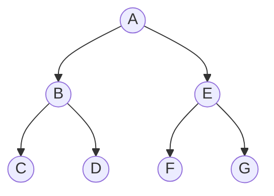

---
{"dg-publish":true,"permalink":"/university-notes-mostly-in-italian/algoritmi-e-strutture-dati/3-2-alberi-binari/","created":"2023-08-19T10:38:29.608+02:00","updated":"2023-08-19T10:38:29.608+02:00"}
---

# Alberi binari
## Indice
- [[🎓 University notes (mostly in Italian)/⚙️ Algoritmi e Strutture Dati/3.2 Alberi Binari#📝Definizione\|📝Definizione]]
- [[🎓 University notes (mostly in Italian)/⚙️ Algoritmi e Strutture Dati/3.2 Alberi Binari#🔎 Visita di un albero\|🔎 Visita di un albero]]
	- [[🎓 University notes (mostly in Italian)/⚙️ Algoritmi e Strutture Dati/3.2 Alberi Binari#Depth-First Search (DFS)\|Depth-First Search (DFS)]]
		- [[🎓 University notes (mostly in Italian)/⚙️ Algoritmi e Strutture Dati/3.2 Alberi Binari#Pre-Order Traversal\|Pre-Order Traversal]]
		- [[🎓 University notes (mostly in Italian)/⚙️ Algoritmi e Strutture Dati/3.2 Alberi Binari#In-Order Traversal\|In-Order Traversal]]
		- [[🎓 University notes (mostly in Italian)/⚙️ Algoritmi e Strutture Dati/3.2 Alberi Binari#Post-Order Traversal\|Post-Order Traversal]]
	- [[🎓 University notes (mostly in Italian)/⚙️ Algoritmi e Strutture Dati/3.2 Alberi Binari#Breadth First Search (BFS)\|Breadth First Search (BFS)]]
		- [[🎓 University notes (mostly in Italian)/⚙️ Algoritmi e Strutture Dati/3.2 Alberi Binari#Level Order Traversal\|Level Order Traversal]]
## 📝Definizione
Un albero binario è un albero in cui ogni nodo ha al massimo due figli, identificati come figlio sinistro e figlio destro.

**Nota**: Due alberi $T$ e $U$ che hanno gli stessi nodi, gli stessi figli per ogni nodo e la stessa radice, sono distinti qualora un nodo $u$ sia designato come figlio sinistro in $T$ e come figlio destro in $U$.
**Per esempio, i seguenti due alberi binari sono diversi:**

/%E2%9A%99%EF%B8%8F%20Algoritmi%20e%20Strutture%20Dati/_images/AlberoBinario.png)
## 🔎 Visita di un albero
Due strategie per analizzare (visitare) tutti i nodi di un albero:

| Visita in profondità [[🎓 University notes (mostly in Italian)/⚙️ Algoritmi e Strutture Dati/3.2 Alberi Binari#Depth-First Search (DFS)\|Depth-First Search (DFS)]]                                                | Visita in ampiezza [[🎓 University notes (mostly in Italian)/⚙️ Algoritmi e Strutture Dati/3.2 Alberi Binari#Breadth First Search (BFS)\|Breadth First Search (BFS)]] | 
| --------------------------------------------------------------------------------------------------------------------------- | ------------------------------------------------------------------------------ |
| Per visitare un albero, si visita ricorsivamente ognuno dei suoi **sottoalberi**                                            | Ogni **livello** dell’albero viene visitato, uno dopo l’altro                  |
| Tre varianti: [[🎓 University notes (mostly in Italian)/⚙️ Algoritmi e Strutture Dati/3.2 Alberi Binari#Pre-Order Traversal\|Pre-Order]], [[🎓 University notes (mostly in Italian)/⚙️ Algoritmi e Strutture Dati/3.2 Alberi Binari#In-Order Traversal\|In-Order]], [[🎓 University notes (mostly in Italian)/⚙️ Algoritmi e Strutture Dati/3.2 Alberi Binari#Post-Order Traversal\|Post-Order]] | [[🎓 University notes (mostly in Italian)/⚙️ Algoritmi e Strutture Dati/3.2 Alberi Binari#Level Order Traversal\|Level Order Traversal]]                               |
| Richiede uno **stack**                                                                                                      | Richiede una **queue**                                                         |

### Depth-First Search (DFS)
Visto che si visita ricorsivamente ognuno dei sottoalberi dell'albero, in base al momento in cui decidiamo di stampare il nodo, la visita si suddivide in 3 modi. Qualunque metodo si scelga, il costo di una visita di un albero contenente $n$ nodi è $\Theta(n)$, in quanto ogni nodo viene visitato al massimo una volta.
- Time complexity: $O(n)$ (_n_ è il numero di elementi)
- Space complexity: $O(h)$ (_h_ è l'altezza dell'albero) 
#### Pre-Order Traversal
Nella visita in pre-order prima si stampa il nodo corrente, poi si visitano i figli. Nella visita in pre-order la radice è sempre il nodo visitato per primo.

```cpp
void preOrder(TreeNode t) {
	if (t != NULL) {
		print(t);
		preOrder(t.left);
		preOrder(t.right);
	}
}
```

##### Esempio

**Sequenza:** A B C D E F G

#### In-Order Traversal
Nella visita in in-order prima si stampa il ramo sinistro, poi il nodo corrente e infine il ramo destro. Quando eseguita in un albero binario di ricerca, la visita in in-order visita i nodi in ordine crescente (da qui il nome "in-order").

```cpp
void inOrder(TreeNode t) {
	if (t != NULL) {
		inOrder(t.left);
		print(t);
		inOrder(t.right);
	}
}
```

##### Esempio

**Sequenza:** C B D A F E G
#### Post-Order Traversal
Nella visita in post-order vengono visitati prima i figli, poi il nodo corrente. Nella visita in post-order la radice è sempre il nodo visitato per ultimo.

```cpp
void postOrder(TreeNode t) {
	if (t != NULL) {
		postOrder(t.left);
		postOrder(t.right);
		print(t);
	}
}
```

##### Esempio

**Sequenza:** C D B F G E A

### Breadth First Search (BFS)
Partendo dalla radice si visitano tutti i nodi livello per livello. La visita è chiamata Level Order Traversal.
Possiamo implementarlo sia ricorsivamente sia iterativamente.

#### Level Order Traversal
##### Esempio

**Sequenza:** A B E C D F G
##### Implementazione ricorsiva
L'idea è la seguente:
- Usiamo un for che va da $1$ a  $h$ (l'altezza dell'albero)
- Ad ogni iterazione, utilizziamo il [[🎓 University notes (mostly in Italian)/⚙️ Algoritmi e Strutture Dati/3.2 Alberi Binari#Depth-First Search (DFS)\|Depth-First Search (DFS)]] per attraversare l'albero, mantenendoci l'altezza del nodo corrente.
	- Se il nodo è nullo -> `return`
	- Se il livello è $1$ siamo arrivati al livello desiderato, quindi stampiamo `tree->data`
	- Se il livello è maggiore di $1$, allora
		- Ricorsivamente, visitiamo il figlio sinistro, decrementando il livello di $1$
		- Ricorsivamente, visitiamo il figlio destro, decrementando il livello di $1$

```cpp
/* Function to print level order traversal a tree */
void levelOrderTraversal(Tree root)
{
    int h = height(root);
	for(int level = 1; level < h + 1; ++level)
        printCurrentLevel(root, level);
}

/* Print nodes at a current level */
void printCurrentLevel(Tree root, int level)
{
	if(root == NULL)
        return;
    else if(level == 1)
        cout << root.data << " ";
    else {
        printCurrentLevel(root.left, level - 1);
        printCurrentLevel(root.right, level - 1);
    }
}

/* Compute the "height" of a tree -- the number of 	nodes along the longest path from the root node
	down to the farthest leaf node. */
int height(Tree node)
{
    if (node == NULL)
        return 0;

    int leftHeight = height(node.left);
    int rightHeight = height(node.right);
    return max(leftHeight, rightHeight) + 1;
}
```
- Time complexity: $O(n^2)$ (_n_ è il numero di elementi)
	- Questo perchè `levelOrderTraversal()` è $O(n) + O(n-1) + O(n-2) + ... + O(1)$, cioè $O(n^2)$
- Space complexity: 
	- $O(n)$ (se l'albero non è bilanciato, nel caso peggiore è praticamente una lista) 
	- $O(\log n)$ (se l'albero è bilanciato, nel caso pessimo non devi tenere tutti gli elementi nello stack)

##### Implementazione iterativa (usando una coda)
L'idea è la seguente:
- Per ogni nodo, prima stampiamo il suo valore, poi lo rimuoviamo dalla coda e successivamente aggiungiamo i suoi figli nella coda. 
```cpp
void levelOrderTraversal(Tree root) {
    /* Base case */
    if (root == NULL)
        return;
    
    /* Create an empty queue for level order traversal */
    queue<Tree> queue;

    /* Enqueue root */
    queue.push(root);

    while(!queue.empty()) {
        /* Print front of queue and remove it from queue */
        Tree node = queue.front();
        cout << node.data << " ";
        queue.pop();

        /* Enqueue left child */
        if(node.left != NULL)
            queue.push(node.left);

        /* Enqueue right child */
        if(node.right != NULL)
                queue.push(node.right);
    }
}
```
- Time complexity: $O(n)$ (_n_ è il numero di elementi)
- Space complexity: $O(w)$ (_w_ è la massima larghezza dell'albero)