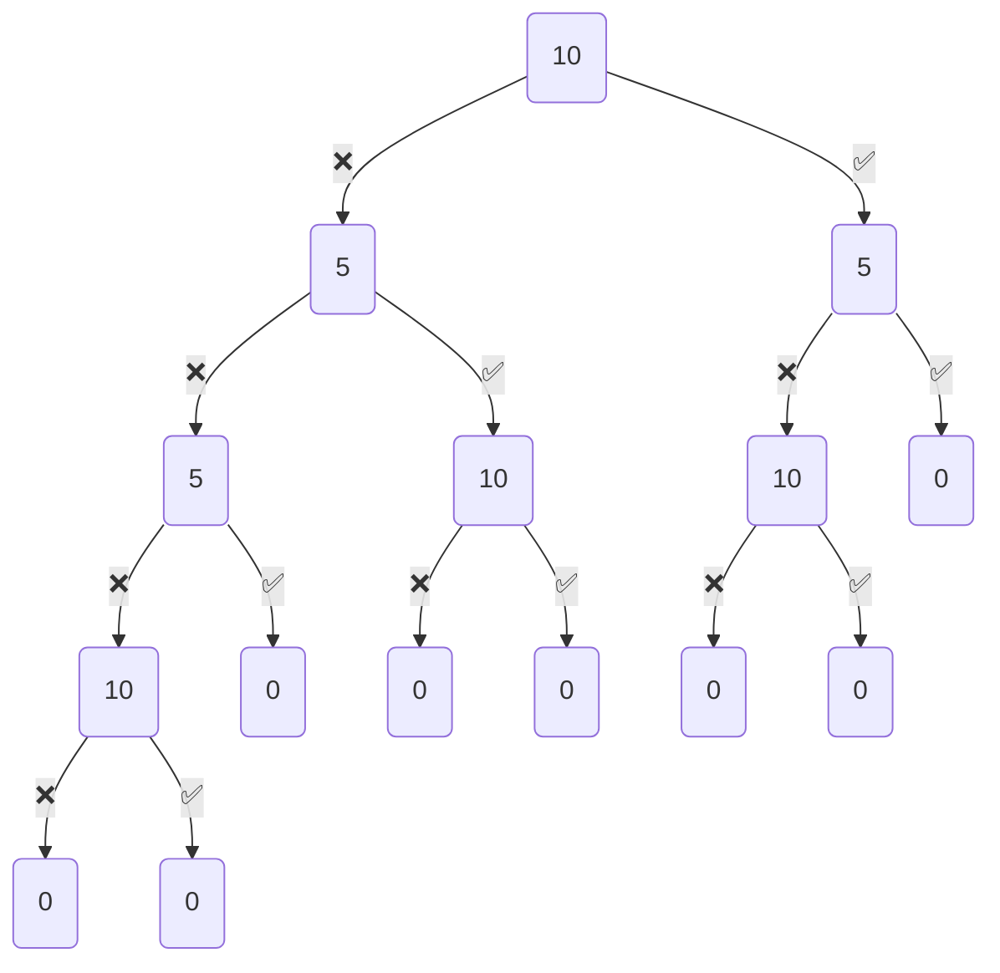

---
{"dg-publish":true,"permalink":"/university-notes-mostly-in-italian/algoritmi-e-strutture-dati/5-dynamic-programming/","created":"2023-08-25T16:00:19.971+02:00","updated":"2025-01-07T10:34:55.586+01:00"}
---

# Dynamic Programming
> Dynamic Programming is mainly an optimization over plain recursion. Wherever we see a recursive solution that has repeated calls for same inputs, we can optimize it using Dynamic Programming. The idea is to simply store the results of subproblems, so that we do not have to re-compute them when needed later. This simple optimization reduces time complexities from exponential to polynomial. 
> 
> For example, if we write simple recursive solution for Fibonacci Numbers, we get exponential time complexity and if we optimize it by storing solutions of subproblems, time complexity reduces to linear.

Quindi in breve, memorizziamo il risultato ottenuto risolvendo un particolare problema in una **tabella DP** (vettore, matrice, dizionario). La tabella deve contenere un elemento per ogni sottoproblema che dobbiamo risolvere, i casi base li memorizziamo direttamente nelle posizioni relative.

**Iterazione bottom-up**
- Si parte dai problemi risolubili come basi base
- Si sale verso problemi via via più grandi ... 
- ... fino a raggiungere il problema originale

## Hateville
### Problema
- Hateville è un villaggio particolare, composto da $n$ case, numerate da $1$ a $n$ lungo una singola strada.
- Ad Hateville ognuno odia i propri vicini della porta accanto, da entrambi i lati.
- Quindi, il vicino i odia i vicini $i − 1$ e $i + 1$ (se esistenti). Hateville vuole organizzare una sagra e vi ha affidato il compito di raccogliere i fondi. 
- Ogni abitante $i$ ha intenzione di donare una quantità $D[i]$, ma non intende partecipare ad una raccolta fondi a cui partecipano uno o entrambi i propri vicini.

1. Scrivere un algoritmo che dato il vettore $D$, restituisca la quantità massima di fondi che può essere raccolta 
2. Bonus: restituire un sottoinsieme di indici $S ⊆ {1, . . . , n}$ tale che il totale dei fondi raccolti $T = \sum_{i \in S} D[i]$ sia massimale

#### Esempio
Vettore donazioni: $D = [10, 5, 5, 10]$
Raccolta fondi massima: $20$
Insieme indici:  $\{1, 4\}$

### Soluzione
È possibile definire una formula ricorsiva che permetta di calcolare il sottoinsieme di case che, se selezionate, dà origine alla maggior quantità di donazioni.
Sia $HV (i)$ uno dei possibili insiemi di indici da selezionare per ottenere una donazione ottimale dalle prime i case di Hateville, numerate $1 . . . n$.

Cosa succede se non accetto la donazione di una casa?
$$HV (i) = HV (i − 1)$$

Cosa succede se accetto la sua donazione? 
$$HV (i) = \{i\} ∪ HV (i − 2)$$

Come faccio a decidere se accettare o meno?
$$HV (i) = max(\overbrace{HV (i − 1)}^{Non\ Preso}, \overbrace{\{i\} ∪ HV (i − 2))}^{Preso}$$

#### Soluzione ricorsiva 
##### Equazione di ricorrenza
$HV(i) = \begin{cases} \varnothing &i=0 \\ D[1] &i=1 \\ max(HV (i − 1), \{i\} ∪ HV (i − 2)) &i\geq 2 \end{cases}$


Ovviamente non vale la pena scrivere un algoritmo ricorsivo, basato su divide-et-impera, per risolvere il problema, visto che la complessità sarebbe $O(2^n)$. Tuttavia, per fini didattici, ecco il codice per farlo.

##### Implementazione
```cpp
int hateVille(const vector<int>& D) {
    return hateVilleHelper(D, D.size() - 1);
}

int hateVilleHelper(const vector<int>& D, int i) {
    if(i < 0)
        return 0;
    else if (i == 0)
        return D[0];
    else
        return max(hateVilleHelper(D, i - 1), hateVilleHelper(D, i - 2) + D[i]);
}
```
- Time complexity: $O(2^n)$ (_n_ è il numero di elementi nell'array)
- Space complexity: $O(n)$

Graficamente, sta avvenendo questo:



#### Soluzione iterativa con dynamic programming
Invece di ricalcolare più volte gli stessi sottoproblemi, utilizziamo un vettore DP in cui salviamo il risultato di un sottoproblema.

Sia quindi $DP[i]$ il valore della massima quantità di donazioni che possiamo ottenere dalle prime i case di Hateville. $DP[n]$ è il valore della soluzione ottima.

##### Equazione di ricorrenza
$HV(i) = \begin{cases} 0 &i=0 \\ D[1] &i=1 \\ max(DP [i − 1], DP [i − 2] + DP[i]) &i\geq 2 \end{cases}$

##### Implementazione
```cpp
int hateVille(const vector<int>& D) {
    int n = D.size();
    vector<int> DP(n + 1);
    DP[0] = 0;
    DP[1] = D[0];
    for(int i = 2; i < n + 1; i++)
        DP[i] = max(DP[i-1], DP[i-2] + D[i-1]);
    // + D[i-1] perchè DP è shiftato a destra di 1, visto che DP[0] = 0
    return DP[n];
}
```
- Time complexity: $O(n)$ (_n_ è il numero di elementi nell'array)
- Space complexity: $O(n)$

/%E2%9A%99%EF%B8%8F%20Algoritmi%20e%20Strutture%20Dati/_images/HateVille.png)

#### Ottenere gli indici delle case selezionate
Abbiamo quindi ottenuto il valore della soluzione massimale, ma non conosciamo gli indici delle case selezionate! Possiamo tuttavia ricostruirci la soluzione originale. Come?

- Si guarda l’elemento $DP[i]$. Da cosa deriva il suo valore?
	- Se $DP[i] = DP[i − 1]$, la casa $i$ non è stata selezionata, dunque si prende la soluzione fino a $i − 1$ senza aggiungere nulla
	- Se $DP[i] = DP[i − 2] + D[i]$, la casa $i$ è stata selezionata, dunque si prende la soluzione fino a $i − 2$ e si aggiunge $i$
##### Implementazione
```cpp
vector<int> hateVille(const vector<int>& D) {
    int n = D.size();
    vector<int> DP(n + 1);
    DP[0] = 0;
    DP[1] = D[0];
    for(int i = 2; i < n + 1; i++)
        DP[i] = max(DP[i-1], DP[i-2] + D[i-1]);
    return solution(DP, n);
}

vector<int> solution(const vector<int>& DP, int i) {
    if(i <= 0)
        return {};
    else if(i == 1)
        return {0};
    else if(DP[i] == DP[i-1])
        return solution(DP, i - 1);
    else {
        vector<int> sol = solution(DP, i-2);
        sol.push_back(i-1);
        return sol;
    }
}
```
- Time complexity: $O(n)$ (_n_ è il numero di elementi nell'array)
- Space complexity: $O(n)$

Si potrebbe migliorare la complessità spaziale di `hateville()` solo nel caso in cui non ci servissero gli indici delle case. Se invece vogliamo ricostruire la soluzione è necessario avere un array di supporto.

## Zaino (knapsack)
### Problema
Dato un insieme di oggetti, ognuno caratterizzato da un peso e un profitto, e uno "zaino" con un limite di capacità, individuare un sottoinsieme di oggetti
- il cui peso sia inferiore alla capacità dello zaino;
- il valore totale degli oggetti sia massimale, i.e. più alto o uguale al valore di qualunque altro sottoinsieme di oggetti

#### Esempio
- Pesi: $[12, 4, 6, 2]$
- Profitti: $[26, 9, 13, 5]$
- Capacità: $12$
- Soluzione: $\{2, 3, 4\}$, ossia $9 + 13 + 5 = 27$

### Soluzione
Dato uno zaino di capacità $C$ e $n$ oggetti caratterizzati da peso $w$ e profitto $p$, definiamo $DP[i][c]$ come il massimo profitto che può essere ottenuto dai primi $i ≤ n$ oggetti contenuti in uno zaino di capacità $c ≤ C$. Dunque il massimo profitto ottenibile dal problema originale è rappresentato da $DP[n][C]$.

Cosa succede se non prendiamo l'oggetto?
$$DP[i][c] = DP[i − 1][c]$$

La capacità non cambia, non c’è profitto.

Cosa succede se prendiamo l'oggetto? 
$$DP[i][c] = DP[i−1][c−w[i]] + p[i]$$

Sottraiamo il peso dalla capacità e aggiungiamo il profitto relativo.

Come faccio a scegliere la soluzione migliore?
$$DP[i][c] = max(\overbrace{DP[i − 1][c − w[i]] + p[i]}^{Preso}, \overbrace{DP[i − 1][c])}^{Non\ Preso}$$

#### Soluzione iterativa con dynamic programming
Invece di ricalcolare più volte gli stessi sottoproblemi, utilizziamo una matrice $DP$ che riempiamo iterativamente, iniziando a risolvere prima i sottoproblemi, arrivando all'ultima cella in cui si troverà la soluzione dell'intero problema.

##### Equazione di ricorrenza
$DP[i][c] = \begin{cases} 0 &i=0\ or\ c=0 \ \ &\text{se non abbiamo più oggetti/capacità} \\ max(\overbrace{DP[i − 1][c − w[i]] + p[i]}^{Preso}, \overbrace{DP[i − 1][c])}^{Non\ Preso} &\text{otherwise} \end{cases}$

##### Implementazione
```cpp
int knapsack(const vector<int>& weight, const vector<int>& profit, int C) {
    int n = weight.size();
    vector<vector<int>> DP(n + 1, vector<int>(C + 1));

    for(int i = 0; i < C + 1; i++)
        DP[0][i] = 0;
    for(int i = 0; i < n + 1; i++)
        DP[i][0] = 0;

    for(int i = 1; i < n + 1; i++) {
        for(int c = 1; c < C + 1; c++) {
            if(weight[i - 1] > c) {
                //If it's too heavy, don't pick it!
                DP[i][c] = DP[i - 1][c];
            }
            else {
                //Should we pick it? Max of both!
                DP[i][c] = max(DP[i - 1][c], DP[i - 1][c - weight[i - 1]] + profit[i - 1]);
            }
        }
    }

    return DP[n][C];
}
```
- Time complexity: $O(n\cdot C)$ (_n_ è il numero di elementi dati in input, _C_ la capacità)
- Space complexity: $O(n \cdot C)$ 

/%E2%9A%99%EF%B8%8F%20Algoritmi%20e%20Strutture%20Dati/_images/Knapsack.png)

In realtà c'è da fare una piccola precisazione sulla complessità spaziale di questo algoritmo. Infatti, sebbene sembri un algoritmo polinomiale, in realtà è definito come "**pseudo-polinomiale**". Questo perchè sono necessari $k = \lfloor \log C \rfloor$ bit per rappresentare C, dunque la complessità è esponenziale rispetto al numero di bit dell'input.

**Esempio:**
Scegliamo come input i numeri che hanno $1$ nel bit più significativo.
Input di $3$ bit? $\rightarrow$ Input in decimale: 4 
Input di $4$ bit? $\rightarrow$ Input in decimale: 8 
Input di $5$ bit? $\rightarrow$ Input in decimale: 16 
Input di $6$ bit? $\rightarrow$ Input in decimale: 32

e così via...

Quindi la complessità spaziale è $O(n \cdot 2^{k})$, dove $k = \lfloor \log C \rfloor$

#### Soluzione ricorsiva 
##### Equazione di ricorrenza
$T(n) = \begin{cases} 1 &n \leq 1 \\ \\ 2T(n - 1) + 1 &n > 1 \end{cases}$

Ovviamente non vale la pena scrivere un algoritmo ricorsivo, basato su divide-et-impera, per risolvere il problema, visto che la complessità sarebbe $O(2^n)$. Tuttavia, visto che è molto veloce da scrivere, ecco il codice per farlo.

##### Implementazione
```cpp
int knapsack(const vector<int>& weight, const vector<int>& profit, int c) {
    int n = weight.size();
    return knapsackHelper(weight, profit, n, c);
}

int knapsackHelper(const vector<int>& weight, const vector<int>& profit, int i, int c) {
    if(i == 0 || c == 0)
        return 0;
    else if(weight[i - 1] > c)
        return knapsackHelper(weight, profit, i - 1, c);
    else
        return max (
            knapsackHelper(weight, profit, i - 1, c),
            knapsackHelper(weight, profit, i - 1, c - weight[i - 1]) + profit[i - 1]
        );
}
```
- Time complexity: $O(2^n)$ (_n_ è il numero di elementi nell'array)
- Space complexity: $O(n)$

Potremmo però utilizzare lo stesso approccio del dynamic programming e salvarci il risultato del sottoproblema una volta risolto. In questo caso, anche se ricorsivamente, daremo un'occhiata alla tabella $DP$ prima di entrare in ricorsione a risolvere il sottoproblema. Questo metodo è chiamato **memoization**.

#### Soluzione ricorsiva con memoization
##### Memoization (annotazione)
Tecnica che fonde l’approccio di memorizzazione della programmazione dinamica con l’approccio top-down di divide-et-impera.
Si crea una tabella DP, inizializzata con un valore speciale che indica che un sottoproblema non è ancora stato risolto.
Quando si deve risolvere un sottoproblema, si controlla nella tabella se è già stato risolto:
- SI: si usa il risultato della tabella
- NO: si calcola il risultato e lo si memorizza
In tal modo, ogni sottoproblema viene calcolato una sola volta e memorizzato come nella versione bottom-up.

##### Implementazione
```cpp
int knapsack(const vector<int>& weight, const vector<int>& profit, int c) {
    int n = weight.size();
    vector<vector<int>> DP(n + 1, vector<int>(c + 1, -1));
    return knapsackHelper(weight, profit, n, c, DP);
}

int knapsackHelper(const vector<int>& weight, const vector<int>& profit, int i, int c, vector<vector<int>>& DP) {
    if(i == 0 || c == 0)
        return 0;
    else if(DP[i][c] != -1)
        return DP[i][c];
    else if(weight[i - 1] > c)
        return DP[i][c] = knapsackHelper(weight, profit, i - 1, c, DP);
    else {
        return DP[i][c] = max (
            knapsackHelper(weight, profit, i - 1, c, DP),
            knapsackHelper(weight, profit, i - 1, c - weight[i - 1], DP) + profit[i - 1]
        );
    }
}
```
- Time complexity: $O(n \cdot C)$ (_n_ è il numero di elementi nell'array)
- Space complexity: $O(n + n \cdot C)$ (_n_ per la ricorsione, _nC_ per la tabella $DP$)

/%E2%9A%99%EF%B8%8F%20Algoritmi%20e%20Strutture%20Dati/_images/Memoization.png)

Applicata in questo modo, non c’è alcun vantaggio nell’utilizzare la tecnica di memoization rispetto al metodo iterativo, tuttavia permette di tradurre in fretta le espressioni ricorsive. 
Invece di utilizzare una tabella, si potrebbe utilizzare un dizionario, evitando così di fare inizializzazioni. Il costo di esecuzione sarebbe pari a $O(\text{min}(2^n,\ n \cdot C))$.

#### Soluzione iterativa con dynamic programming con spazio ottimizzato
##### Implementazione
```cpp
int knapsack(const vector<int>& weight, const vector<int>& profit, int C) {
    int n = weight.size();
    vector<int> DP(C + 1, 0);

    for(int i = 0; i < n; i++)
        for(int c = C; c >= 0; c--)
            if(weight[i] <= c)
                DP[c] = max(DP[c], DP[c - weight[i]] + profit[i]);

    return DP[C];
}
```
- Time complexity: $O(n \cdot C)$ (_n_ è il numero di elementi nell'array, _C_ la capacità)
- Space complexity: $O(C)$

## Zaino (knapsack) senza limiti
### Problema
Il problema è il medesimo di [[#Zaino (knapsack)]], ma non abbiamo limiti sul numero di volte che un oggetto può essere selezionato.

### Soluzione
Dato uno zaino di capacità $C$ e $n$ oggetti caratterizzati da peso $w$ e profitto $p$, definiamo $DP[i][c]$ come il massimo profitto che può essere ottenuto dai primi $i ≤ n$ oggetti contenuti in uno zaino di capacità $c ≤ C$, senza porre limiti al numero di volte che un oggetto può essere selezionato. Dunque il massimo profitto ottenibile dal problema originale è rappresentato da $DP[n][C]$.

#### Soluzione ricorsiva con memoization
È sufficiente non fare $-1$ ad $i$ quando prendo l'oggetto, visto che posso prendere l'oggetto quante volte voglio.

##### Equazione di ricorrenza
$DP[i][c] = \begin{cases} 0 &i=0\ or\ c=0 \ \ &\text{se non abbiamo più oggetti/capacità} \\ max(\overbrace{DP[i \cancel{− 1}][c − w[i]] + p[i]}^{Preso}, \overbrace{DP[i − 1][c])}^{Non\ Preso} &\text{otherwise} \end{cases}$

##### Implementazione
```cpp
int knapsack(const vector<int>& weight, const vector<int>& profit, int c) {
    int n = weight.size();
    vector<vector<int>> DP(n + 1, vector<int>(c + 1, -1));
    return knapsackHelper(weight, profit, n, c, DP);
}

int knapsackHelper(const vector<int>& weight, const vector<int>& profit, int i, int c, vector<vector<int>>& DP) {
    if(i == 0 || c == 0)
        return 0;
    else if(DP[i][c] != -1)
        return DP[i][c];
    else if(weight[i - 1] > c)
        return DP[i][c] = knapsackHelper(weight, profit, i - 1, c, DP);
    else {
        return DP[i][c] = max (
            knapsackHelper(weight, profit, i - 1, c, DP),
            knapsackHelper(weight, profit, i, c - weight[i - 1], DP) + profit[i - 1]
        );
    }
}
```

#### Soluzione ricorsiva con dynamic programming e spazio ottimizzato
In realtà, non avendo limiti al numero di volte che un oggetto può essere preso, possiamo ottimizzare lo spazio usato ed evitare di usare una matrice $DP$. 
Perchè possiamo fare questo?
Perchè in [[#Zaino (knapsack)]] dovevo tenere conto se un oggetto era stato preso oppure no, quindi avevo bisogno di una seconda dimensione per tenere traccia di quali oggetti avevo considerato. Qui posso riprenderli quanto voglio, quindi posso semplificare la formula. Ovviamente questo approccio rende più difficile ricostruire la soluzione, ma vedremo in seguito come risolvere questo problema.

Praticamente ora scorriamo la "matrice" per colonne invece che per righe; proviamo quindi tutti gli oggetti per $c = 0, 1, 2, ..., C$.

##### Implementazione
```cpp
int unboundedKnapsack(const vector<int>& weight, const vector<int>& profit, int C) {
    int n = weight.size();
    vector<int> DP(C+1, 0);
    
    for (int c = 0; c < C + 1; c++)
        for (int i = 0; i < n; i++)
            if (weight[i] <= c)
                DP[c] = max(DP[c], DP[c-weight[i]] + profit[i]);

	return DP[C];
}
```
- Time complexity: $O(n \cdot C)$ (_n_ è il numero di elementi nell'array)
- Space complexity: $O(C)$ (_n_ per la ricorsione, _nC_ per la tabella $DP$)

#### Ottenere gli indici degli oggetti selezionati
Come detto prima, questo approccio rende più difficile ricostruire la soluzione, ma possiamo tenerci traccia in un altro vettore quali oggetti abbiamo preso. Poi, ricorsivamente, sottraiamo alla capacità totale il peso dell'oggetto selezionato e infine li aggiungiamo all'array. 

##### Implementazione
```cpp
vector<int> unboundedKnapsack(const vector<int>& weight, const vector<int>& profit, int C) {
    int n = weight.size();
    vector<int> DP(C+1, 0);
    vector<int> pos(C+1, -1);
    
    for (int c = 0; c < C + 1; c++) {
        for (int i = 0; i < n; i++) {
            if (weight[i] <= c) {
                int val = DP[c-weight[i]] + profit[i];
                if(val > DP[c]) {
                    DP[c] = val;
                    pos[c] = i;
                }
            }
        }
    }

	return solution(weight, pos, C);
}

vector<int> solution(const vector<int>& weight, const vector<int>& pos, int C) {
    if(C == 0 || pos[C] < 0)
        return { };
    else {
        vector<int> sol = solution(weight, pos, C - weight[pos[C]]);
        sol.insert(sol.begin(), pos[C]);
        return sol;
    }
}
```