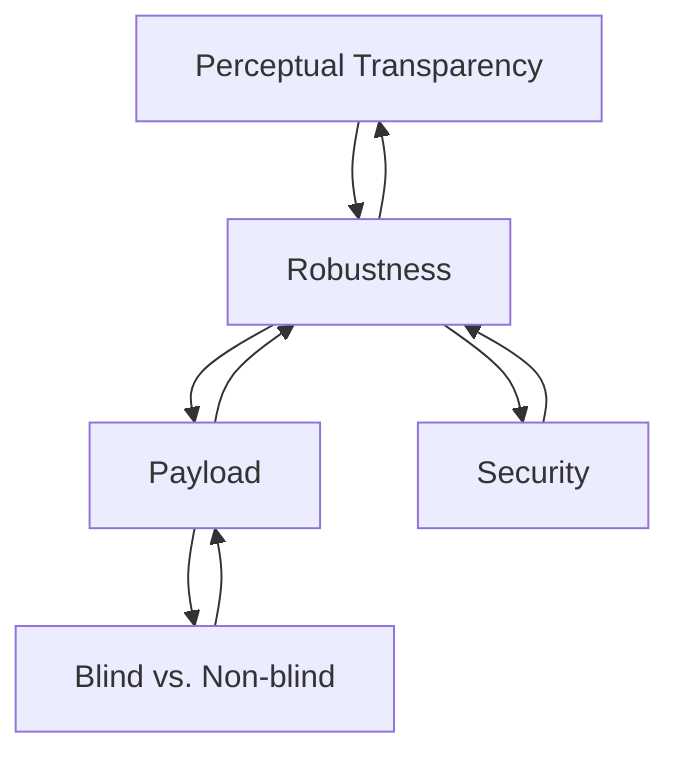

---
{"dg-publish":true,"permalink":"/university-notes-mostly-in-italian/multimedia-data-security/theory/2-digital-watermarking/","created":"2024-10-28T08:30:12.664+01:00","updated":"2025-02-23T23:35:08.654+01:00"}
---

# 2. Digital Watermarking
As introduced in [[🎓 University notes (mostly in Italian)/🔒 Multimedia Data Security/Theory/1. Introduction#Watermarking\|1. Introduction#Watermarking]], digital watermarking is a method of embedding hidden information (often called a **stegomessage** or **watermark**) within a host signal, like an image, video, or audio file. We can also say that watermarking is a **mechanism to create a communication channel that is multiplexed into original content**, making the embedded data part of the media itself.

## How Does Digital Watermarking Work?

Digital watermarking takes advantage of what’s known as **perceptual headroom**, which refers to the limitations of human perception. Our senses—especially sight and hearing—are not perfect, so small changes can be made to digital content without noticeable quality degradation. These small modifications are where the watermark is hidden. The watermark remains undetected by human observers, but specialized signal processing techniques can extract or identify it.

### General Process - Theoretical Model 1

The process of embedding a watermark involves an **embedding function**, which uses an **embedding key** to insert information into the original data. On the other end, an **extraction function** retrieves this hidden information using an **extraction key**. This communication happens over a channel where the host signal serves as the carrier of the embedded message (we need the original data), otherwise we talk about [blind techniques](####Based\ on\ the\ availability\ of\ the\ original\ data).
Here's a diagram to represent the process better:

/%F0%9F%94%92%20Multimedia%20Data%20Security/_images/Theoretical%20model%201.png)

### Key Requirements

For digital watermarking to be effective, certain requirements need to be met:

- **Imperceptibility**: The watermark should not visibly degrade the quality of the original content. Users shouldn't be able to notice the difference between the watermarked and original versions.
    
- **Robustness**: The watermark must survive common signal processing operations such as compression, resizing, or filtering. Even after these transformations, the embedded data should remain intact and retrievable.
    
- **Capacity**: The watermark should be able to carry enough information without taking up too much space in the host media.
    
- **Security**: According to **Kerckhoff’s principle**, we assume the method used to embed the data could be known to an attacker. The security of the system relies on the secrecy of the key, not the embedding algorithm itself.
    

## Types of Watermarking Attacks

Watermarks can be exposed to various types of attacks:

- **Active Attacks**: In this case, an attacker tries to extract or manipulate the hidden data, possibly corrupting the watermark.
    
- **Passive Attacks**: Here, the attacker tries to get information about the hidden data without actively tampering with it. This is essentially a form of eavesdropping.

Watermarking systems must be designed to resist these types of attacks, maintaining both the watermark's integrity and the secrecy of the embedded message.

## Watermarking Requirements for Different Applications

Depending on the specific application, different types of watermarks are needed:

- **Robust watermarks** are crucial for applications like copyright protection and ownership verification. These watermarks must withstand significant manipulation and still remain intact.
    
- **Fragile watermarks** are useful for data authentication and tamper-proofing. These watermarks are designed to break or become altered if the media is tampered with, making it easy to detect unauthorized changes.
    
- **Statistically invisible watermarks** are essential for steganography, where the goal is to hide the presence of a message entirely.
    
- **High payload watermarks** are needed for labeling applications or systems with high data embedding requirements.

Here's a diagram that represents the interrelationship between the above concepts:

## Classification of Watermarking Techniques

Watermarking can be categorized in several ways:

### Based on the availability of the original data

- **Blind Techniques**: The watermark can be recovered without needing the original, non-marked content. This is more convenient in many practical applications, but achieving robustness can be harder.
- **Non-blind Techniques**: The original content is required to extract the watermark. This usually ensures better robustness but may not be feasible in all scenarios.

### Based on the decoding process
- **Detectable Watermarks**: These are typically 1-bit, 0-bit watermarks. In this case, it’s only possible to determine whether a specific watermark is embedded in the image. This ensures **privateness** is automatically achieved.
    
- **Readable Watermarks**: These are multibit watermarks where the bits hidden in the image can be read without prior knowledge of their position. This allows for more complex information to be stored and extracted.

### Based on the key management

- **Symmetric Schemes**: The same key is used for both embedding and detecting the watermark.
    
- **Asymmetric Schemes**: Different keys are used for embedding and detecting. This improves security, especially in public scenarios, since knowing the detection key doesn’t allow someone to remove the watermark.

## Watermarking in Different Domains

There are two main domains in which watermarking is applied:

- **Spatial Domain**: Watermarks are embedded by directly modifying pixel values. This approach is simpler and can better exploit the characteristics of the Human Visual System (HVS). However, it may suffer from synchronization problems and is generally less robust.
    
- **Transform Domain**: Here, watermarks are embedded in the transformed version of the content, such as in the **Discrete Cosine Transform (DCT)** or **Discrete Fourier Transform (DFT)** domain. This method offers higher robustness, making it more resistant to geometric manipulations (like resizing or rotation), though it tends to require more computational resources.   

Some **hybrid techniques** combine the benefits of both spatial and transform domains, balancing robustness with spatial localization of the watermark.

## Example: LSB Replacement

One simple and widely used watermarking method is **Least Significant Bit (LSB) replacement**. In this technique, the least significant bits of pixel values are replaced with the watermark’s bits. For instance, if you replace the last few bits of an image's pixels with watermark data, the resulting image will look almost identical to the original, yet the hidden data can be extracted perfectly.

In the example below, the left image is the original, the right one the LSB replaced. 

/%F0%9F%94%92%20Multimedia%20Data%20Security/_images/LSB%20Replacement.png)

However, this method has its drawbacks. While the watermark can be embedded without noticeable degradation, it's very fragile. Any compression, such as JPEG, or even the addition of minor noise, can destroy the embedded data. This method is also vulnerable to attacks, as the watermark can be removed without affecting the image’s perceptual quality.

> [!info] Compression? JPEG?
> When it is said that the watermark is "fragile," it means that it is highly sensitive to any type of modification to the image. One example is JPEG compression, which is one of the most common techniques used to reduce image file sizes. It works by eliminating certain visual information that is considered less perceivable to the human eye. During this process, the compression can alter the pixel values, and since the watermark is embedded in the least significant bits, it can be overwritten or changed.
> 
> **Example of Compression**: Imagine that the original value of a pixel is 11010101 (where "1" and "0" represent the bits). If a compression process modifies this pixel to 11010100, the watermark could be completely lost.

### Robustness Against Attacks

Achieving robustness in watermarking means withstanding common signal processing operations and intentional attacks. Watermarks must be able to survive:

- **Signal Processing**: Operations such as enhancement, sharpening, or filtering.
    
- **Compression**: Especially **JPEG compression**, which is widely used in multimedia content. Techniques like **JPEG 2000** also pose challenges.
    
- **Geometric Manipulation**: Resizing, cropping, rotation, and other transformations can potentially destroy a watermark.
    

Tools like **StirMark** and **Certimark** are commonly used to test the robustness of watermarking systems under various attack scenarios.

## Robustness vs. Security

It's important to differentiate between **robustness** and **security** in watermarking systems:

- **Robustness** refers to the watermark’s ability to survive non-malicious manipulations, such as resizing or compression. For example, if I send a watermarked image on WhatsApp, the watermark has to be robust against the automatic compression of WhatsApp.
    
- **Security** focuses on withstanding malicious attacks where adversaries attempt to remove or alter the watermark. A secure watermarking system assumes that the attacker knows the algorithm used, so the key must remain secret to ensure security.