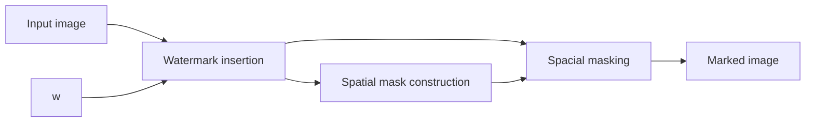

---
{"dg-publish":true,"permalink":"/university-notes-mostly-in-italian/multimedia-data-security/theory/4-hvs-and-watermarking/","created":"2025-02-05T09:09:55.346+01:00","updated":"2025-02-23T23:22:48.276+01:00"}
---

# 4. HVS & Watermarking
Hiding information effectively requires utilizing specific strategies to ensure that unauthorized individuals cannot detect the hidden object. There are four main techniques:

1. **Keep it secret**: The hidden object is placed in a location unknown to unauthorized individuals. If the location is unknown, the object is unlikely to be discovered.
2. **Make it small**: The hidden object is made so small that it becomes imperceptible to the human eye. Human perception is limited by object size.
3. **Make it similar**: The hidden object is designed to resemble its surroundings so closely that it becomes indistinguishable.
4. **Make it spread**: The hidden object is divided into small pieces that are spread around, making it impossible to perceive the object as a whole.

## Human Visual System (HVS)

The Human Visual System (HVS) plays a crucial role in how people perceive images. Several key principles govern how humans detect disturbances in visual data:

- Distortions are **less visible** in highly textured regions than in uniform areas.
- **Contours** (edges) are more sensitive to noise addition than highly textured regions but less than flat areas.
- Disturbances are **less visible** in very dark and very bright regions, following **[Weber's Law](https://www.wikipedia.org/wiki/Weber%E2%80%93Fechner_law)**.

### Just Noticeable Difference (JND)
Let's see an example, watch this image:

/%F0%9F%94%92%20Multimedia%20Data%20Security/_images/Pasted%20image%2020250205092603.png)

A small square with uniform luminance $L+\Delta$ is superimposed on a uniform background of luminance L. The value of $\Delta$ is gradually increased until the human observer perceives a difference between the square and the background. The minimum amount of intensity change required to notice a difference is termed the **Just Noticeable Difference (JND)**. The JND increases for very low and very high luminance values.

/%F0%9F%94%92%20Multimedia%20Data%20Security/_images/Pasted%20image%2020250205092727.png)

#### Weber’s Law

Weber’s law states that the ratio of the just noticeable difference to the background intensity is a constant. This can be observed in daily life: in a noisy environment, one must shout to be heard, whereas in a quiet room, a whisper suffices. Mathematically, this means that the threshold for detecting differences in intensity is proportional to the background luminance.

For a wide range of luminance values, the Weber fraction remains constant at approximately $0.02$.

More complex models are necessary to accurately represent human vision in the presence of textured patterns.

### Masking in the Human Visual System

The human eye is most sensitive to changes in brightness (luminance) at medium levels. This means that if an image is neither too dark nor too bright, small variations in brightness are more noticeable. However, at very low or very high luminance levels, the ability to perceive changes decreases.
Instead, when multiple visual stimuli are present, a phenomenon called _masking_ occurs. This means that a new stimulus (such as a watermark) can become less visible if other visual patterns are already in the image.
If a new stimulus appears on top of a background that contains a sinusoidal pattern (a repeating wave-like signal), the new stimulus might be harder to distinguish. The background acts as a mask, reducing the visibility of the new element.
The masking effect is strongest when the stimulus and the masking signal share the same **frequency, phase, and orientation**. In simpler terms, if both patterns oscillate at the same speed, in the same direction, and in sync, the new stimulus blends into the background, making it nearly invisible.

In digital watermarking, this masking effect is crucial. By embedding the watermark in areas where natural masking occurs, we can make it less detectable to human observers while still ensuring that it remains retrievable when needed.

## Frequency Masking in Watermarking

**Frequency masking** is an essential concept in watermarking. The formula for watermark embedding in the frequency domain is:

$$|f_{iw}| = |f_i| + \alpha w_i |f_i|$$

where:

- $f_i$ represents a transformed coefficient (DCT, DFT, DWT),
- $\alpha$ is a scaling factor constrained by invisibility.

Here some problems:

- **Inter-frequency masking is neglected**, meaning interactions between different frequencies are not considered.
- **Lack of spatial localization**, leading to suboptimal watermark placement.

### Improved Watermarking Techniques

Barni et al. (2001) proposed an improved wavelet-based watermarking approach using **pixel-wise masking**:

- Uses **DWT (Discrete Wavelet Transform)**.
- Defines the **Just Noticeable Difference (JND) threshold** for each coefficient.
- Detection is based on the **Newman-Pearson theorem**.

The embedding process follows:

$$I^\theta_0 (i,j) = I^\theta_0 (i,j) + \alpha w^\theta (i,j) \cdot x^\theta (i,j)
$$
where:
- $w$ is a weighing function accounting for the local noise sensitivity (it is this weighing function that allows to exploit the masking characteristics of the HVS.)
- $x^\theta (i,j)$ is the watermark, a pseudo-random sequence of $-1$ and $+1$. It's defined as $x^\theta (i,j) = m_{\theta MN + iN + j}$, where $m$ is arranged in 2D, where $2M\times2N$ are the dimensions of the host image

### Selection of Subbands

Watermarking is typically embedded into the **three largest detail subbands**, balancing robustness and imperceptibility (based on experimental tests):

- **Higher robustness** allows stronger watermarking.
- **Low visibility at these frequencies** enables increased watermark strength without noticeable distortion.

## Spatial Masking

Spatial masking exploits HVS characteristics to hide watermarks in **high-activity regions**.

Watermark insertion follows:

where:
- $I_w = I + M W$
- $M$ is a **masking image**, indicating how perceptible the watermark is at each pixel.

These are the goals of spatial masking:
- **Increase watermark invisibility** at a given energy level.
- **Increase watermark strength** while maintaining perceptibility constraints.
- **Improve robustness** against image processing techniques (achieved through the use of a higher watermark energy and because through masking the code is hidden in regions which are less affected by common image processing techniques)

## Heuristic Masking

Heuristic methods further optimize watermark placement:

- Watermarks are **easier to hide in high-activity regions**.
- **Edges are more sensitive** to distortions than textures.
- **Dark and bright regions** can sustain stronger watermarking than medium-gray areas.

There are some problems though:

- No clear distinction between **textured regions** and **edges**.
- **More advanced models** are needed to separate these components effectively.

## Curiosity: Watermarking vs. Compression

The duality between the problem of data hiding and that of compression consists in the fact that, while in compression technology the aim is to remove from the multimedia document all those data which are perceptually less important, in data hiding technology the goal is, on the contrary, to add to the multimedia document some data in such a way that they result to be perceptually unimportant.

We can say they are **inverse** problems, but:

- **Compression disturbs watermarking** by removing embedded data.
- **Watermarking can learn from compression** by exploiting HVS properties to improve resilience.

Despite their opposition, **watermarking can be designed to be robust against compression** by carefully embedding data in regions less affected by common compression techniques.