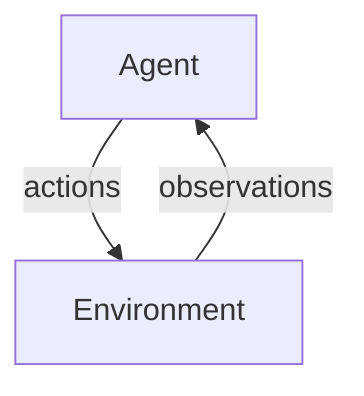

---
{"dg-publish":true,"permalink":"/university-notes-mostly-in-italian/autonomous-software-agents/2-what-is-a-software-agent/","created":"2025-02-26T09:40:49.494+01:00","updated":"2026-06-06T10:14:43.555+02:00","dg-note-properties":{}}
---

# 2. What Is a (Software) Agent?

As discussed in the [[🎓 University notes (mostly in Italian)/🤖 Autonomous Software Agents/1. Introduction\|🎓 University notes (mostly in Italian)/🤖 Autonomous Software Agents/1. Introduction]], every action performed by a computer is traditionally hard-coded by a programmer. In conventional software, every possible condition must be anticipated and explicitly programmed. If the software encounters a situation its designer did not foresee, it may crash, sometimes with catastrophic consequences. This limitation has fueled a growing interest in developing software that can autonomously decide how to achieve its objectives, adapting its behavior in response to rapidly changing, unpredictable, or open-ended environments.

## The Role of the Environment

When the environment is well-known, scanning and modeling it is relatively straightforward. For instance, large language models (LLMs) are trained on vast datasets to excel within certain domains. But what happens when they encounter completely novel or unexpected data? In such cases, the agent must predict and adapt without relying solely on pre-coded responses.
Crucially, in multi-agent scenarios, our focus shifts from controlling a single agent’s actions in isolation to managing the emergent, collective behavior of a system.

Consider a firefighting scenario: if multiple agents are responsible for extinguishing a fire, our aim is not to micro-manage each agent’s every move. Instead, we adopt a goal-oriented approach where agents cooperate to resolve the situation collectively.

A simplified representation of an agent interacting with its environment might look like this:



## A Practical Example: The Thermostat

Imagine a basic control system, such as a thermostat. The thermostat continuously monitors the room temperature using a sensor. Based on its reading, it performs one of two actions:

```javascript
if (temperature is too cold) {
    heating_on();
} else {
    heating_off();
}
```

In this simple system, the thermostat only considers the room temperature. However, consider the added complexity of having open windows. Ideally, the thermostat should also verify that the windows are closed before activating the heater:

```javascript
if (temperature is too cold && windows_closed) {
    heating_on();
} else {
    heating_off();
}
```

If the system isn’t aware of the window’s status in advance, it must be capable of learning and adapting to this new parameter. This brings us to the challenge of coordinating multiple agents.

### Coordinating Multiple Agents

Let’s extend the example to a system with both a thermostat and automated windows. Here, the thermostat’s goal is to maintain a comfortable temperature, while the windows’ role might be to regulate air quality by opening when the air is stale. However, keeping the heater on when windows are open might be counterproductive.

The solution is to design a coordination mechanism between the two agents. They must learn to collaborate during execution:

- If it is too cold **and** the windows are closed, the thermostat should turn on the heating.
- If the temperature is acceptable, the heating should be turned off.
- If the air is stale **and** the heating is off, the windows should open.
- Once the air quality improves, the windows should close.

There are two common approaches: using a centralized controller that manages both agents, or enabling the agents to communicate directly and negotiate their actions in real time.

## Reasoning and Abductive Inference

Consider another scenario where a user requests, “Can you close the window?” Such a request might be driven by various underlying needs. For example, the user might want to increase the room’s temperature or reduce external noise. The agent must infer the true cause behind the request—a process known as abduction.

In abductive reasoning, the agent uses existing knowledge to hypothesize possible explanations. For instance, suppose the following relationships are known:

- **Not optimal temperature** leads to **feeling cold**.
- **Excessive noise** prevents effective concentration (e.g., following a lecture).
- **Wearing a coat** reduces the sensation of cold.

If the agent observes that the user is wearing a coat (thus likely not feeling cold), it may deduce that the request to close the window is motivated by the need for a quieter environment rather than a change in temperature. This reasoning process can be formalized with propositions:

- **a:** Close the window.
- **b:** Temperature is acceptable.
- **c:** Noise level is acceptable.
- **d:** User feels cold.
- **e:** User can follow the lecture.
- **g:** User is wearing a coat.

When the agent receives a request for **a**, it must determine why. If executing **a** is expected to yield both **b** and **c**, then observing that either **b** or **c** is false (i.e., !b or !c) can lead to the conclusion that either the user feels cold (**d**) or cannot follow the lecture (!e). Knowing that **g** (wearing a coat) negates **d**, the agent may conclude that the user’s true intent is to enable concentration (**e**). This example illustrates how an agent can merge pre-existing and newly acquired knowledge to explore alternatives and make decisions.

## Flexibility: Reactive and Proactive Behavior

A defining characteristic of a robust agent is its flexibility, which encompasses both reactive and proactive behaviors:

- **Reactive behavior:** The agent responds promptly and appropriately to immediate changes in its environment.
- **Proactive behavior:** The agent anticipates future conditions through planning and goal-oriented actions.

This dual capability allows an agent not only to handle unexpected events efficiently but also to pursue long-term objectives with a strategic outlook.

## Learning and Adaptation

It is unrealistic to pre-program a system to cover every possible scenario. Therefore, agents must be endowed with the ability to learn—from both their environment and their own operational experiences. An agent might learn:

- **Environmental patterns:** For example, it might deduce that all shops close at 5 p.m., or that a request to close a door might have a private connotation.
- **Self-improvement insights:** It may recognize that it consistently fails to close a door properly, or that performing one task at a time tends to yield better results.

Machine learning techniques and dedicated learning components enable agents to update their internal models and refine their behaviors over time.

## Roles/Goals vs. Tasks

Finally, it is important to distinguish between assigning **tasks** and assigning **roles/goals** to software:

In traditional software systems, we assign tasks (such as online registration), where both the “what” and the “how” are specified in advance. The system is expected to execute these tasks exactly as defined, and any changes in requirements are not tolerable.

In contrast, when we assign roles or goals to agents, only the “what” is predetermined. For example, a registration agent is given the goal of completing a registration process, but it dynamically decides how to achieve this objective by selecting and executing appropriate tasks at runtime.

Consider **the goal** of reaching a destination: rather than dictating a single method of travel, the agent might choose from several **tasks**: taking the bus, walking, or calling a taxi—depending on current conditions.

## Multi-Agent Systems

In many real-world scenarios, a single agent is insufficient to solve complex problems. Instead, systems composed of multiple agents are the norm. Multi-agent systems (MAS) allow for decentralization, distribute control across various loci, integrate multiple perspectives, and even handle competing interests—all of which are essential for modeling real-world dynamics.

### Definition

A multi-agent system consists of a collection of agents that interact with one another. In the most general case, each agent acts on behalf of a user with distinct goals and motivations. To interact successfully, these agents must be capable of cooperation, coordination, and negotiation—much like human beings working together. As Katia Sycara aptly puts it:

> “… If a problem domain is particularly complex, large, or unpredictable, then the only way it can reasonably be addressed is to develop a number of functionally specific and (nearly) modular components (agents) that are specialized at solving a particular problem aspect. When interdependent problems arise, the agents in the system must coordinate with one another to ensure that interdependencies are properly managed.”

In essence, MAS are systems where multiple autonomous agents interact through communication and coordination in order to achieve both individual and shared objectives.

### Fundamental Characteristics

A MAS is characterized by several core elements:

- **Interaction:**  
    Agents engage in cooperative, coordinated, or even competitive interactions. Their communication is crucial to managing both individual objectives and interdependencies.
    
- **Local and Organizational Interests:**  
    While each agent pursues its own goals, it must also consider the broader organizational or social objectives. The system’s overall performance depends on balancing these sometimes conflicting interests.
    
- **Organizational Structure:**  
    Multi-agent systems are often embedded within an organizational framework. This structure defines roles, norms, and rules that govern the interactions among agents. The system might involve various layers, such as strategic, management, and operational levels, each with distinct responsibilities and processes.

### Agent Interactions

Interaction among agents is inevitable and essential. Agents interact at a knowledge level, negotiating aspects such as which goals to pursue, when, and for whom. These interactions are fundamental for:

- **Achieving Individual Objectives:**  
    Each agent acts to fulfill its own tasks or represent an individual or company.
    
- **Managing Interdependencies:**  
    Complex problems often require coordination among agents, with each addressing a specific facet of the overall challenge.
    

### Organizational Context

Agents do not operate in a vacuum. They are situated within an organizational context that influences their behavior:

- **Explicit Relationships:**  
    Agents may be organized as peers, teams, or coalitions, each subject to clearly defined institutional norms and regulations.
    
- **Role Assignment and Hierarchies:**  
    Depending on their position within the organization, agents might operate at different levels (e.g., strategic, management, or operational). This layered structure helps manage the system’s complexity.
    

A multi-agent system, therefore, consists of agents that interact through communication, act within an environment, and are linked by various organizational relationships.

/%F0%9F%A4%96%20Autonomous%20Software%20Agents/_images/Pasted%20image%2020250307232204.png)

### Emergent Behavior

One of the fascinating aspects of MAS is the phenomenon of emergent behavior. Unlike systems where the overall behavior is simply the sum of its parts, MAS can exhibit behaviors that are not explicitly predefined by the individual agents. For example:

- **Flocking:**  
    The coordinated movement of birds in a flock is an emergent behavior that cannot be deduced solely from the behavior of a single bird.
    
- **Market Dynamics:**  
    Market crashes and other economic phenomena often result from the complex interplay of numerous independent agents rather than from the action of any one investor.
    

Emergent behaviors arise from local interactions among agents and can vary widely depending on the social, organizational, and dynamic context of the system.

### Agent Communication

Communication is the backbone of multi-agent systems. However, it goes beyond the mere sending of messages; it involves a series of processes:

- **Signal Transmission:**  
    Agents send signals that are encoded and decoded using a shared language or protocol. This process includes transmitting information through a specific channel or medium and ensuring that the context of the communication is understood by all parties.
    
- **Interpretation and Meaning:**  
    For a message to be significant, an agent must be able to perceive it and translate it into meaningful information. This not only characterizes the sender’s attitude but also conveys the agent’s state, intentions, and goals.
    
- **Coordinated Action:**  
    Through communication, agents can establish common beliefs, coordinate actions, and manage requests and acknowledgments, ensuring that messages are correctly interpreted and acted upon.

### System Engineering Challenges

Designing multi-agent systems involves addressing two primary challenges:

- **Agent Design:**  
    How can we build agents capable of independent, autonomous actions that successfully achieve delegated tasks?
    
- **Organizational Design:**  
    How do we ensure that these agents can effectively interact—cooperating, coordinating, and negotiating—with other agents that might have differing interests or goals?
    

These challenges are often seen as representing the micro (individual agent design) versus the macro (societal or organizational design) aspects of MAS engineering.