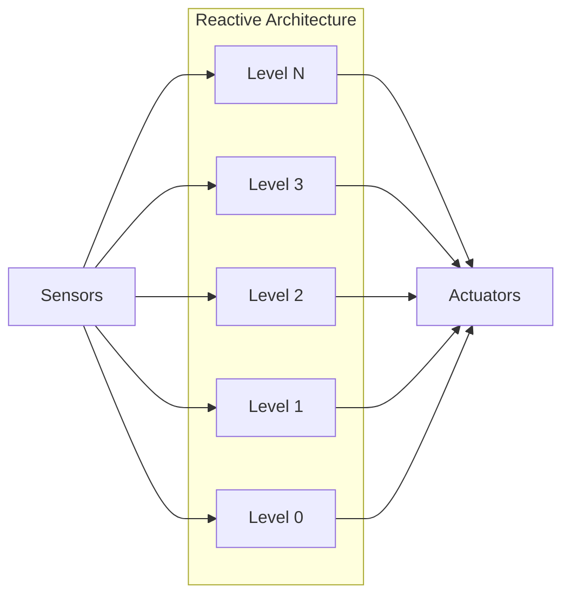
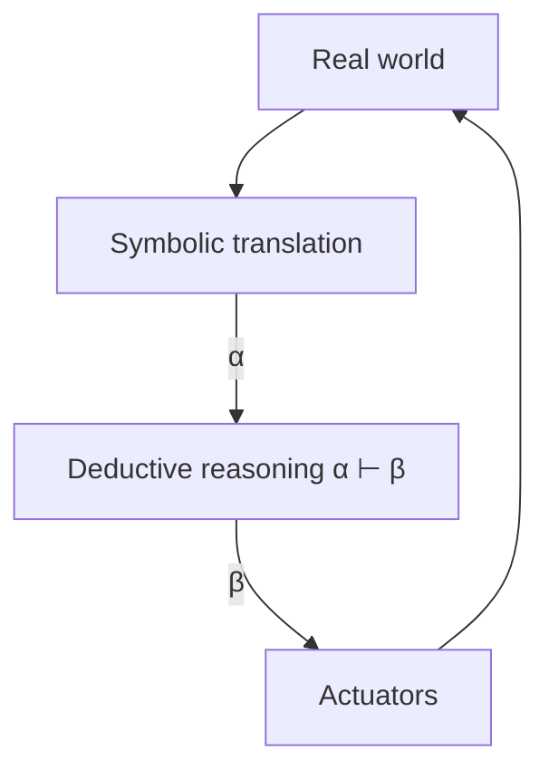
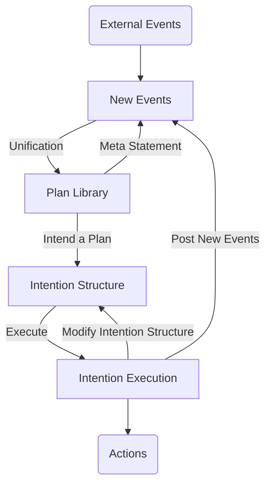

---
{"dg-publish":true,"permalink":"/university-notes-mostly-in-italian/autonomous-software-agents/3-agents-architectures/","created":"2025-03-05T10:10:53.593+01:00","updated":"2026-06-06T10:14:46.333+02:00"}
---

# 3. Agents’ Architectures

An agent’s internal architecture defines not only the types of components it comprises but also the manner in which these components interact to produce intelligent behavior. Much like the organizational structures found in human institutions, these architectures provide a framework for understanding both group structures and individual behaviors, shaping the internal processes—such as reasoning—that ultimately lead to an agent’s actions.

## Internal Agent Architectures

At the heart of every autonomous system is the mechanism that supports behavior in dynamic, real-world, and open environments. The internal architectures of agents vary widely.

Some systems are built on logic-based, **symbolic reasoning** where explicit rules and representations dictate decisions. 

Others follow a **reactive approach**, emphasizing rapid responses to environmental changes without relying on an internal symbolic model of the world.

There are also **hybrid** or **layered** architectures that combine reactive and deliberative strategies, along with **Belief-Desire-Intention (BDI)** architectures that incorporate a more structured, deliberative process.

In practice, many modern systems gravitate towards a blend of reactive, hybrid, and deliberative methods, each chosen to best meet the demands of the environment in which the agent operates.

### Historical Evolution

The history of agent architectures reflects an evolution of thought within the field of artificial intelligence. Between 1956 and 1985, nearly all agents were designed as symbolic reasoning systems, where explicit logical inference determined the next course of action. However, as these systems encountered the unpredictable nuances of real-world environments, their limitations became apparent. This realization sparked a shift towards reactive architectures starting around 1985, as researchers began to explore models that could respond to environmental changes more immediately. From the 1990s onward, a variety of alternative architectures emerged, most notably hybrid models that attempted to combine the strengths of both symbolic reasoning and reactive responses. An illustration of this historical progression can be seen in the evolution depicted in the figure below.

/%F0%9F%A4%96%20Autonomous%20Software%20Agents/_images/history.png)

### Reactive Architectures

Reactive architectures are particularly valued for their ability to perceive environmental changes and respond with remarkable speed. In many application domains, the need for a swift reaction outweighs the benefits of fully deliberative processing, which can be too slow to apply in fast-changing scenarios. Rather than relying on a symbolic representation of the world, reactive agents make decisions based solely on the sensory information they receive, mapping perceptual inputs directly to corresponding actions. This approach is realized through networks of sensors and effectors that ensure each environmental stimulus triggers an immediate and appropriate response.

In 1991, Rodney Brooks articulated three key theses that underpinned the reactive paradigm. He argued that intelligent behavior can be generated without the need for explicit representations, that such behavior does not require abstract reasoning, and that intelligence itself is an emergent property of complex systems. His influential work on the **subsumption architecture** demonstrated that a hierarchy of simple, rule-like behaviors could work in tandem, with lower-level behaviors—such as obstacle avoidance—taking precedence over higher-level functions. In this design, each behavior competes with others to gain control, and the system as a whole exhibits intelligent behavior as a natural emergent outcome of these interactions.

The subsumption architecture organizes tasks in layers, where primitive behaviors form the foundation and are overridden only when higher-priority tasks emerge. This hierarchical structure ensures that essential functions are reliably executed, while still allowing the agent to adapt to more complex demands. The result is a system that, despite its simplicity, is capable of navigating highly dynamic environments with flexibility and resilience.



#### Example

As we said, at the most fundamental level, an agent is endowed with a set of simple, prioritized behaviors that govern its actions in a dynamic environment. Consider, for instance, an explorer tasked with sample collection in an unknown terrain. The lowest-level behavior is dedicated to obstacle avoidance: whenever the agent detects an obstacle, it immediately stops and changes direction. This behavior ensures that the agent navigates safely, even in complex settings.

In addition to obstacle avoidance, the agent is programmed to handle samples intelligently. If it is carrying samples and reaches the base—often referred to as the “mother-ship”—it will drop the samples there. Conversely, if it is carrying samples but is not yet at the base, it will prioritize returning to the mother-ship to secure the collected data. When the agent encounters a sample in the environment, it stops exploring and picks up the sample. And finally, if no higher priority tasks are applicable, the agent defaults to exploring the environment in a random fashion. This layered decision-making is captured succinctly in the following code example:

```javascript
while(run) {
    if (obstacle) {                     
        stop();
        change_direction();
    } else if (carry_samp) {           
        if (at_station) {
            drop_samp();
        } else {
            move_toward_station();
        }
    } else if (samp) {                 
        pick_up();
    } else {                           
        move_randomly();
    }
}
```

While this implementation clearly delineates the sequence of behaviors, one might consider a multithreaded version to allow simultaneous monitoring of obstacles, sample detection, and navigation. In such an implementation, the core logic remains the same, but separate threads can manage distinct tasks concurrently, enhancing the overall responsiveness of the agent.

#### Advantages and Limitations of Reactive Architectures

Reactive architectures are celebrated for their **simplicity, computational efficiency, and inherent robustness in the face of failures**. Their design is well-suited for environments where **fast reactions are critical**, as decisions are made directly based on local sensory input.

However, this reliance on immediate environmental information also introduces **limitations**. Since decisions are made on a short-term, local basis, the agent may **struggle to incorporate nonlocal or more holistic environmental cues**. This short-term view can be problematic when broader context is needed for **optimal decision-making**.
Furthermore, the challenge of enabling reactive agents to learn remains an open question. The emergent behavior of such systems arises from the interactions between simple components and the environment, which makes it difficult to engineer specific behaviors in a controlled, systematic manner. As the number of individual behaviors increases, the dynamics of their interactions can become increasingly complex and hard to predict.

## Logic-Based Architectures

In contrast to the reactive paradigm, logic-based architectures emphasize a symbol-based reasoning process. These systems require an agent to maintain an internal, symbolic representation of the world. Intelligent behavior is generated by syntactically manipulating these representations through logical deduction or theorem proving. A formal theory underpins the agent’s actions, explaining how goals are generated to satisfy its objectives and how goal-directed behavior is interleaved with reactive responses.

This approach to agent design, often referred to as symbolic AI, treats the agent as a knowledge-based system. A deliberative agent in this framework possesses an explicit model of the world, and its decisions are driven by the logical manipulation of that model. However, building such an agent involves solving two key problems.

The first, known as the transduction problem, is the challenge of converting real-world sensory inputs into an accurate and timely symbolic description. This is particularly critical in areas such as vision, speech recognition, and learning.

The second is the representation and reasoning problem, which involves symbolically encoding complex real-world phenomena and executing logical operations quickly enough to be useful in dynamic environments. The complexity of these symbol manipulation algorithms often renders them computationally intractable.

A simplified view of the process can be illustrated by the following flowchart:



### Deductive Reasoning Agents

Building on logic-based architectures, deductive reasoning agents decide on their actions by leveraging a set of rules that encode the optimal behavior in any given situation. In this framework, a theory—denoted by ρ—is used to interpret a logical database $\Delta$ that describes the current state of the world. The set of possible actions, $Ac$, is evaluated such that if a particular action is logically deduced from $\Delta$ using ρ, that action is executed. Typically, the decision-making process involves first checking for actions explicitly prescribed by the current state. If no such action exists, the agent considers actions that are not explicitly excluded by its current knowledge base. If neither condition is met, the agent refrains from acting.
To summarize, let
- $\uprho$ be this theory (typically a set of rules)
- $\delta$ be a logical database that describes the current state of the world
- $Ac$ be the set of actions the agent can perform
- $\Delta \vdash_{\uprho} \upphi$ means that $\upphi$ can be proved from $\Delta$ using $\uprho$

The following pseudocode illustrates this action selection process:

```c
/* Try to find an action explicitly prescribed */
for each a ∈ Ac do
    if Δ ⊢_ρ Do(a) then
        return a
    end-if
end-for

/* Try to find an action not excluded */
for each a ∈ Ac do
    if Δ ⊬_ρ ¬Do(a) then
        return a
    end-if
end-for

return null /* no action found */
```

#### An Example: The Vacuum World

In this chapter, we delve into the classic Vacuum World problem—a fundamental example used to illustrate the principles of autonomous software agents. The scenario involves a robot tasked with cleaning dirt from a 3x3 grid. For instance, imagine dirt is present at coordinates (0,2) and (1,2), while the robot begins its operation at position (1,1).

/%F0%9F%A4%96%20Autonomous%20Software%20Agents/_images/Pasted%20image%2020250305121151.png)

The problem domain is defined using a set of predicates:
- $In(x, y)$ indicates the agent’s current position
- $Dirt(x, y)$ denotes the presence of dirt
- $Facing(d)$ specifies the direction the agent is facing.

The agent can perform actions such as turning, moving forward, or sucking up dirt, with turning defined as a clockwise rotation. So $\text{Ac = \{turn, forward, suck\}}$.

The behavior of the agent is determined by a set of logical rules that decide which action to perform based on the current state.

##### Prioritizing Cleaning

A critical rule ensures that cleaning takes precedence over all other actions. It can be expressed as follows:

$In(x, y) \land Dirt(x, y) \rightarrow Do(suck)$

If the robot is in a cell where dirt is present, the cleaning action is executed immediately. This rule is part of the reasoning framework and is distinct from the factual data in the agent’s database.

##### Navigation Rules

When no cleaning is needed, the agent follows a cyclic path designed to cover every grid position. A sample set of rules might be:

1. **In(x, y) ∧ Dirt(x, y) → DO(suck)**
2. **[In(0, 0) ∨ In(1, 2)] ∧ ¬Facing(E) → DO(turn)**
3. **[In(2, 0) ∨ In(2, 1)] ∧ ¬Facing(W) → DO(turn)**
4. **[In(0, 2) ∨ In(2, 2)] ∧ ¬Facing(S) → DO(turn)**
5. **In(1, 0) ∧ [Facing(W) ∨ Facing(S)] → DO(turn)**
6. **In(1, 1) ∧ [Facing(E) ∨ Facing(S)] → DO(turn)**
7. **In(0, 1) ∧ [Facing(W) ∨ Facing(E)] → DO(turn)**
8. **DO(forward)**

Here, the order of the rules implicitly defines their priority. The navigation rules ensure that, if the cleaning condition is not met, the agent methodically traverses the environment.

For example:

/%F0%9F%AA%B2%20Security%20Testing/_images/Pasted%20image%2020250305121708.png)

##### Incorporating Memory and Free Movement

To enhance the model, we introduce a new predicate:

- **free(x, y, d):** Indicates that the agent is free to move in direction _d_ from position (x, y).

The extended reasoning framework can now be expressed as:

- **In(x, y) ∧ Dirt(x, y) → Do(suck)**
- **free(x, y, d) → Do(forward)**
- **Do(rotate)**

This extension opens the possibility of implementing memory, allowing the agent to track previously visited positions and adjust its path dynamically for improved performance.

### Challenges in Logic-Based Decision Making

#### Decision-Making Delays

A notable issue with logic-based reasoning is the time delay between decision-making and action execution. Consider the following scenario:

- At time **t₁**, the agent’s database (Δ₁) supports the deduction of an optimal action **a**.
- By the time **t₂** is reached (after the reasoning process completes), the environment might have changed.

If **t₂ – t₁** is negligible, the chosen action remains optimal. However, in environments where changes occur rapidly, this delay can lead to suboptimal behavior. This problem is a key motivation behind alternative approaches that sacrifice some logical rigor for speed.

/%F0%9F%A4%96%20Autonomous%20Software%20Agents/_images/Pasted%20image%2020250305122104.png)

#### Calculative Rationality

The concept of **calculative rationality** arises from this challenge. An agent exhibits calculative rationality if its decision-making mechanism selects an action that was optimal at the initiation of the decision process. In fast-changing environments, however, such a rationality model is insufficient because the optimal action may shift before execution. As a result, modern systems often adopt strategies that relax strict logical representations to achieve better real-time performance while sacrificing some theoretical elegance.

#### Sensor-to-Symbol Translation

Another significant challenge is translating raw sensor data into internal symbolic representations. For example, converting video camera input into a predicate such as **Dirt(0,1)** is non-trivial. This translation process is crucial because it bridges the gap between the physical world and the agent’s abstract reasoning framework.

#### Computational Complexity

- **Undecidability:** Decision making using first-order logic is generally undecidable.
- **NP-Completeness:** Even when simplified to propositional logic, the decision-making process can become NP-complete in the worst-case scenario.

Typical strategies to address these issues include:

- Weakening the logical framework.
- Using non-logical, symbolic representations.
- Shifting as much reasoning as possible from run time to design time.

### Planning Systems in Autonomous Agents

Planning is a core capability of reasoning agents. A planning system generates a sequence of actions that transforms an initial state into a goal state. This process involves:

- **Search:** Identifying a viable path through the state space.
- **Knowledge Representation:** Accurately modeling the environment and the agent’s internal state.

Applications of planning range from robot navigation to the planning of speech acts in conversational agents, illustrating the broad applicability of these concepts.

### Another Example: The Blocks World

The Blocks World is a classic domain in artificial intelligence where equal-sized blocks are arranged on a table. In this environment, a robot arm is capable of manipulating the blocks using a set of actions. This example illustrates how theorem-proving techniques can be employed to construct plans for achieving specified goals.

#### Actions

The robot arm can perform the following actions:

- **UNSTACK(a, b):** Remove block _a_ from atop block _b_.
- **STACK(a, b):** Place block _a_ on top of block _b_.
- **PICKUP(a):** Grasp block _a_ from the table.
- **PUTDOWN(a):** Place block _a_ down on the table.

#### Predicates

We describe the state of the world using predicates such as:

- **ON(A, B):** Block _A_ is on block _B_.
- **ONTABLE(X):** Block _X_ is on the table.
- **CLEAR(X):** There is no block on top of block _X_.
- **ARMEMPTY:** The robot’s arm is empty.

These predicates allow us to formulate the conditions of the Blocks World in a logical manner.

#### General Logical Truths

Certain relationships in the Blocks World are always true. For example, we can express the following axioms:

1. If any block is being held, then the arm cannot be empty:  
    $$\exists x\ \text{HOLDING}(x) \rightarrow \neg \text{ARMEMPTY}$$
    
2. Any block on the table is not on top of any other block:  
    $$\forall x\, (\text{ONTABLE}(x)) \rightarrow \neg \exists y\, \text{ON}(x,y))$$
    
3. If no block is on top of a given block, then that block is clear:  
    $$\forall x\, (\neg \exists y\, \text{ON}(y,x)) \rightarrow \text{CLEAR}(x))$$

#### Constructing Plans Using Theorem-Proving Techniques

The key challenge is to generate a sequence of actions (a plan) that transitions the world from an initial state to a desired goal state. One effective approach is **Green’s Method**, which extends logical reasoning with state variables.

We introduce a function:

$$DO: A \times S \to S$$

which maps an action and a state to a new state. For example, the expression

$$DO(\text{UNSTACK}(x,y), s)$$

denotes the new state resulting from unstacking block _x_ from block _y_ in state _s_.

##### Characterizing the UNSTACK Action

To formalize the effects of **UNSTACK**, we can write:

$$\text{CLEAR}(x,s) \land \text{ON}(x,y,s) \rightarrow \Big( \text{HOLDING}(x,\, DO(\text{UNSTACK}(x,y), s)) \land \text{CLEAR}(y,\, DO(\text{UNSTACK}(x,y), s)) \Big)$$

Suppose the initial state $s_0$ satisfies:

$$\text{ON}(A,B,s_0) \land \text{CLEAR}(A,s_0)$$

We can then prove that:

$$\text{HOLDING}(A,\, DO(\text{UNSTACK}(A,B), s_0)) \land \text{CLEAR}(B,\, DO(\text{UNSTACK}(A,B), s_0))$$

For clarity in our proofs, we denote:

$$s_1 = DO(\text{UNSTACK}(A,B), s_0)$$

so that we have:

$$\text{HOLDING}(A, s_1) \land \text{CLEAR}(B, s_1)$$

##### Characterizing the PUTDOWN Action

Similarly, we characterize **PUTDOWN** by:

$$\text{HOLDING}(x,s) \rightarrow \text{ONTABLE}(x,\, DO(\text{PUTDOWN}(x), s))$$

Now, consider the plan that involves first unstacking block _A_ from block _B_ and then putting _A_ down on the table. We denote the intermediate and final states as:
$$s_1 = DO(\text{UNSTACK}(A,B), s_0)$$
$$s_2 = DO(\text{PUTDOWN}(A), s_1)$$

Thus, we can prove:
$$\text{ONTABLE}(A, s_2)$$

In other words, the constructive proof demonstrates the following nested action sequence:

$$\text{ONTABLE}\Big(A,\, DO\Big(\text{PUTDOWN}(A),\, DO\big(\text{UNSTACK}(A,B), s_0\big)\Big)\Big)$$

This nested expression shows the plan in two steps:

1. **UNSTACK(A,B)**
2. **PUTDOWN(A)**

So, given an initial database containing:

$$\text{ON}(A,B,s_0) \land \text{ONTABLE}(B,s_0) \land \text{CLEAR}(A,s_0)$$

and a goal state expressed as

$$\exists s\,:\,\text{ONTABLE}(A,s)$$

we can use theorem proving to find the plan:

$$\text{ONTABLE}\Big(B,\, DO\Big(\text{PUTDOWN}(A),\, DO\big(\text{UNSTACK}(A,B), s_0\big)\Big)\Big)$$

## Hybrid Architectures in Autonomous Agents

While theorem-proving provides a solid theoretical foundation for planning, practical systems often incorporate hybrid architectures to handle real-world complexity.

### Deliberative vs. Reactive Components

Hybrid architectures combine two complementary parts:

- **Deliberative Component:** Contains a symbolic world model that develops plans and makes decisions based on logical reasoning.
- **Reactive Component:** Capable of responding to events without the overhead of complex reasoning. In many systems, the reactive component may override the deliberative one in time-critical situations.

This structuring naturally leads to the idea of a layered architecture:

- **Horizontal Layering:**  
    Each layer is directly connected to the sensory inputs and action outputs. Every layer operates somewhat like an independent agent, generating suggestions for actions.
    
- **Vertical Layering:**  
    Sensory input and action output are handled by a single dedicated layer, while higher layers abstract away from raw data to reason at increasingly abstract levels.

## The BDI Architecture

The Belief-Desire-Intention (BDI) architecture is one of the most popular models in the agent community (Rao and Georgeff, 1995). Its influence is evident in numerous implementations over the years, including PRS (1987), dMARS (1998), JAM (1999), Jack (2001), and JADEX (2005). Originating in the 1980s as a model of practical reasoning, BDI captures the challenges posed by dynamic, unpredictable environments. These environments are characterized by:

- Multiple, unpredictable evolutions,
- A wide variety of potential courses of action,
- Several competing objectives at any given moment,
- Localized sensing capabilities, and
- Resource-bounded reasoning.

A fundamental assumption of the BDI model is the use of plans. In this context, a “plan” is understood as a known recipe—a piece of practical know-how—rather than a freshly chosen course of action.

### Beliefs

**Beliefs** represent the agent’s information about the world, including its past experiences. There are several reasons for this:

- **Dynamic Environment:** The world continuously evolves, so an agent needs to remember past states to act intelligently.
- **Local Perception:** Since the agent can only sense its immediate surroundings, stored information fills in the gaps.
- **Resource Constraints:** It is more efficient for an agent to cache information rather than recompute it continuously.

Because the stored information might be imperfect or incomplete, we refer to it as _beliefs_ rather than _knowledge_. In epistemic logic, knowledge implies that if an agent knows a proposition PP, then PP is true. In contrast, beliefs are understood to be a best-effort approximation of reality. In addition, agents typically cache plans (or “recipes”) for similar reasons—to save on computational resources when encountering recurring situations.

### Desires (Goals)

**Desires** capture the agent’s preferred end states. For example, an agent might have the desire to "graduate" or "complete a project." These desires explain why certain parts of the agent’s code execute, providing a rationale behind its actions. Desires are particularly useful in the following contexts:

- **Failure Recovery:** When an action fails, the underlying desire helps in recovering and redirecting the plan.
- **Goal Interaction:** Desires allow the agent to reason about and manage conflicts or synergies between multiple goals.

In this way, desires serve as motivational anchors that guide the agent’s behavior.

### Intentions

While beliefs and desires form the informational and motivational base, **intentions** capture the commitment to a specific course of action. They are essentially the instantiated plans that the agent has chosen to follow. Intentions are crucial for several reasons:

- **Incremental Planning:** Resource-bounded agents must plan “bit-by-bit” while interacting with a dynamic environment.
- **Coordination:** Intentions can serve as a basis for coordinating actions among multiple agents.
- **Action-Oriented:** By their very nature, intentions lead directly to action. They are persistent (by default) and must be internally consistent. Moreover, intentions should be fully developed by the time execution begins.

Intentions are what transform abstract goals into concrete actions.

### Commitment, Re-Planning, and Options

An important consideration in the BDI framework is the handling of commitment and re-planning when the environment changes. A key question arises: if an agent is in the middle of following an intention and the world changes, should it re-plan?

- **Classical Decision Theory:** Advocates for continuous re-planning.
- **Classical Computing:** Without goals, an agent might never re-plan.

Neither extreme is ideal. In practice, agents reduce the number of options by:

- Disregarding alternatives that conflict with current intentions,
- Maintaining chosen intentions unless a strong reason emerges for change,
- Assuming that, during further planning, their intentions will be achieved.

For instance, an agent might intend to return a library book in the afternoon and then go to the movies in the evening. Given that the library is at a fixed location (e.g., UNITN@Albere), the agent may plan the remainder of its day based on that assumption.

### Implementation in Jack

Jack is a notable implementation of the BDI architecture that illustrates the distinction between an architectural model and its concrete implementation. In Jack:

- **Beliefs:** Are maintained in a local knowledge base, essentially a database.
- **Events:** Model the agent’s goals and trigger plan execution.
- **Plans:** Represent predetermined sequences of actions or sub-goals designed to accomplish specific tasks.
- **Intentions:** Correspond to the currently running plans.

This separation of concerns allows Jack to efficiently manage the complexities of a dynamic environment while still following the BDI principles.

### Summary and Process Flow

The BDI cycle can be visualized as a flow of information from external events through to action execution. The following Mermaid diagram summarizes the process:



This diagram captures the cycle of sensing, planning, intention formation, and action execution, which is at the heart of the BDI approach.