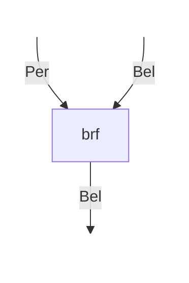
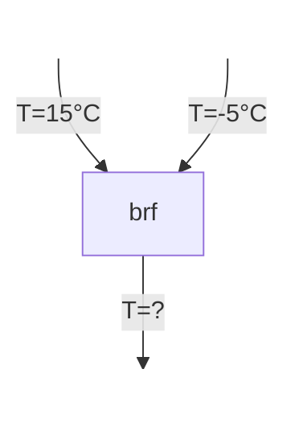
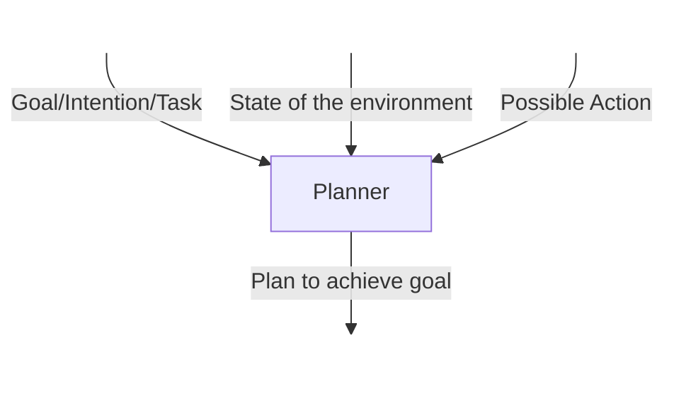
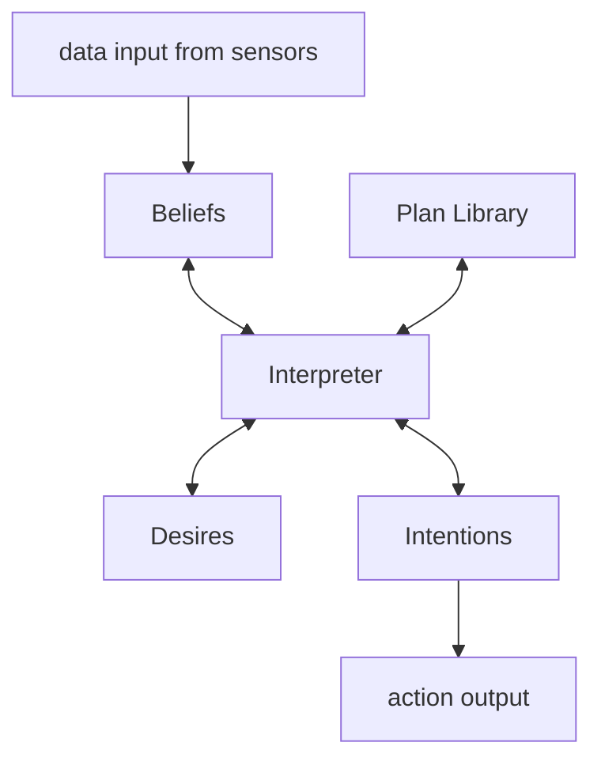
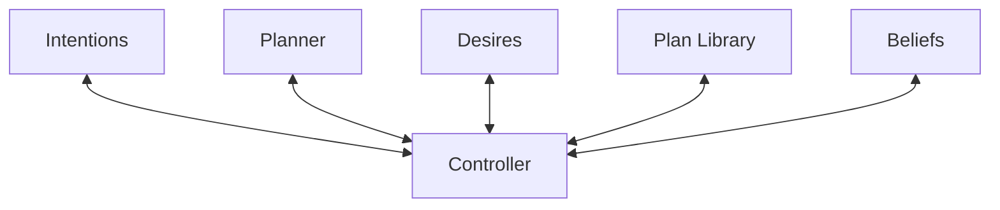

---
{"dg-publish":true,"permalink":"/university-notes-mostly-in-italian/autonomous-software-agents/4-bdi-agents/","created":"2025-03-24T17:05:37.890+01:00","updated":"2026-06-06T10:14:49.175+02:00"}
---

# 4. BDI Agents

This chapter delves into the inner workings of Belief-Desire-Intention (BDI) agents, with a special focus on practical reasoning. We explore how these agents deliberate about their actions, form intentions, and plan to achieve their goals. Throughout the chapter, real-world examples, pseudocode, and diagrams illustrate the concepts in depth, providing a comprehensive understanding of autonomous decision-making.

## Practical Reasoning

Practical reasoning is the process through which an agent determines the best course of action to pursue its objectives. Unlike theoretical reasoning—which is aimed at establishing or understanding beliefs—practical reasoning is concerned with selecting and justifying actions. It involves evaluating and balancing conflicting factors based on the agent’s values, desires, and the truths it holds.

For instance, as Bratman (1990) explains, practical reasoning requires weighing the pros and cons of different options, which leads to a decision that best aligns with the agent's overall priorities.

> [!example] **Example: Choosing a Job**
> 
> Consider the case of Alex, who has received two job offers:
> 
> - **Job A:** A high-paying corporate position that demands long hours and compromises work-life balance.
> - **Job B:** A lower-paying nonprofit role that aligns with Alex’s passion for social impact while offering a healthier work-life balance.
> 
> In this scenario, Alex employs practical reasoning to navigate the decision. While Job A promises financial stability and potential career advancement, Job B offers personal fulfillment and the chance for a balanced lifestyle. By carefully evaluating these conflicting considerations, Alex can choose the job that best meets his overall objectives.

## Theoretical vs. Practical Reasoning

It is essential to distinguish between two types of reasoning: theoretical and practical.

Theoretical reasoning is concerned with deriving beliefs based on logical deduction. For example, if an agent believes that "all men are mortal" and "Socrates is a man," then it logically concludes that "Socrates is mortal." This type of reasoning is foundational to understanding how the world works but does not directly inform action.

In contrast, practical reasoning involves making decisions that lead to action. Consider an individual who must choose between catching a bus or a train. This decision involves not just logical deductions, but an evaluation of factors like time efficiency, cost, and personal convenience. Here, the process is about determining the best way to act given the current circumstances.

## Components of Human Practical Reasoning

Human practical reasoning typically consists of two interrelated activities:

1. **Deliberation:** This is the process of deciding what state of affairs one wishes to achieve. It is about setting clear goals based on the agent’s desires.
2. **Means-Ends Reasoning:** Once the goal is set, the next step is to determine how to achieve it. This involves selecting the necessary actions and planning the steps required to bring the goal to fruition.

When the deliberation process culminates in the selection of a goal, the result is what we refer to as an **intention**. The agent then employs its knowledge and further reasoning to craft a plan that outlines the specific actions required.

## Intentions in Practical Reasoning

Intentions are pivotal in practical reasoning as they direct the allocation of resources and effort toward achieving specific goals. When an agent forms an intention to bring about a condition, say $\phi$, it is expected that the agent will devote the necessary resources to planning and executing actions that result in $\phi$. This can be formally represented as:

$$
I(\phi) \rightarrow \text{Plan}(a_1, a_2, \dots, a_n)
$$

Here, $I(\phi)$ denotes the intention to achieve the state of affairs $\phi$, and the arrow indicates the subsequent planning process, which consists of a series of actions $a_1, a_2, \dots, a_n$ designed to realize the goal.

> [!example] **Example: Preparing for a Marathon**
> 
> Consider Alice, who intends to run a marathon in six months. This intention not only signifies her goal but also compels her to devise a training regimen, adjust her daily schedule, and commit resources towards achieving optimal physical condition.

Once an intention is formed, it is reasonable for both the agent and external observers (like her friends or coach) to expect a series of actionable measures that support the intended goal. In Alice's case, her commitment to running a marathon entails:
- **Planning a Training Schedule:** For example, committing to running four times a week to build endurance.
- **Investing in Proper Running Gear:** Purchasing quality running shoes and related equipment.
- **Adjusting Her Diet:** Adopting nutritional habits that build stamina and facilitate recovery.
- **Seeking Guidance:** Engaging a coach or joining a training group to ensure she remains motivated and receives expert advice.
- **Setting Milestone Goals:** Establishing incremental targets, such as first completing a 5K run and then progressing to a 10K, before the marathon.

If Alice were to neglect these steps despite her stated intention, observers might reasonably question the sincerity of her commitment.

### Filtering Out Conflicting Intentions

Intentions act as a filter to ensure consistency in decision-making. In other words, if an agent has an intention to achieve a particular goal, say $\phi$, it is expected that the agent will avoid adopting another intention $\psi$ if $\phi$ and $\psi$ are mutually exclusive. 

> [!example] **Example: Avoiding Conflicting Behaviors**
> 
> Alice contemplates a new intention: “I want to party late every weekend and stay up until 3 AM.” However, this plan directly conflicts with her marathon training because:
> - Late-night partying can reduce sleep quality, impairing recovery.
> - The consumption of alcohol or unhealthy foods might hinder her physical performance.
> - Staying out late could disrupt her early morning training sessions.
> 
> Recognizing these conflicts, Alice filters out excessive partying to maintain a consistent focus on her marathon preparation.

### Adapting Through Replanning

Effective agents not only set intentions but also monitor the progress of their actions. If an attempt to realize an intention fails, the agent is inclined to reassess and try an alternative approach while keeping the original goal unchanged.

For instance, after a few weeks of training, Alice experiences exhaustion and muscle pain during a long-distance run. Rather than abandoning her marathon goal, she adapts her strategy by:
- Adjusting her training plan, such as incorporating additional rest days or cross-training.
- Improving her nutrition and hydration to better sustain endurance.
- Seeking further advice from a coach to refine her running technique.
- Experimenting with different training times, like switching from morning to evening sessions.

This adaptive behavior underscores the dynamic nature of practical reasoning, where persistence is coupled with strategic flexibility.

### Belief in Possibility and the Rationality of Intentions

A fundamental aspect of forming intentions is the belief in their possibility. An agent will only commit to an intention if it believes that there is at least some feasible pathway to achieve it. In other words, it would not be rational to adopt an intention $\phi$ if one believes $\phi$ is impossible.

> [!example] **Example: Confidence in Achievability**
> 
> Alice trusts well-established training programs and has witnessed others succeed in similar endeavors. Her belief in the possibility of success underpins her intention to run the marathon. If she believed that success was unattainable, she would be unlikely to commit to such a rigorous plan.

### Managing the Side Effects: The Package Deal Problem

Intentions are typically pursued without a commitment to every side effect they might bring about. More formally, if an agent believes that $\phi \rightarrow \psi$ and it intends $\phi$, it does not necessarily follow that the agent also intends $\psi$. This phenomenon is known as the **side effect** or **package deal problem**.

For example, while Alice is fully aware that preparing for a marathon might cause certain undesirable side effects—such as soreness, fatigue, or even minor injuries—she does not intend to incur these side effects. Instead, she focuses solely on the primary goal, recognizing that such consequences are incidental to her main intention.

### Intentions vs. Mere Desires

Intentions carry a much stronger commitment compared to simple desires. As Bratman (1990) explains:

> “My desire to play basketball this afternoon is merely a potential influencer of my conduct this afternoon. It must vie with my other relevant desires [. . . ] before it is settled what I will do. In contrast, once I intend to play basketball this afternoon, the matter is settled: I normally need not continue to weigh the pros and cons. When the afternoon arrives, I will normally just proceed to execute my intentions.”  
> Bratman, 1990

Then, while desires may influence behavior, intentions are definitive commitments that ultimately drive consistent action.

## Complications in Practical Reasoning

Implementing practical reasoning as a computational process introduces several complications. One of the main challenges is resource limitations, which include:

- **Memory Constraints:** The available memory restricts the amount of information an agent can process.
- **Time Constraints:** Agents have limited time to deliberate and must often make decisions quickly.

These constraints imply that computation is a valuable resource that directly impacts an agent's performance. Since agents cannot deliberate indefinitely, they must commit to a particular state of affairs—even if that state might not be optimal in every circumstance.

## The Role and Definition of Intentions

Intentions are defined as the states of affairs that an agent has chosen and committed to. They act as **pro-attitudes**, meaning they inherently lead to action. Key characteristics of intentions include:

- **Persistence:** Once formed, intentions tend to persist over time.
- **Constraint on Reasoning:** Intentions constrain further practical reasoning by narrowing the focus of decision-making.
- **Interplay with Future Beliefs:** They are closely related to beliefs about future states of the world.

These characteristics ensure that intentions not only guide actions but also interact dynamically with other mental states, such as beliefs and desires.

## Representation of Mental States

In BDI (Belief-Desire-Intention) agents, mental states are represented explicitly, though the exact form of representation is not predetermined. Typically, an agent's mental state is organized as follows:

- **Beliefs (B):** The set of all current beliefs held by the agent, denoted as $B \subseteq \text{Bel}$.
- **Desires (D):** The set of all current desires, represented as $D \subseteq \text{Des}$.
- **Intentions (I):** The set of all current intentions, indicated by $I \subseteq \text{Int}$.

This structure provides a clear framework for how agents store and utilize information during decision-making.

## Deliberation Process in BDI Agents

Deliberation in BDI agents involves two key phases:

### 1. Option Generation

An agent generates a set of potential desires based on its current beliefs and intentions. This process is formalized by the option generation function:

$$
\text{Option}: \text{Bel} \times \text{Int} \rightarrow \text{Des}
$$

This function maps the agent’s current beliefs and intentions to a new set of desires, representing the range of available options.

### 2. Option Filtering

After generating possible options, the agent selects the best course of action by filtering these options. This is done using a filtering function:

$$
\text{Filter}: \text{Bel} \times \text{Des} \times \text{Int} \rightarrow \text{Int}
$$

Through this function, the agent’s current beliefs, desires, and existing intentions are combined to yield a refined set of intentions that guide future actions.

## Belief Revision Mechanism

An agent must also update its beliefs when new information is perceived from the environment. This process is captured by the belief revision function, which maps the current beliefs and a new percept to updated beliefs:

$$
\text{Belief Revision Function}: \text{Bel} \times \text{Per} \rightarrow \text{Bel}
$$

This function ensures that the agent’s knowledge remains current, allowing for dynamic adjustments in its reasoning and planning processes.

## Diagrams Illustrating the BDI Process

Below are two Mermaid diagrams that illustrate different aspects of the BDI process. The first diagram shows the flow of percepts and beliefs leading to a new belief formation, while the second diagram adds context with temperature inputs.





## Means-End Reasoning

Means-end reasoning is the process by which an agent decides how to achieve a desired end using the available means. In the field of artificial intelligence, this process is commonly known as **planning**. It involves mapping a goal or task to a series of actions that, when executed in sequence, are expected to bring about the desired state of affairs.

### Inputs and Outputs

Means-end reasoning operates based on the following inputs:
- **A Goal, Intention, or Task:** This represents the state of affairs the agent seeks to achieve or maintain.
- **The Current State of the Environment:** This is the agent’s current set of beliefs about the world.
- **A Set of Available Actions:** These are the actions the agent can perform in order to move closer to the goal.

Based on these inputs, the output of means-end reasoning is:
- **A Sequence of Actions:** A plan that is intended to produce the desired outcome.

### The Core Idea

The basic idea behind means-end reasoning is to provide an agent with:
- A representation of the goal or intention it is trying to achieve.
- A representation of the actions it can perform.
- A representation of the current state of the environment.

Using these representations, the agent automatically generates a plan to achieve its goal. This process is at the heart of automatic programming and decision-making in autonomous systems.

> [!example] **Example of Means-End Reasoning**
> 
> Imagine an agent tasked with navigating from one city to another. It uses its current map (environment), its goal destination, and a list of possible routes (actions) to generate an optimal travel plan.

Below is a Mermaid diagram illustrating the means-end reasoning process:



## Implementing Practical Reasoning Agents

Designing agents that use practical reasoning involves structuring a control loop that continuously perceives, deliberates, plans, and executes actions. Below are successive iterations of such an implementation.

### Agent Control Loop: Version 1

The first version of the control loop outlines the basic steps an agent follows:

```python
# Agent Control Loop Version 1
while True:
    observe the world;
    update internal world model;
    deliberate about what intention to achieve next;
    use means-ends reasoning to get a plan for the intention;
    execute the plan;
```

### Agent Control Loop: Version 2

A more formal algorithm is provided in the following version. Here, the agent starts with an initial set of beliefs (`B0`) and continuously updates its beliefs and intentions based on new percepts.

```python
# Agent Control Loop Version 2
B := B0;  /* initial beliefs */
while True do:
    get next percept p;
    B := brf(B, p);      # Update beliefs using the belief revision function
    I := deliberate(B);  # Deliberate to form intentions
    π := plan(B, I);     # Generate a plan using means-end reasoning
    execute(π);          # Execute the plan
end while
```

_Note:_ In this version, the environment is assumed to be static during the deliberation cycle.

### Agent Control Loop: Version 3

The complete [[#Deliberation Process in BDI Agents|deliberation]] process is integrated into a more sophisticated agent control loop. This version explicitly shows how option generation and filtering work in tandem with belief revision and planning:

```python
# Agent Control Loop Version 3
B := B0;
I := I0;
while True do:
    get next percept p;
    B := brf(B, p);           # Update beliefs
    D := options(B, I);       # Generate options (desires) from current beliefs and intentions
    I := filter(B, D, I);     # Filter options to form new intentions
    π := plan(B, I);          # Plan actions based on updated beliefs and intentions
    execute(π);               # Execute the plan
end while
```

This iterative loop allows the agent to continuously adapt to new information from the environment while maintaining a consistent pursuit of its goals.

### Commitment Strategies

Commitment strategies are crucial in designing autonomous agents because they determine how an agent adheres to its intentions and navigates unforeseen circumstances. In essence, an agent can be committed both to its desired ends (the goals it wishes to bring about) and to the means (the mechanisms it employs to achieve these goals). Different strategies dictate how flexibly or rigidly an agent holds onto its intentions.

#### Blind Commitment

A blindly committed agent, sometimes described as exhibiting fanatical commitment, continues to maintain an intention until it firmly believes that the intention has been achieved. Such an agent does not re-evaluate its commitment even if unexpected changes occur in the environment. The following example simulates a robot that is blindly committed to its intention, as it follows a pre-determined path regardless of new percepts:

```python
-- t=0
B = {In(1,0), carry(pack_1)}  # Robot spawns at location (1,0), carrying pack_1
I = {}                        # No initial intentions
P = {}                        # No plan yet
Do: Null

-- t=1
B = {In(1,0), carry(pack_1)}
I = {In(1,3), pack_1}         # The robot forms the intention to be at (1,3) with pack_1
P = {move(1,1), move(1,2), move(1,3), put_down(pack_1)}  # The shortest path to (1,3)
Do: Null

-- t=2
B = {In(1,0), carry(pack_1), In(0,0, pack_2)}  # A new pack (pack_2) appears at (0,0)
I = {In(1,3, pack_1)}         # The original intention remains unchanged
P = {move(1,2), move(1,3), put_down(pack_1)}
Do: move(1,1)

-- t=3
B = {In(1,1), carry(pack_1), In(0,0, pack_2)}
I = {In(1,3, pack_1)}
P = {move(1,3), put_down(pack_1)}
Do: move(1,2)

-- t=4
B = {In(1,2), carry(pack_1), In(0,0, pack_2)}
I = {In(1,3, pack_1)}
P = {put_down(pack_1)}
Do: move(1,3)

-- t=5
B = {In(1,3), carry(pack_1), In(0,0, pack_2)}
I = {In(1,3, pack_1)}
P = {}
Do: put_down(pack_1)

-- t=6
B = {In(1,3), In(1,3, pack_2), In(0,0, pack_2)}
I = {}                        # Intention is dropped after the goal is believed to be achieved
P = {}
Do: Null
````

In this simulation, the agent remains fixated on its original intention, even when new environmental factors (like the appearance of pack_2) emerge. The agent only abandons its intention when it believes the intended state has been fully realized.

### Agent Control Loop: Version 4: Replanning When a Plan Goes Wrong

A rigid commitment to an intention might prove detrimental if the chosen plan fails. In such cases, an agent should replan—attempting alternative strategies while keeping its original commitment intact. The following control loop illustrates how an agent might adjust its plan dynamically:

```python
# Agent Control Loop Version 4
B := B0;
I := I0;
while true do:
    get next percept p;
    B := brf(B, p);
    D := options(B, I);
    I := filter(B, D, I);
    π := plan(B, I);
    while not empty(π) do:
        α := hd(π);
        execute(α);
        π := tail(π);
        get next percept p;
        B := brf(B, p);
        if not sound(π, I, B) then:
            π := plan(B, I);
        end-if;
    end-while;
end-while;
```

In this version, the agent continuously monitors the soundness of its current plan. If an unexpected change or obstacle renders part of the plan unfeasible (for example, an obstacle appears blocking the intended route), the agent triggers a replanning process while still adhering to its original intention.

Consider the following simulation where an unforeseen blockage forces the agent to replan:

```python
-- t=0
B = {In(1,0), carry(pack_1)}
I = {}
P = {}
Do: Null

-- t=1
B = {In(1,0), carry(pack_1)}
I = {In(1,3), pack_1}
P = {move(1,1), move(1,2), move(1,3), put_down(pack_1)}
Do: Null

-- t=2
B = {In(1,0), carry(pack_1), In(0,0, pack_2)}
I = {In(1,3, pack_1)}
P = {move(1,2), move(1,3), put_down(pack_1)}
Do: move(1,1)

-- t=3
B = {In(1,1), carry(pack_1), In(0,0, pack_2)}
I = {In(1,3, pack_1)}
P = {move(1,3), put_down(pack_1)}
Do: move(1,2)  # The agent attempts to move to (1,2)

-- t=4
B = {In(1,1), carry(pack_1), In(0,0, pack_2), block(1,2)}  # An obstacle is detected at (1,2)
I = {In(1,3, pack_1)}
P = {move(0,1), move(0,2), move(0,3), move(1,3), put_down(pack_1)}  # The agent replans a new path
Do: Null
```

### Agent Control Loop: Version 5: Single-Minded Commitment

While blind commitment involves unyielding adherence to an intention, it can lead to overcommitment—where the agent never re-evaluates whether its intentions remain appropriate given the evolving context. A more refined approach is **single-minded commitment**. A single-minded agent will persist with its intention until it is convinced that either the goal has been achieved or that it has become impossible to achieve.

> [!note] **Key Insight:**  
> Single-minded commitment introduces a checkpoint mechanism where the agent periodically assesses whether to continue pursuing its intention. This ensures that the agent does not remain locked into an unachievable goal, thereby balancing persistence with adaptability.

Through these commitment strategies, agents can be designed to handle complex, dynamic environments by maintaining focus on their goals while also adapting to unforeseen challenges.

The following pseudocode illustrates the control loop for an agent that incorporates single-minded commitment:

```python
# Agent Control Loop Version 5
B := B0;      # Initialize beliefs
I := I0;      # Initialize intentions
while True do:
    get next percept p;
    B := brf(B, p);       # Update beliefs based on new percept
    D := options(B, I);   # Generate options from beliefs and intentions
    I := filter(B, D, I); # Filter options to update intentions
    π := plan(B, I);      # Generate a plan based on current beliefs and intentions
    while not empty(π) or succeeded(I, B) or impossible(I, B) do:
        α := hd(π);     # Get the next action in the plan
        execute(α);     # Execute the action
        π := tail(π);   # Update the plan by removing the executed action
        get next percept p;
        B := brf(B, p); # Update beliefs with new percept
        if not sound(π, I, B) then:
            π := plan(B, I);  # Replan if the current plan is no longer sound
        end-if
    end-while;
end-while;
````

### Agent Control Loop: Version 6: Intention Reconsideration

While periodic reconsideration of intentions is essential, it comes at a cost. An agent that does not revisit its intentions might continue pursuing a goal that is no longer viable. On the other hand, if it reconsiders too frequently, it may never devote sufficient time to achieving any goal.

The key challenge is finding a balance:

- **Under-Reconsideration:** The agent may persist with unachievable or irrelevant intentions.
    
- **Over-Reconsideration:** The agent may spend too much time deliberating and not enough time executing plans.
    

A potential solution is to incorporate a meta-level control component that explicitly decides when to reconsider intentions.

#### Deliberation with Intention Reconsideration

The following version of the agent control loop demonstrates a strategy where the agent reconsiders its intentions after every action. This allows the agent to adapt quickly to new information, such as the appearance of additional objects or changing environmental conditions:

```python
# Agent Control Loop Version 6
B := B0;      # Initialize beliefs
I := I0;      # Initialize intentions
while True do:
    get next percept p;
    B := brf(B, p);       # Update beliefs with new percept
    D := options(B, I);   # Generate options based on beliefs and intentions
    I := filter(B, D, I); # Filter options to update intentions
    π := plan(B, I);      # Generate a plan from current beliefs and intentions
    while not empty(π) or succeeded(I, B) or impossible(I, B) do:
        α := hd(π);     # Get the next action in the plan
        execute(α);     # Execute the action
        π := tail(π);   # Update the plan by removing the executed action
        get next percept p;
        B := brf(B, p); # Update beliefs with new percept
        D := options(B, I);   # Recompute options with updated beliefs
        I := filter(B, D, I); # Update intentions after reconsideration
        if not sound(π, I, B) then:
            π := plan(B, I);  # Replan if necessary
        end-if;
    end-while;
end-while;
```

#### Example Simulation of Intention Reconsideration

The following simulation illustrates how an agent reconsiders its intentions when new objects appear in the environment. In this scenario, the appearance of an additional pack prompts the agent to update its intentions:

```python
-- t=0
B = {In(1,0), carry(pack_1)}
I = {}
P = {}
Do: Null

-- t=1
B = {In(1,0), carry(pack_1)}
I = {In(1,3, pack_1)}
P = {move(1,1), move(1,2), move(1,3), put_down(pack_1)}
Do: Null

-- t=2
B = {In(1,0), carry(pack_1), In(0,0, pack_2)}
I = {In(1,3, pack_1)}
P = {move(1,2), move(1,3), put_down(pack_1)}
Do: move(1,1)

-- t=3
B = {In(1,1), carry(pack_1), In(0,0, pack_2)}
I = {carry(pack_2), In(1,3, pack_1)}  # Intention reconsideration: pack_2 is now a priority!
P = {move(1,0), move(0,0), pick_up(pack_2), move(1,1), move(1,2), move(1,3), put_down(pack_1)}
Do: Null

-- t=4
B = {In(1,1), carry(pack_1), In(0,0, pack_2)}
I = {carry(pack_2), In(1,3, pack_1)}
P = {move(0,0), pick_up(pack_2), move(1,1), move(1,2), move(1,3), put_down(pack_1)}
Do: move(1,0) ……
```

### Agent Control Loop: Version 7: Balancing the Frequency of Reconsideration

Intention reconsideration is computationally expensive. An agent must strike a balance:

- **Infrequent Reconsideration:** Risks persisting with outdated intentions.
    
- **Frequent Reconsideration:** Can result in constant indecision and failure to execute plans effectively.
    

A robust solution is to implement an explicit meta-level control mechanism that determines whether the agent should reconsider its intentions at a given time. The revised control loop below demonstrates this approach:

```python
# Agent Control Loop Version 7
B := B0;      # Initialize beliefs
I := I0;      # Initialize intentions
while True do:
    get next percept p;
    B := brf(B, p);       # Update beliefs
    D := options(B, I);   # Generate options
    I := filter(B, D, I); # Update intentions based on options
    π := plan(B, I);      # Generate a plan
    while not empty(π) or succeeded(I, B) or impossible(I, B) do:
        α := hd(π);     # Select the next action
        execute(α);     # Execute the action
        π := tail(π);   # Update the plan
        get next percept p;
        B := brf(B, p); # Update beliefs with new percept
        if reconsider(I, B) then:   # Meta-level check to decide on reconsideration
            D := options(B, I);
            I := filter(B, D, I);
        end-if;
        if not sound(π, I, B) then:
            π := plan(B, I);  # Replan if current plan is unsound
        end-if;
    end-while;
end-while;
```

## Optimal Intention Reconsideration

Researchers such as Kinny and Georgeff have explored different strategies for intention reconsideration in autonomous agents. Two contrasting approaches have been identified:

- **Bold Agents:** These agents never pause to reconsider their intentions. They remain fully committed to their current plans and focus exclusively on execution.
- **Cautious Agents:** In contrast, cautious agents stop to reconsider their intentions after every action. This frequent re-evaluation allows them to adapt quickly if the environment changes.

The effectiveness of these strategies depends largely on the dynamism of the environment, which is often quantified by the rate of world change, denoted by $g$:
- When $g$ is low—meaning the environment is relatively stable—bold agents tend to perform better. They avoid the overhead of constant reconsideration, allowing them to concentrate on completing their tasks efficiently.
- When $g$ is high—indicating rapid changes in the environment—cautious agents outperform their bold counterparts. Their ability to frequently reassess ensures that they can recognize when an intention is doomed and take advantage of new opportunities as they arise.

## The Procedural Reasoning System

One of the first and most influential architectures for BDI agents is the **Procedural Reasoning System (PRS)**, developed by Georgeff and Lansky. This system equips agents with a **plan library** that encapsulates procedural knowledge—specifically, the mechanisms that can be employed to realize an agent’s intentions.

### Key Features of PRS

- **Plan Library:** The agent selects plans from a hand-written repository rather than constructing them from scratch.
- **Plan Structure:** Each plan in the library comes with:
  - **Preconditions (Context):** Conditions that must be met for the plan to be applicable.
  - **Postconditions (Goal):** The desired outcome once the plan is executed.
  - The plan’s body may include both actions and sub-goals.
- **Option Determination:** The available options for the agent are directly influenced by the plans stored in its library.

The following Mermaid diagram illustrates the flow of information within the PRS framework:



## Combining Procedural and Planning Approaches

Modern agent architectures often integrate both procedural reasoning and planning. In such hybrid systems, the agent's controller coordinates between its intentions, desires, and beliefs while also leveraging a planner and a plan library. This combination allows the agent to benefit from the rapid, reactive nature of procedural plans and the flexibility of on-the-fly planning.

The diagram below captures the interplay between these components:



## Plan Library vs. Planning

When comparing the two approaches, several trade-offs become apparent:

- **Plan Library:**
    
    - **Fast (Re)Planning:** Since the agent selects from a set of predefined plans, the decision process is highly reactive.
        
    - **Limited Flexibility:** The agent's behavior is constrained by the predefined plans available in the library.
        
- **Planning:**
    
    - **Dynamic Plan Generation:** The agent generates plans on the fly without relying on predefined templates.
        
    - **Time Consuming:** Dynamic planning can be computationally expensive, particularly in environments that require rapid responses.

## JACK: An Agent Development Environment

JACK is a sophisticated agent development environment produced by the Agent Oriented Software Group, first released in 1998. It is built on top of the Java programming language and extends it by introducing agent-related concepts based on the Belief-Desire-Intention (BDI) architecture. More details about JACK can be found on the [AOS Group website](http://www.aosgrp.com).

### Core Principles and Components

The design and development of JACK are underpinned by two key principles:
- **Extension of Java:** JACK operates as an extension of Java, augmenting it with semantic and syntactic features specifically tailored for agent-oriented programming.
- **BDI Architecture:** It is built around the Belief-Desire-Intention framework, providing a structured approach for modeling the mental states of agents.

#### Main Components of the JACK Development Environment

JACK comprises three primary components:

> [!note] **JACK Agent Language**  
> The JACK Agent Language is a superset of the Java language. It introduces new base classes, interfaces, and methods to facilitate agent-oriented concepts, enhancing Java with constructs for handling beliefs, desires, and intentions.

> [!note] **JACK Compiler**  
> The JACK Compiler translates the JACK Agent Language into pure Java code. This process ensures that the resulting agents can run on any Java platform, leveraging Java's portability.

> [!note] **JACK Agent Kernel**  
> The JACK Agent Kernel is the runtime environment where JACK agents operate. It provides the foundational agent functionality as defined by the JACK Agent Language, managing execution, communication, and other core services.

### Architectural Overview

Below is a schematic representation of the JACK architecture:

/%F0%9F%A4%96%20Autonomous%20Software%20Agents/_images/Pasted%20image%2020250327090801.png)

In this architecture, agents schedule actions using the **TaskManager**. Here are some key points about action scheduling and events in JACK:

- **Action Scheduling:**  
  Agents execute sequences of actions (plans) in response to recorded events. Unlike systems that rely on automated planning, JACK does not generate plans on the fly; instead, it relies on pre-defined plans.

- **Event Classification:**  
  Events within the agent architecture are divided into:
  - **External Events:** Messages received from other agents.
  - **Internal Events:** Initiated by the agent itself.
  - **Motivations:** Goals that the agent is driven to achieve.

- **Capabilities:**  
  Capabilities structure clusters of reasoning elements into coherent modules. These can be integrated into agents to extend their functionality.

### Multi-agent Systems and Networking in JACK

JACK also supports the development of multi-agent systems with robust networking capabilities:

- **Networking:**  
  JACK employs UDP over IP for network communications, supplemented by a thin management layer that ensures reliable peer-to-peer communication.

- **Agent Communication:**  
  The JACK Kernel is responsible for routing messages between agents and interfacing with lower-level networking infrastructure. It also includes a rudimentary Agent Name Server.

- **Standards Support:**  
  JACK supports the FIPA ACL (Agent Communication Language), an IEEE standard for agent messaging, ensuring interoperability and standardized communication.

### Supporting Software Tools

In addition to the runtime environment and language features, JACK provides a suite of supporting tools that facilitate agent development:

- **Graphical Development Environment:**  
  JACK offers a comprehensive, graphical interface for agent development. Developers can design multi-agent systems by defining agents and their interrelationships using a notation similar to UML.

- **Plan Editor:**  
  A dedicated plan editor allows the specification of plans as decision diagrams, streamlining the design of agent behaviors.

- **Plan Tracing and Interaction Tools:**  
  Tools such as the plan tracing tool and agent interaction tool enable developers to visualize the execution of plans and monitor inter-agent communications in real time.

- **Agent Tracing Controller:**  
  This monitoring tool allows developers to select specific agents for tracing, providing a visual representation of agents as they execute their plans.