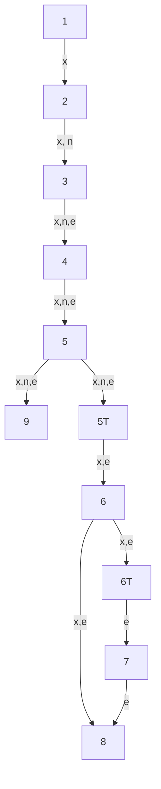
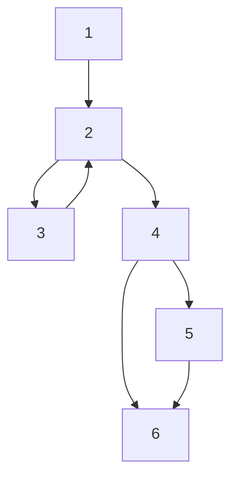

---
{"dg-publish":true,"permalink":"/university-notes-mostly-in-italian/security-testing/written-exam-15-01-2025-with-solutions/","created":"2025-02-05T11:16:12.715+01:00","updated":"2025-02-23T23:36:54.409+01:00"}
---

# Written Exam 15-01-2025 (with solutions)
## Question 1
### Problem
Given a Java function called **met**, inside a class named **is_Prime**, and having the following signature:
```java
public boolean met(int num) {
(s1)   int i = 2;
(s2)   boolean flag = false,ret = flag;

(s3)   if (num < 0) {
(s4)      num = num * (-1);
		}
(s5)   if (num == 0 || num == 1) {
(s6)       flag = true;
		}

(s7)  while (i <= num / 2) {
(s8)     if (num % i == 0) {
(s9)       flag = true;
(s10)      break;
			}
(s11)    ++i;
		}
(s12)  if (!flag) 
(s13)     ret=true;
		else 
(s14)    ret=false;

(s15)  return ret;
}
```

And the following test cases:
```java
@Test
void testA() {
	is_Prime isP=new is_Prime();
	boolean b=isP.met(5);
	assertEquals("True.", b);
}

@Test
void testC() {
	is_Prime isP=new is_Prime();
	boolean b=isP.met(1);
	assertEquals("False.", b);
}

// @Test is a label that is used to indicate that the following method is a test case method
// The _assertEquals(expected, actual)_ function asserts that the variable of value expected and the actual one are equal. If they are not, an AssertionError is thrown. If expected and actual are null, they are considered equal.
```

Given the mutations:
```
- [M1] Line s1 : int i = 2;  --> int i = 1;
- [M2] Line s6 : flag = true;  -->  flag = false;
- [M3] Line s7 :  while (i <= num / 2){   --> while (i <= num-1 / 2){
- [M4] Line s12 :  if (!flag) --> if (flag)
- [M5] Line s14 : ret=false; --> ret=true;
```

Compute the mutation score for the two test cases.

### Solution
Remember that $\text{mutant score = (killed mutants / total number of mutants) * 100}$
In addition, a **mutant** is a copy of a code program with a mutation (only one change), so the mutants they gave us in the statement.
Instead, a **mutant is killed** if it fails on at least one test case.

Analysis of test case 1:
```
Mutant 1: test case 1 does not fail → Not Killed
Mutant 2: test case 1 does not fail → Not Killed    //ret=true is returned
Mutant 3: test case 1 fails → Killed                //i <= num - (1/2), so we enter in 5%5==0  
Mutant 4: test case 1 fails → Killed                //ret=false is returned
Mutant 5: test case 1 does not fail → Not killed    //tests only check present elements
```

For the test case 1, 2 number of killed mutants out of 5.

Analysis of test case 2:
```
Mutant 1: test case 2 does not fail → Not Killed
Mutant 2: test case 2 fails → Killed               //flag=false is setted
Mutant 3: test case 2 does not fail → Not killed   
Mutant 4: test case 2 fails → Killed               //ret=true is returned
Mutant 5: test case 2 fails → Killed               //ret=true is returned
```

For the test case 2, 3 number of killed mutants out of 5.

## Question 2
### Problem
Given the following PHP code:

```php
<?php
1   $x = $_POST["x"];
2   $n = $_POST["name"];
3  $e = $n . "/" . $x  
4   $y = htmlentities(e); 
5   if (ctype_alnum($n)) {
6      if (is_numeric($x)) {
7         echo "Hello: " . $n . "(id = " . $x ")";
       }
8      echo "Hello: " . $n;
    } else {
9     echo "Wrong name/id: " . $y;
   }
?>
```

Note:
$\_POST[‘var_name’]: is used to collect form data, having var_name, submitted through an HTML form with the method "POST".
echo: is used to output one or more strings
is_numeric(var): it is used to determine if the given variable var is a number or a numeric string. In both these two cases, the function returns true, otherwise the function returns false. 
htmlentities: it converts all applicable characters to HTML entities 
ctpe_alnum(string): it checks if all of the characters in the provided string (text) are alphanumeric. It returns true if every character in text is either a letter or a digit, false otherwise. When called with an empty string the result will always be false.

#### Sub-question 1
Perform static taint analysis on the code do detect the XSS vulnerability.  
  
Please, consider only the lines of code that are numbered (e.g.,  "1   $x = $\_POST["x"];")  
Please, write the correct value in each cell or write "**-**", if not applicable.

| Node | GEN | KILL | IN  | OUT |
| ---- | --- | ---- | --- | --- |
| 1    | ___ | ___  | ___ | ___ |
| 2    | ___ | ___  | ___ | ___ |
| 3    | ___ | ___  | ___ | ___ |
| 4    | ___ | ___  | ___ | ___ |
| 5    | ___ | ___  | ___ | ___ |
| 5T   | ___ | ___  | ___ | ___ | 
| 6    | ___ | ___  | ___ | ___ |
| 6T    | ___ | ___  | ___ | ___ |
| 7    | ___ | ___  | ___ | ___ |
| 8   | ___ | ___  | ___ | ___ |
| 9    | ___ | ___  | ___ | ___ |

#### Sub-solution 1
Here some key concepts to know before doing the exercise.

The taint status of a variable is true if the variable may contain unsanitized user input, false if it is ensured not to contain it. We express this with:
- x $\rightarrow$ T: variable x is tainted
- x $\rightarrow$ F: variable x is untainted
  
In general, the GEN column contains the tainted set, the KILL column contains the untainted set.
We iterate for every line, and we insert the variable in the current line in the GEN column if the variable is tainted, otherwise we insert it in KILL.
If there is an `if, foreach, while` or **variables that depends on other variables (also itself)**, we have to insert the variable (we call it `x`) both in GEN and KILL. In GEN we insert `{[x->T]x}`, in KILL we insert `{[x->F]x}`

For example:

/%F0%9F%AA%B2%20Security%20Testing/_images/Pasted%20image%2020250114173053.png)

At this point is very useful making a graph of the code.
For example, for the code at the left, the corresponding graph is at right.

/%F0%9F%AA%B2%20Security%20Testing/_images/Pasted%20image%2020250114164023.png)

Now we start filling the IN and OUT column. In general, for every node (line of code), the OUT column represent all the tainted variables collected until that line, the IN column represent the tainted variables received from the predecessor node (line of code). Using mathematics:
- IN is the union of all the tainted variables received from the predecessor line, so `IN[p] = forU OUT[p]`
- OUT is the union of the not tainted variable on the current line union the not tainted variables received in input, so `OUT[n] = GEN[n] U (IN[n] \ KILL[n])`

When have finished all this, we have to start again updating the IN and OUT column, because maybe we chose a path (when there are `if, foreach, while` this 100\% happens) with few tainted variables.

For example, at the second iteration of the algorithm on the code at left, the result is at right:

/%F0%9F%AA%B2%20Security%20Testing/_images/Pasted%20image%2020250114173413.png)

The code is safe if the returned/printed/etc variable is **not** in the tainted variables.

We can now fill this:

| Node | GEN                               | KILL                        |
| ---- | --------------------------------- | --------------------------- |
| 1    | $\{x\}$                           | -                           |
| 2    | $\{n\}$                           | -                           |
| 3    | $\{[x -> T\ \textbar\ n -> T]e\}$ | $\{[x -> F\ \&\ n -> F]e\}$ |
| 4    | -                                 | $\{y\}$                       |
| 5    | -                                 | -                           |
| 5T   | -                                 | $\{n\}$                       |
| 6    | -                                 | -                           |
| 6T   | -                                 | $\{x\}$                       | 
| 7    | -                                 | -                           |
| 8    | -                                 | -                           |
| 9    | -                                 | -                           |

Here's the final graph:


| Node | GEN                               | KILL                        | IN            | OUT           |
| ---- | --------------------------------- | --------------------------- | ------------- | ------------- |
| 1    | $\{x\}$                           | -                           | -             | $\{x\}$       |
| 2    | $\{n\}$                           | -                           | $\{x\}$       | $\{x,n\}$     |
| 3    | $\{[x -> T\ \textbar\ n -> T]e\}$ | $\{[x -> F\ \&\ n -> F]e\}$ | $\{x, n\}$    | $\{x, n,e\}$  |
| 4    | -                                 | $\{y\}$                       | $\{x, n, e\}$ | $\{x, n, e\}$ |
| 5    | -                                 | -                           | $\{x, n, e\}$ | $\{x, n, e\}$ |
| 5T   | -                                 | $\{n\}$                       | $\{x, n, e\}$ | $\{x, e\}$    |
| 6    | -                                 | -                           | $\{x, e\}$    | $\{x, e\}$    |
| 6T   | -                                 | $\{x\}$                       | $\{x, e\}$    | $\{e\}$       |
| 7    | -                                 | -                           | $\{e\}$       | $\{e\}$       |
| 8    | -                                 | -                           | $\{x, e\}$    | $\{x, e\}$    |
| 9    | -                                 | -                           | $\{x, n, e\}$ | $\{x, n, e\}$ |

#### Sub-question 2
Based on the results of static taint analysis, list the sink statements (please, write the line numbers separated by ',' e.g., "1,4").

#### Sub-solution 2
Sink statements are places in the code where potentially dangerous user input is output, so the answer is 7,8,9.

#### Sub-question 3
Based on the results of static taint analysis, is the code vulnerable to XSS? Briefly motivate your answer.

#### Sub-solution 3
The code is NOT vulnerable to XSS, because every variable is used (echoed) only when it is NOT tainted (thanks to `ctype_alnum()`, `is_numeric()` and `htmlentities()`).

#### Sub-question 4
Is the vulnerability a true or a false positive? Briefly motivate your answer.

#### Sub-solution 4
It's a false positive because even if the variables aren't satinized, they are used only when we are sure they are not tainted. XSS attack is not possible.

## Question 3
### Problem
Describe what is session hijacking, the underlying technical problem that can lead to this issue and how it is possible. Then describe some possible mitigation actions. Last, describe at least one vulnerability typically associated with this security issue.

### Solution
Session hijacking is the exploitation of a valid session key to gain unauthorized access to information or services, or more in particular, it refers to the theft of a cookie used to authenticate a user to a remote server.
This is a common scenario:
An authorized user logs into a website, prompting the site to generate and store a session cookie containing the user’s session ID on the client side. While the user remains connected, an attacker manages to steal this session ID, allowing them to impersonate the authenticated user undetected. With this stolen credential, the attacker gains unauthorized access to the website and can perform actions as the legitimate user. This type of attack can occur through various methods.
There are lots of attacks that can happen.
Sniffing (aka Session-side jacking)
In a sniffing attack, also known as session-side jacking, the attacker uses a sniffer to intercept a valid session ID and then exploits it to access the web server. However, this method is more challenging when encrypted communication, such as HTTPS, is in place.
Another approach is a **man-in-the-middle (MITM) attack via a Trojan**, where the attacker infects the victim’s system with malware, allowing them to monitor activity and steal session IDs.
Alternatively, an attacker may leverage **cross-site scripting (XSS)** by crafting a malicious link embedded with JavaScript and tricking the victim into clicking it. Once executed, the script steals the session ID and transmits it to the attacker.
Lastly, brute force attacks can be used to predict session cookie values, particularly when weak algorithms or poorly generated authentication tokens are involved. Without proper security measures, session hijacking remains a significant threat to web applications and their users.

## Question 4
### Problem
Please, check the following fragment of code to detect if it is vulnerable and to locate vulnerability-related statements (i.e., that lead to the vulnerability)

```c
printf("Enter the password:\n");
fgets(userPass,9,stdin);
if(strncmp(userPass,PASSWORD,9)==0){
   printf("PASSWORD VERIFIED\n");
}

/*
Note:
"char *fgets (char *string, int n, FILE *stream)"; it reads characters from the current stream position up to and including the first new-line character (\n), up to the end of the stream, or until the number of characters read is equal to n-1, whichever comes first. It stores the result in string and adds a null character (\0) to the end of the string. 
"int strncmp ( const char * str1, const char * str2, size_t num )"; it compares up to num characters of the string str1 to those of the string str2. 
*
```

#### Sub-question 1
Is the code vulnerable to buffer buffer overflow?

#### Sub-solution 1
True

#### Sub-question 2
If the code is vulnerable, which lines of code is related to the vulnerability (please, if there are more than one lines related to the vulnerability, list the line numbers separated by comma (e.g., 1,2,4).

#### Sub-solution 2
Source: 2, Sink: 4

#### Sub-question 3
If the code is vulnerable, write a possible attack vector.

#### Sub-solution 3
If `PASSWORD` is among the last variables in the stack and the size of `userPass` is < 9, we can overwrite `PASSWORD`. Suppose the size of password is $m$ and we have found the size of userPass, it's sufficient that we set the last $2 \cdot m$ of `userPass` characters all equals.

## Question 5
### Problem
Describe what is black-box fuzzing and present (with examples, if possible) at least three possible techniques to conduct black-box fuzzing.

### Solution
Black-box testing is a testing methodology that differs from white-box testing because of input derivation and the level of knowledge about the software's internal structure.
In black-box testing, the internal structure of the software is unknown  to the tester. Instead, test cases are derived using external resources, such as specifications or requirements, and the focus is solely on the program's input/output behavior. If, for any given input, the expected output matches the actual output, the test is considered successful.  Since it is impractical to generate all possible inputs, techniques like boundary value analysis and equivalence partitioning are often employed to reduce the number of test cases. Input values in black-box testing  can be generated through techniques like random testing (e.g., generating independent, random inputs), grammar-based fuzzing (using a model of expected input formats) and mutation-based fuzzing (mutating typical input values to create new ones). Black-box testing, in contrast to white-box testing, is lightweight, fast, and easy to perform, but it suffers from poor code coverage because it does not consider the internal program structure.

## Question 6
### Problem
Given the following code of the function met(..), inside a class named is_Prime

```java
public boolean met(int num) {
(s1)	  int i = 2;
(s2)	  boolean flag = false,ret = flag;
	  
(s3)	  if (num < 0) {
(s4)	     num = num * (-1);
		  }
(s5)	  if (num == 0 || num == 1) {
(s6)	      flag = true;
		  }
	  
(s7)	 while (i <= num / 2) {
(s8)         if (num % i == 0) {
(s9)	         flag = true;
(s10)            break;
		     }
(s11)        ++i;
		 }
(s12)    if (!flag) 
(s13)        ret=true;
	     else 
(s14)        ret=false;
(s15)  return ret;
	}
```

And the following JUnit test cases:

T1.
```java
@Test
void testA() {
 is_Prime isP=new is_Prime();
 boolean b=isP.met(5);
 assertEquals("True.", b);
}
```

T2.
```java
@Test
void testB() {
 is_Prime isP=new is_Prime();
 boolean b=isP.met(8);
 assertEquals("False.", b);
}
```

T3.
```java
@Test
void testC() {
 is_Prime isP=new is_Prime();
 boolean b=isP.met(1);
 assertEquals("False.", b);
}
```

Note:
@Test is a label that is used to indicate that the following method is a test case method
The assertEquals(expected, actual) function asserts that the variable of value expected and the actual one are equal. If they are not, an AssertionError is thrown. If expected and actual are null, they are considered equal.

Compute the percentage of code statement coverage for the following test cases:

```
testA()   // coverage: ___ out of ___ statements
testB()   // coverage: ___ out of ___ statements
testC()   // coverage: ___ out of ___ statements
```

Compute the percentage of code decision coverage for the following test cases:

```
testA()   // coverage: ___ out of ___ statements
testB()   // coverage: ___ out of ___ statements
testC()   // coverage: ___ out of ___ statements
```

Compute the percentage of code condition coverage for the following test cases:

```
testA()   // coverage: ___ out of ___ statements
testB()   // coverage: ___ out of ___ statements
testC()   // coverage: ___ out of ___ statements
```

Compute the total code coverage by considering testA, testB, and testC

```
testA()   // total coverage: ___ out of ___ statements
testB()   // total coverage: ___ out of ___ statements
testC()   // total coverage: ___ out of ___ statements
```

### Solution
#### Statement coverage
Let's start by computing the percentage of code statement coverage. Remember, statement coverage aims at involving the execution of all the executable statements at least once.
$$\text{coverage = (executed statements / total statements)}*100$$
The total lines are $15$, so the statements are $15$.

Let's compute the percentage of code statement coverage for the test cases A, B and C.

The lines covered by the `testA` are `s1-s2-s3-s5-s7-s8-s11-s12-s13-s15`.
Then
```
testA()   // coverage: 10 out of 15 statements
```

The lines covered by the `testB` are `s1-s2-s3-s5-s7-s8-s9-s10-s12-s14-s15`.
Then
```
testB()   // coverage: 11 out of 15 statements
```

The lines covered by the `testC` are `s1-s2-s3-s5-s6-s7-s12-s14-s15`.
Then
```
testC()   // coverage: 9 out of 15 statements
```

The total code statement coverage by considering testA, testB, and testC is the union of all the lines covered, that is `s1-s2-s3-s5-s6-s7-s8-s9-s10-s11-s12-s13-s14-s15`.
Then
```
Total coverage per statements: 14 out of 15 statements
```

#### Decision coverage
We can now move to decision coverage, that reports the true or false outcomes of each boolean expression, that is code decision points (tough to achieve 100%).
$$\text{coverage = (decision outcomes exercised / total decision outcomes)} * 100$$
$$\text{so basically}$$
$$\text{coverage = (if evaluated / number of if * 2)} * 100$$

In our case we have $5$ decisions evaluated, so the total decision outcomes are $10$.

The lines covered by the `testA` are `s3(F)-s5(F)-s7(T,F)-s8(F)-s12(T)`.
Then
```
testA()   // coverage: 6 out of 10 statements
```

The lines covered by the `testB` are `s3(F)-s5(F)-s7(T,F)-s8(T)-s12(F)`.
Then
```
testB()   // coverage: 6 out of 10 statements
```

The lines covered by the `testC` are `s3(F)-s5(T)-s7(F)-s12(F)`.
Then
```
testC()   // coverage: 4 out of 10 statements
```

The total code decision coverage by considering testA, testB, and testC is the union of all the coverage, that is `s3(F)-s5(T,F)-s7(T,F)-s8(T,F)-s12(T,F)`.
Then
```
Total coverage per statements: 9 out of 10 statements
```

#### Condition coverage
We can now move to condition coverage, that reveals how the (atomic) logical operands in the conditional statement are evaluated (each one needs to be evaluated true and false once).
$$\text{coverage = (executed operands / total operands)} * 100$$
$$\text{so basically}$$
$$\text{coverage = (condition evaluated / number of condition * 2)} * 100$$

In our case we have $6$ decisions evaluated, so the total decision outcomes are $12$.

The lines covered by the `testA` are `s3(F)-s5(F,F)-s7(T,F)-s8(F)-s12(T)`.
Then
```
testA()   // coverage: 7 out of 12 statements
```

The lines covered by the `testB` are `s3(F)-s5(F,F)-s7(T,F)-s8(T)-s12(F)`.
Then
```
testB()   // coverage: 7 out of 12 statements
```

The lines covered by the `testC` are `s3(F)-s5(F,T)-s7(F)-s12(F)`.
Then
```
testC()   // coverage: 4 out of 12 statements
```

The total code condition coverage by considering testA, testB, and testC is the union of all the coverage, that is `s3(F)-s5(F,T,F)-s7(T,F)-s8(T,F)-s12(T,F)`.
Then
```
Total coverage per statements: 10 out of 12 statements
```

## Question 7
### Problem
Match the following statements
- Access of Improper Limitation of a Pathname to a Restricted Directory ('Path Traversal')
- Out-of-bounds Write
- Heap-based Buffer Overflow
- Missing Authentication for Critical Function
- Use-After-Free

with respect to the type of vulnerability they are describing:

Vulnerability 1:
```c
String path = getInputP();
if (path.startsWith("/safe_dir/")) {
	File f = new File(path);
	f.delete()
}
```

Vulnerability 2:
The product writes data past the end, or before the beginning, of the intended buffer

Vulnerability 3:
It generally means that the buffer was allocated using malloc() or new()

Vulnerability 4:
The product does not perform any check for functionality that requires a provable user identity or consumes a significant amount of resources.

Vulnerability 5:
```c
char* ptr = (char*)malloc (SIZE);
if (err) {
  abrt = 1;
  free(ptr);
  free(ptr);
}
...
if (abrt) {
   logError("operation aborted before commit", ptr);
}
```

### Solution
Vulnerability 1: Access of Improper Limitation of a Pathname to a Restricted Directory ('Path Traversal')
```c
String path = getInputP();
if (path.startsWith("/safe_dir/")) {
	File f = new File(path);
	f.delete()
}
```

Vulnerability 2: Out-of-bounds Write
The product writes data past the end, or before the beginning, of the intended buffer

Vulnerability 3: Heap-based Buffer Overflow
It generally means that the buffer was allocated using malloc() or new()

Vulnerability 4: Missing Authentication for Critical Function
The product does not perform any check for functionality that requires a provable user identity or consumes a significant amount of resources.

Vulnerability 5: Use-After-Free
```c
char* ptr = (char*)malloc (SIZE);
if (err) {
  abrt = 1;
  free(ptr);
  free(ptr);
}
...
if (abrt) {
   logError("operation aborted before commit", ptr);
}
```

## Question 8
### Problem
Select true or false in the following statements:

1. Concerning static analysis, we can say that a false positive alarm is an alarm not raised when the error is present
2. Given the following program control-flow graph: the number of independent path of the graph is.

   
3.  An example of a static analysis technique is model checking. A model checker typically uses an exhaustive search of the finite state space of a software to determine if a given property is true.
4. In static analysis, an oracle describes what a program is supposed to produce as output
5. Static code analysis concerns the inspection of all software artifacts (e.g., software requirements, specifications, code)
6. Static analysis techniques can produce incorrect results (e.g., can reject correct program properties
7. In the following fragment of code, the variable b in line 6 is tainted
```python
def foo:
	b = 0
	x = input()
	while b < 100:
		b = b + x
	return b
```
8. Typically, static analysis tools approximate the program’s reachable states with something that is easier to compute
9. Concerning static analysis, we can say that a given static analysis technique uses a sound approximation iff: every property that is true in the software is true in the approximation
10. Static analysis can  exhaustively check a property of a software
11. In the flow analysis, a def-use pair is formed if and only if there is a definition-clear path between the use and the definition 
12. About model checking. Given the following state-transition graph, we can say that the property: G(Start->F Heat) is true.

/%F0%9F%AA%B2%20Security%20Testing/_images/Pasted%20image%2020250205160834.png)

### Solution
1. Concerning static analysis, we can say that a false positive alarm is an alarm not raised when the error is present

The answer is false, false positive alarm is an alarm raised when the error is not present, false negative alarm is an alarm not raised when the error is present.

2. Given the following program control-flow graph: the number of independent path of the graph is.


The answer is 4, every time there is a junction, independent paths double.

3. An example of a static analysis technique is model checking. A model checker typically uses an exhaustive search of the finite state space of a software to determine if a given property is true.

The answer is true, model checking is a static analysis technique that exhaustively explores the finite state space of a system to verify if a given property holds.

4. In static analysis, an oracle describes what a program is supposed to produce as output.

The answer is false, an oracle is typically used in testing to determine the expected output of a program, not in static analysis.

5. Static code analysis concerns the inspection of all software artifacts (e.g., software requirements, specifications, code)

The answer is true, software inspection concerns the analysis of the static software representation aiming at discovering problems.

6. Static analysis techniques can produce incorrect results (e.g., can reject correct program properties)
The answer is true. Static code analysis can prove the absence of errors but might subject to incorrect results.

7. In the following fragment of code, the variable b in line 6 is tainted
```python
def foo:
	b = 0           # untainted
	x = input().    # tainted
	while b < 100:
		b = b + x   # tainted
	return b
```

The answer is true.

8. Typically, static analysis tools approximate the program’s reachable states with something that is easier to compute

The answer is true, static analysis tools approximate program behavior to make computations feasible. They abstract away details that would make precise analysis too expensive.

9. Concerning static analysis, we can say that a given static analysis technique uses a sound approximation iff: every property that is true in the software is true in the approximation

The answer is true.

10. Static analysis can exhaustively check a property of a software

The answer is true.

11. In the flow analysis, a def-use pair is formed if and only if there is a definition-clear path between the use and the definition

The answer is false, in the flow analysis, a def-use pair is formed if and only if there is a definition-clear path between the definition and the use.

12. About model checking. Given the following state-transition graph, we can say that the property: G(Start->F Heat) is true.

/%F0%9F%AA%B2%20Security%20Testing/_images/Pasted%20image%2020250205160834.png)

The answer is false, the node with Start and Heat exists. 