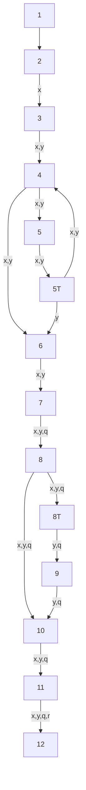
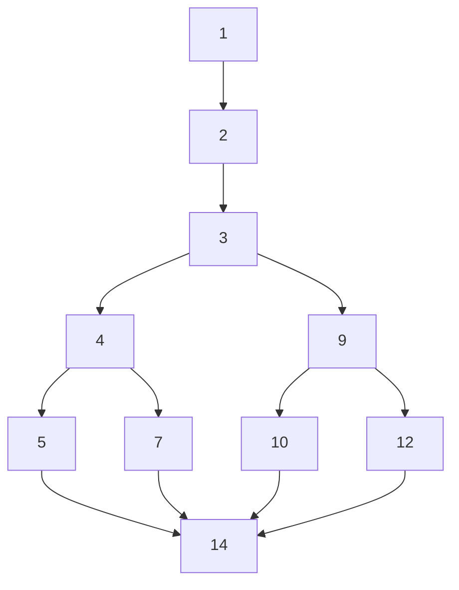

---
{"dg-publish":true,"permalink":"/university-notes-mostly-in-italian/security-testing/written-exam-mockup-with-solutions/","created":"2025-01-14T11:39:20.711+01:00","updated":"2025-02-23T23:36:58.492+01:00"}
---

# Written Exam Mockup (with solutions)
## Question 1
### Problem
Describe what is fuzzy testing, what are the fundamental components, and why it is used in security testing. Furthermore, describe at least two examples of black-box fuzzing techniques.

### Answer
> [!warning] To cover different aspects, do this!
> • What is
> • How it works (characteristics)
> • Different types, algorithms and techniques
> • Examples of code(s)
> • Existing tools
> • Typical domain of application
> • Limits

The goal of fuzzy testing is to generate random input combination to be fed to the program and make it crash or to discover new vulnerabilities.

**Characteristics**
- Generate long inputs and check whether the system crashes
- It simplifies test oracle to create larger input sets
	- Inputs can be generated randomly but following some patterns and templates, for example very long or completely empty strings, min/max values of integers, or only zero and negative values etc.
- It monitors the program results to detect system crashes
	- Adding program assertions (enabled!) can reveal more even if requires effort and knowledge

**Types of fuzzing:**
- Dump: fuzzing that does not consider the context and state of the software under test, simply dump random input
	- Advanced dump fuzzing:
		- It can use basic templates do drive the input generation
		- It can also check the output of the execution to go beyond the detection of simple crashes (drive the input generation) 
- Smart: fuzzing that use some degree of intelligence and knowledge
	- It focuses on the format and type of the input and on its code coverage
	- It focuses on the algorithms for generating the input (random, templated, guided, mutation-based)

**Existing tools:**
Some tools are American fuzzy lop, LibFuzzer, ZAP fuzzer...

**Typical domain of application:**
Typical domain of application are desktop apps, web apps, protocols and files format

**Limits:**
- Fuzzers tend to find simple bugs
- The more a fuzzer is protocol-aware, the less weird errors it will find $\rightarrow$ random approach still popular
- If black-box fuzzing (you attack a closed system), it's difficult to evaluate the impact of the found vulnerability

## Question 2
### Problem
According to the definition of tainted variables and untainted variables, identify which variables in the following code are tainted and which ones are untainted.

```cpp
1. int function() {
2.     int b = 0; //b is:
3.     int x;
4.     std::cin > > x; //x is:
5.     while b < 100:
6.     b = b + x; //b is:
7.     return b; //b is:
8. }
```

### Answer
The terms "tainted" and "untainted" refer to whether a variable's value can be controlled or influenced by an external source (tainted) or not (untainted).

```cpp
1. int function() {
2.     int b = 0; // b is: untainted (initially assigned 0, not influenced by external input)
3.     int x;
4.     std::cin >> x; // x is: tainted (value is set by user input from std::cin)
5.     while (b < 100) {
6.         b = b + x; // b is: tainted (depends on the tainted variable x)
7.     }
8.     return b; // b is: tainted (returning a value influenced by tainted input x)
9. }
```

## Question 3
### Problem
Identify true and false statements among the following ones.

DevSecOps is the secure version of DevOps, a software development process based on 8 phases focused on rapid delivery and quick feedback.

Security by design is needed to apply cryptography as much as possible during the software development, aiming at making a software secure.

In the security meta-model, the attackers give rise to threats.

In fuzz testing, the program assertions are not used

Mutation testing assumes that seeded faults are not representative of real faults.

Mutation testing is often used to judge the effectiveness of a test suite in discovering real faults.

In the security meta-model, countermeasures may have vulnerabilities and can exploit threats.

In the DevSecOps framework, Secure Testing is conducted only in the building phase.

Code coverage and mutation testing are usually use to decide when stop testing.

### Answer
Identify true and false statements among the following ones. For each statement, explain the reason behind the answer.

1. DevSecOps is the secure version of DevOps, a software development process based on 8 phases focused on rapid delivery and quick feedback.

True. DevSecOps integrates security practices into every phase of the DevOps process, which indeed focuses on rapid delivery and quick feedback. The DevOps lifecycle generally includes phases like planning, coding, building, testing, releasing, deploying, operating, and monitoring, which can be seen as an 8-phase process.

2. Security by design is needed to apply cryptography as much as possible during the software development, aiming at making a software secure.

False. Security by design involves considering security from the initial stages of software development. While cryptography is an aspect, security by design encompasses broader practices, such as threat modeling, secure coding practices, and ensuring that security controls are built into the design of the application.

3. In the security meta-model, the attackers give rise to threats.

True. In security models, attackers often pose threats, which are potential actions or events that could lead to a security breach.

4. In fuzz testing, the program assertions are not used.

False. Fuzz testing aims to find vulnerabilities by inputting invalid or random data. Program assertions can be used in this context to check if the program operates as expected or crashes, helping identify areas where the program's behavior is unexpected.

5. Mutation testing assumes that seeded faults are not representative of real faults.

False. Mutation testing actually assumes that the seeded faults (mutations) are representative of real faults. The idea is to introduce small changes (mutations) and see if the test suite can detect these changes, thereby indicating its effectiveness in catching real faults.

6. Mutation testing is often used to judge the effectiveness of a test suite in discovering real faults.

True. Mutation testing evaluates the quality of test cases by checking how well they can detect deliberately introduced faults, thereby assessing their effectiveness in discovering real, unintended faults.

7. In the security meta-model, countermeasures may have vulnerabilities and can exploit threats.

False. Countermeasures are designed to mitigate or eliminate threats and should not exploit them. However, countermeasures can indeed have vulnerabilities themselves, which might be exploited by attackers.

8. In the DevSecOps framework, Secure Testing is conducted only in the building phase.

False. DevSecOps aims to integrate security throughout the entire development lifecycle, including planning, coding, building, testing, and deploying, not restricted to the building phase.

9. Code coverage and mutation testing are usually used to decide when to stop testing.

True. Code coverage and mutation testing can provide metrics to help decide when testing is sufficient. High code coverage and effective mutation tests indicate that most code paths have been tested, potentially signaling an appropriate point to conclude testing.

## Question 4
### Problem
By considering the following code

```cpp
1. #include <stdio.h>
2. int main(int argc, char* argv[]]) {
3.     char buf[1024];
4.     char* cmd = "lpq":
5.     char* argsl] = ["-P", argv[1], (char*)NULL);
6.     execvp(cmd, args);
7. }
```
- The code suffers of the command injection vulnerability: \_\_\_
- Briefly motivate your answer
- Write an example of attack vector, if any (i.e., an example of input values that exploit the bug)

> [!note] Note on `execvp (const char* cmd, char* argv[])`
> It runs the command cod (as well as any executable file) with arguments argv by creating a new Sub-process

### Answer
The code does not suffer from command injection.
This is because it uses `execvp`, which directly executes the specified command and arguments without invoking a shell interpreter. Command injection vulnerabilities typically arise when user input is passed to a shell for interpretation, allowing malicious input to execute unintended commands. Since `execvp` avoids shell parsing, input like `"; rm -rf /"` will not be executed as a separate command. However, if the invoked program (`lpq`) mishandles the input arguments, unintended behavior could still occur, but this is not classified as command injection.

## Question 5
Given the following code:
```php
‹?php
1.  $db = mysql_connect ("localhost", "root", "pwd");
2.  $x = $_POST["x"];
3.  $y = $_POST["y"];
4.  while (preg_match ("[a-zA-Z]+", $x)) {
5.      $x = preg_replace("[a-zA-Z]+", "", $x);
6.  }
7.  $q = "SELECT * FROM users WHERE id=". $x;
8.  if (htmlentities ($x) == $x) {
9.      $q = "SELECT * FROM users WHERE id=" . $y;
10. }
11. $r = mysql_result($q, $db);
12. echo $r;
?>
```

### Sub-question 1
Perform static taint analysis on the code do detect the SQL injection vulnerability.
Please, write the correct value in each cell or write "-", if not applicable.

| Node | GEN | KILL | IN  | OUT |
| ---- | --- | ---- | --- | --- |
| 1    | ___ | ___  | ___ | ___ |
| 2    | ___ | ___  | ___ | ___ |
| 3    | ___ | ___  | ___ | ___ |
| 4    | ___ | ___  | ___ | ___ |
| 5    | ___ | ___  | ___ | ___ |
| 5T   | ___ | ___  | ___ | ___ | 
| 6    | ___ | ___  | ___ | ___ |
| 7    | ___ | ___  | ___ | ___ |
| 8    | ___ | ___  | ___ | ___ |
| 8T   | ___ | ___  | ___ | ___ |
| 9    | ___ | ___  | ___ | ___ |
| 10   | ___ | ___  | ___ | ___ |
| 11   | ___ | ___  | ___ | ___ |
| 12   | ___ | ___  | ___ | ___ |

### Sub-answer 1
Here some key concepts to know before doing the exercise.

The taint status of a variable is true if the variable may contain unsanitized user input, false if it is ensured not to contain it. We express this with:
- x $\rightarrow$ T: variable x is tainted
- x $\rightarrow$ F: variable x is untainted
  
In general, the GEN column contains the tainted set, the KILL column contains the untainted set.
We iterate for every line, and we insert the variable in the current line in the GEN column if the variable is tainted, otherwise we insert it in KILL.
If there is an `if, foreach, while` or **variables that depends on other variables (also itself)**, we have to insert the variable (we call it `x`) both in GEN and KILL. In GEN we insert `{[x->T]x}`, in KILL we insert `{[x->F]x}`

For example:

/%F0%9F%AA%B2%20Security%20Testing/_images/Pasted%20image%2020250114173053.png)

At this point is very useful making a graph of the code.
For example, for the code at the left, the corresponding graph is at right.

/%F0%9F%AA%B2%20Security%20Testing/_images/Pasted%20image%2020250114164023.png)

Now we start filling the IN and OUT column. In general, for every node (line of code), the OUT column represent all the tainted variables collected until that line, the IN column represent the tainted variables received from the predecessor node (line of code). Using mathematics:
- IN is the union of all the tainted variables received from the predecessor line, so `IN[p] = forU OUT[p]`
- OUT is the union of the not tainted variable on the current line union the not tainted variables received in input, so `OUT[n] = GEN[n] U (IN[n] \ KILL[n])`

When have finished all this, we have to start again updating the IN and OUT column, because maybe we chose a path (when there are `if, foreach, while` this 100\% happens) with few tainted variables.

For example, at the second iteration of the algorithm on the code at left, the result is at right:

/%F0%9F%AA%B2%20Security%20Testing/_images/Pasted%20image%2020250114173413.png)

The code is safe if the returned/printed/etc variable is **not** in the tainted variables.

We can now fill this:

| Node | GEN         | KILL        |
| ---- | ----------- | ----------- |
| 1    | ___         | ___         |
| 2    | $x$         | ___         |
| 3    | $y$         | ___         |
| 4    | ___         | ___         |
| 5    | ___         | ___         |
| 5T   | ___         | $x$         |
| 6    | ___         | ___         |
| 7    | $\{[x->T]q\}$ | $\{[x->F]q\}$ |
| 8    | ___         | ___         |
| 8T   | ___         | $x$         |
| 9    | $q$         | ___         |
| 10   | ___         | ___         |
| 11   | $\{[q->T]r\}$ | $\{[q->F]r\}$ |
| 12   | ___         | ___         |

Here's the final graph:


Here's the second part of the algorithm:

| Node | GEN           | KILL          | IN               | OUT              |
| ---- | ------------- | ------------- | ---------------- | ---------------- |
| 1    | ___           | ___           | ___              | ___              |
| 2    | $x$           | ___           | ___              | $\{x\}$          |
| 3    | $y$           | ___           | $\{x\}$          | $\{x, y\}$       |
| 4    | ___           | ___           | $\{x, y\}$       | $\{x, y\}$       |
| 5    | ___           | ___           | $\{x, y\}$       | $\{x, y\}$       |
| 5T   | ___           | $x$           | $\{x, y\}$       | $\{y\}$          |
| 6    | ___           | ___           | ___              | ___              |
| 7    | $\{[x->T]q\}$ | $\{[x->F]q\}$ | $\{x, y\}$       | $\{x,y,q\}$      |
| 8    | ___           | ___           | $\{x,y,q\}$      | $\{x, y, q\}$    |
| 8T   | ___           | $x$           | $\{x,y,q\}$      | $\{y, q\}$       |
| 9    | $q$           | ___           | $\{y, q\}$       | $\{y, q\}$       |
| 10   | ___           | ___           | ___              | ___              |
| 11   | $\{[q->T]r\}$ | $\{[q->F]r\}$ | $\{x, y, q\}$    | $\{x, y, q, r\}$ |
| 12   | ___           | ___           | $\{x, y, q, r\}$ | $\{x, y, q, r\}$ | 

### Sub-question 2
Based on the results of static taint analysis, list the sink statements (please, write the line numbers separated by ',' e.g., "1,4").

### Sub-answer 2
The answer is **11**. The sink statements are all the nodes that have an edge to the node 12 that with`r` (the sink) in `OUT`.

### Sub-question 3
Based on the results of static taint analysis, is the code vulnerable to SQL injection?

### Sub-answer 3
The answer is **True**. The code is vulnerable because it uses the tainted variable `$q` directly in a sink statement at line 11. `$q` is constructed using user-provided values (`$x` and `$y`) without proper sanitization or escaping, making it susceptible to SQL injection attacks. This allows an attacker to inject arbitrary SQL commands by manipulating the input data passed through `$x` or `$y`.

### Sub-question 4
Is the vulnerability a true or a false positive?

### Sub-answer 4
This is a true positive because the vulnerability can be exploited under realistic conditions. An attacker can manipulate the value of `$y`, which is appended to `$q` if `$x` is empty or matches certain conditions. For example, if `$x` is malformed or cleared by the loop and `$y` contains malicious SQL, the constructed query `$q` will directly include the unvalidated user input, leading to a genuine SQL injection vulnerability.

### Sub-question 5
In case the vulnerability is a true positive, provide an attack vector:

### Sub-answer 5
The answer is to put`$_POST["x"] = ""` and `$_POST["y"] = "1" or 1=1"`
If `$x` is set to nothing, it triggers the condition in line 8 (`htmlentities($x) == $x`), causing `$q` to be overwritten with the value that includes `$y`. By setting `$y` to `1" or 1=1"`, an attacker creates a query that always evaluates to true, bypassing authentication or exposing sensitive data from the database.

## Question 6
Given the following code of the function `fun_largest` of a Java class Nested:

```Java
public double fun_largest(double n1, double n2, double n3) {
    double ret = -1.0;
    if(n1 >= n2) {
        if(n1 >= n3)
            ret = n1;
        else
            ret = n3;
    } else {
        if(n2 >= n3)
            ret = n2;
        else
            ret = n3;
    }
    return ret;
}
```

And the following JUnit test cases:

JUnit 1.
```java
@Test
void Nested_test_1() {
    Nested n = new Nested();
    double n1 = -4.5, n2 = 3.9, n3 = 5.5;
    double ret = n.fun_largest(n1, n2, n3);
    assertEquals(5.5, ret, 0.001);
}
``` 

JUnit 2.
```java
@Test
void Nested_test_2() {
    Nested n = new Nested();
    double n1 = 10, n2 = 2, n3 = 1;
    double ret = n.fun_largest(n1, n2, n3);
    assertEquals(10, ret, 0.001);
}
```
  
> [!info] Note
> @Test is a label that is used to indicate that the following method is a test case method.
> The assertEquals(expected, actual, delta) function asserts that the double variable of value expected and the actual one are equal within a positive delta. If they are not, an AssertionError is thrown. If expected and actual are null, they are considered equal.

Compute the percentage of code statement coverage for the following test cases (Please, consider 10 as the total number of statements):

```
Nested_test_1()   // coverage: ___ %

Nested_test_2()   // coverage: ___ %
```

Compute the percentage of code decision coverage for the following test cases:

```
Nested_test_1()   // coverage: ___ %

Nested_test_2()   // coverage: ___ %
```

Compute the percentage of code branch coverage for the following test cases:

```
Nested_test_1()   // coverage: ___ %

Nested_test_2()   // coverage: ___ %
```

### Answer
#### Statement coverage
Let's start by computing the percentage of code statement coverage. Remember, statement coverage aims at involving the execution of all the executable statements at least once.
$$\text{coverage = (executed statements / total statements)}*100$$

The problem says the total number of statements are 10, so we can imagine (we hope) that the line number that we have to consider are: `1, 2, 3, 4, 5, 7, 9, 10, 12, 14`

Using JUnit 1.
```java
@Test
void Nested_test_1() {
    Nested n = new Nested();
    double n1 = -4.5, n2 = 3.9, n3 = 5.5;
    double ret = n.fun_largest(n1, n2, n3);
    assertEquals(5.5, ret, 0.001);
}
```

The lines covered are `1, 2, 3, 9, 12, 14`, so $6 / 10 = 60\%$ coverage for `Nested_test_1`

Using JUnit 2.
```java
@Test
void Nested_test_2() {
    Nested n = new Nested();
    double n1 = 10, n2 = 2, n3 = 1;
    double ret = n.fun_largest(n1, n2, n3);
    assertEquals(10, ret, 0.001);
}
```

The lines covered are `1, 2, 3, 4, 5, 14`, so $6 / 10 = 60\%$ coverage for `Nested_test_2`

#### Decision coverage
We can now move to decision coverage, that reports the true or false outcomes of each boolean expression, that is code decision points (tough to achieve 100%).
$$\text{coverage = (decision outcomes exercised / total decision outcomes)} * 100$$
$$\text{so basically}$$
$$\text{coverage = (if evaluated / number of if * 2)} * 100$$

In our case we have $6$ `if` and $2$ if are evaluated in both cases, so both tests have $33.3\%$ of coverage.

#### Condition coverage
What would have changed with condition coverage?
In this example nothing, because remember that condition coverage reveals how the (atomic) logical operands in the conditional statement are evaluated (each one needs to be evaluated true and false once).
$$\text{coverage = (executed operands / total operands)} * 100$$
$$\text{so basically}$$
$$\text{coverage = (condition evaluated / number of condition * 2)} * 100$$

In this example we have one condition for each if, so nothing change!

#### Branch coverage
In branch coverage we have to draw a graph similar to the static taint analysis, where each line of code is a node and each possible jump from one line of code to another line is an edge.
Remember, branch coverage tests every outcome from the code to ensure that every branch (CFG edge) is executed at least once.
$$\text{coverage=(executed branches / total branches)} * 100$$
$$\text{so basically}$$
$$\text{coverage = (edges evaluated (jumps between lines of code) / number of edges of the graph)} * 100$$

The graph we obtain from the code of `fun_largest` is the following:


The number of edges are $12$.
JUnit 1 covers the following path: `1 -> 2 -> 3 -> 4 -> 5 -> 14`, $5$ edges touched, so $5 / 12 = 41.6\%$ coverage for `Nested_test_1`.
JUnit 2 covers the following path: `1 -> 2 -> 3 -> 9 -> 12 -> 14`, $5$ edges touched, so $5 / 12 = 41.6\%$ coverage for `Nested_test_2`.

## Question 7
### Problem
Match the following vulnerability, CWE, and attack scenario descriptions with their corresponding OWASP top-10 vulnerability categories, that are: Vulnerable and Outdated Components / Broken Access Control / Security Logging and Monitoring Failures / Security Misconfiguration.

- The product relies on third-party components that are not actively supported or maintained by the original developer or a trusted proxy for the original developer.
- The software does not return custom error pages to the user, possibly exposing sensitive information.
- Violation of the principle of least privilege or deny by default.
- Information written to log files can be of a sensitive nature and give valuable guidance to an attacker or expose sensitive user information.

### Answer
- The product relies on third-party components that are not actively supported or maintained by the original developer or a trusted proxy for the original developer. **Vulnerable and Outdated Components**
- The software does not return custom error pages to the user, possibly exposing sensitive information. **Security Misconfiguration**
- Violation of the principle of least privilege or deny by default. **Broken Access Control**
- Information written to log files can be of a sensitive nature and give valuable guidance to an attacker or expose sensitive user information. **Security Logging and Monitoring Failures**

## Question 8
### Problem
Describe what is SQL injection, clearly state what is the problem beyond SQL injection, describe at least two types of different SQL injection, provide some examples for each type. Finally, briefly introduce possible mitigation actions.

### Answer
SQL Injection is a vulnerability that lets an attacker introduce (inject) undesired SQL code into SQL queries executed by the software.

**Types of SQL Injection:**
- In-band SQL Injection:
	- Classic SQL Injection
	- Error-based SQL Injection: it relies on feeding unexpected commands or invalid input, typically through a user interface, to cause the database server to reply with an error that may contain details about the target: structure, version, operating system, and even to return full query results.
	- Union-based SQL Injection: In this technique, the user combines the query and get the result back as some part of an HTTP response.
- Inferential SQL Injection (Blind SQL Injection)
	- Boolean-based blind SQL injection: A boolean query causes the application to give a different response for a valid or invalid result in the database. It works by enumerating the characters from the text that needs to be extracted (ex. database name, table name, column name etc) one by one.
	- Time-based Blind SQL Injection: It relies on waiting for a specific period before a vulnerable application responds to an attacker's query tailored with a time delay value. The success of the attack is based on the time taken by the application to deliver the response.
	- Out-of-band SQL Injection

**SQL Injection mitigation:**
- Escaping all user supplied input (it is only a partial prevention, sanitize all inputs is a complex task)
- Use of prepared statements (with parameterized queries)
- Allow-list input validation
- Use of properly constructed stored procedures (SQL code that is prepared and saved in the database, so that it can be reused)

## Bonus question
Consider the following program P in the Calculator class
```java
1. public boolean isPositive(int number) {
2.     boolean result = false;
3.     if (number ≥ 0) {
4.         result = true;
5.     }
6.     return result;
7. }
```

And the following test case:

```java
1. @Test
2. public void testPositive() {
3.     Calculator obj = new Calculator();
4.     assertEquals(true, obj.isPositive(20));
5. }
```

Given the mutations:
```
Mutant 1: Change line 3, changed conditional boundary → “if (number > 0) {“
Mutant 2: Change line 3, negated conditional → “if (false) {“
Mutant 3: Change line 6, replaced return statement → “return !result;”
```

### Sub-question 1
Compute the mutation score for the test.

### Sub-answer 1
Remember that $\text{mutant score = (killed mutants / total number of mutants) * 100}$
In addition, a **mutant** is a copy of a code program with a mutation (only one change), so the mutants they gave us in the statement.
Instead, a **mutant is killed** if it fails on at least one test case.
Why doing mutation-based testing? The goal is to judge the effectiveness of a test suite in discovering real faults. If mutating the program does not make the test fail, it means the test is not testing enough, we have to add more of them!

In this example:
```
Mutant 1: no test case fail → Not killed    //20 is greater than 0
Mutant 2: test case fails → Killed          //if false makes the test return false
Mutant 2: test cases fails → Killed         //!result makes the test return false
```

The mutation score is $66\%$, because 2 mutants out of 3 are killed.

### Sub-question 2
Identify 1 new test case, one of which has a mutation score greater than the other one.

### Sub-answer 2
We can add a new test case to improve the mutation score, so that our tests are testing more!

New test case:
```java
1. @Test
2. public void testPositive() {
3.     Calculator obj = new Calculator();
4.     assertEquals(true, obj.isPositive(0));
5. }
```

Now this is the situation:
```
Mutant 1: test case 2 fails → Killed     //0 is not greater than 0
Mutant 2: test case 1 fails → Killed     //if false makes the test return false
Mutant 2: test case 1 fails → Killed     //!result makes the test return false
```

The mutation score of this new test is $100\%$, because 3 mutants out of 3 are killed. Perfect!

## Bonus question 2
Consider the following code:
```java
public int binarySearch(int array[], int element, int low, int high) {
	while (low <= high) {
		int mid = low + (high - low) / 2;
		if (array[mid] == element)
			return mid;
		if (array[mid] < element)
			low = mid + 1;
		else
			high = mid - 1;
	}
	return -1;
}
```

And the following test cases:
```java
@Test
void Test_3() {
	BinarySearch bs=new BinarySearch();
	int n=3;
	int[] array= {3, 4, 5, 6, 7, 8, 9};
	int ret_value = bs.binarySearch(array, n, 0, (array.length- 1));
	assertEquals(ret_value, 0);
}

@Test
void Test_4() {
	BinarySearch bs=new BinarySearch();
	int n=9;
	int[] array= {3, 4, 5, 6, 7, 8, 9};
	int ret_value = bs.binarySearch(array, n, 0, (array.length- 1));
	assertEquals(ret_value, 6);
}
```

Given the mutations:
```
[M1] Line nr.1 “low <= high“→ “low<high”
[M2] Line nr. 2 “low + (high - low) / 2” → “low + (high + low) / 2”
[M3] Line nr. 3 “array[mid] == element” → “array[low] == element”
[M4] Line nr. 5 “array[mid] < element” → “array[high] < element”
[M5] Line nr. 8 “return -1;” → “return 1;”
```

### Sub-question 1
Compute the mutation score for the two test cases.

### Sub-answer 1
Remember that $\text{mutant score = (killed mutants / total number of mutants) * 100}$
In addition, a **mutant** is a copy of a code program with a mutation (only one change), so the mutants they gave us in the statement.
Instead, a **mutant is killed** if it fails on at least one test case.

Analysis of test case 1:
```
Mutant 1: test case 1 fails → Killed                //-1 is returned
Mutant 2: test case 1 does not fail → Not Killed
Mutant 3: test case 1 fails → Killed                //array[0] == 3, mid=3 is returned
Mutant 4: test case 1 does not fail → Not Killed    //we always go in left subarray
Mutant 5: test case 1 does not fail → Not killed    //tests only check present elements
```

For the test case 1, the mutation score is $40\%$, because 2 mutants out of 5 are killed.

Analysis of test case 2:
```
Mutant 1: test case 2 fails → Killed               //-1 is returned
Mutant 2: test case 2 fails → Killed
Mutant 3: test case 2 does not fail → Not killed   //9 is the last element, unlucky!
Mutant 4: test case 2 fails → Killed               //we always go in left subarray
Mutant 5: test case 2 does not fail → Not killed   //tests only check present elements
```

For the test case 2, the mutation score is $60\%$, because 3 mutants out of 5 are killed.

## Bonus question 3
### Problem
By considering the following code:
```java
String updateServer = request.getParameter("updateServer");
List<String> commandArgs = new ArrayList<String>();
commandArgs.add("ping");
commandArgs.add(updateServer);
ProcessBuilder build = new ProcessBuilder(commandArgs);
```

The code suffers of the command injection vulnerability: True / False
Briefly explain what is the bug that leads to the possible vulnerability: `___`
Write an example of attack vector, if any (i.e., an example of input values that exploit the bug): `___`

> [!info] Note
> ProcessBuilder is a class used to create operating system processes

### Answer
The code suffers from the command injection vulnerability: **True**.  
The vulnerability arises because user-provided input (`updateServer`) is directly added to the command arguments passed to `ProcessBuilder` without any validation or sanitization. This allows an attacker to inject additional malicious commands by supplying a specially crafted input string. For example, if the input value for `updateServer` is `127.0.0.1 && rm -rf /`, the `ProcessBuilder` will execute the `ping` command followed by the malicious `rm -rf /`, leading to potential destructive behavior. To mitigate this, the code should validate and sanitize `updateServer` to ensure it does not contain any illegal or harmful characters.

## Bonus question 4
### Problem
What's the difference between black-box testing and white-box testing?

### Answer
Black-box testing and white-box testing are two complementary software testing methodologies that differ in their focus, input derivation, and level of knowledge about the software's internal structure. 

In **black-box testing**, the internal structure or implementation of the software is unknown to the tester. Instead, test cases are derived using external resources, such as specifications or requirements, and the focus is solely on the program's **input/output behavior**. If, for any given input, the expected output matches the actual output, the test is considered successful. Since it is impractical to generate all possible inputs, techniques like **boundary value analysis** and **equivalence partitioning** are often employed to reduce the number of test cases. Input values in black-box testing can be generated through techniques like **random testing** (e.g., generating independent, random inputs), **grammar-based fuzzing** (using a model of expected input formats), and **mutation-based fuzzing** (mutating typical input values to create new ones). Black-box testing is lightweight, fast, and easy to perform, but it suffers from poor code coverage because it does not consider the internal program structure.

In contrast, **white-box testing** assumes complete knowledge of the program's internal structure. Test cases are derived by analyzing the code itself, aiming to identify specific paths, conditions, or behaviors that need to be exercised. Techniques such as **dynamic symbolic execution** (DSE) are used to generate test inputs systematically. DSE executes the program with concrete input values while simultaneously building a **path condition**, which represents the constraints that input values must satisfy to traverse a specific execution path. These path conditions can be solved to generate new inputs that force the program to explore alternative paths, improving coverage. White-box testing is precise and systematic, but it is also slower and more complex due to its reliance on code analysis.

In practice, there is a **cost/precision tradeoff** between the two approaches. Black-box testing is lightweight and fast but offers limited coverage, while white-box testing is more thorough but resource-intensive. Neither approach is inherently superior—many applications are so buggy that any testing approach will find issues. A **gray-box testing** approach, which combines elements of both, can be used to balance speed and coverage. Ultimately, using a mix of both black-box and white-box testing methods is the most practical and effective strategy for identifying software bugs.

## Bonus question 5
### Problem
What's the difference between dynamic and static analysis?

### Answer
Dynamic and static analysis are complementary approaches for understanding the behavior of a program.

Static analysis examines a program's code without executing it, using the program itself as a guide to infer its behavior. It is **input-insensitive**, meaning it does not rely on specific inputs to analyze the program.
On the other hand, dynamic analysis observes the program's behavior during execution, using a combination of inputs and observed behavior as a guide to better understand the program's logic. This makes dynamic analysis inherently **input-sensitive**.

We can summarize this as:
- Program + Input = Behavior
- Static: Program as a guide to Behavior → input insensitive
- Dynamic: Input + Behavior as a guide to the Program → input sensitive

In terms of **completeness**, static analysis is considered complete because it attempts to explore all possible paths within the program. However, this can lead to **imprecision** due to abstractions and infeasible paths. It examines a small subset of states for all possible execution paths, which may result in over-approximations. In contrast, dynamic analysis is incomplete because it only examines the concrete execution paths taken for a given test input. While this makes it precise for the specific test set, it leaves many feasible paths unexplored.

Static analysis requires **abstraction** to ensure termination. It bounds the number and size of states to prevent infinite exploration. In contrast, termination in dynamic analysis is a property of the running system rather than the analysis itself. Abstraction in dynamic analysis is used primarily to reduce runtime overhead, focusing on short paths rather than long traces.

Another key difference lies in their handling of paths. Static analysis often explores **infeasible paths**, leading to conservative conclusions—properties might be reported as not holding when they actually do. This makes static analysis **safe but imprecise**. Dynamic analysis, however, explores only feasible paths and may conclude that a property holds when it actually doesn’t, making it **precise for the test set but unsafe** overall.

The **imprecision** in each approach can be quantified. For dynamic analysis:

$$\text{Imprecision} = \frac{\text{Feasible paths} - \text{Executed paths}}{\text{Feasible paths}}$$

Precision improves as the number of executed paths approaches the set of all feasible paths, which requires systematic test generation. For static analysis, the imprecision is given by:

$$\text{Imprecision} = \frac{\text{Infeasible paths}}{\text{Infeasible paths} + \text{Feasible paths}}$$

Here, precision increases as the number of infeasible paths approaches zero, which requires effective techniques to identify and eliminate such paths.

In conclusion, while static analysis provides a broader but less precise view of the program, dynamic analysis offers a narrower but more precise perspective. Combining these approaches can often yield better insights into program behavior and properties.


## Bonus question 6
### Problem
What is XSS?

### Answer
Cross-Site Scripting (XSS) is a type of **injection attack** where malicious scripts are injected into trusted websites. It exploits the vulnerability of web applications that fail to properly validate or sanitize user input, allowing attackers to inject malicious code, often in the form of browser-side scripts.

**How it works (Characteristics):**
XSS attacks occur when an application processes and sends malicious user-provided content back to the client without proper validation or sanitization. The browser, unaware of the malicious nature of the script, executes it as if it were legitimate. This can grant attackers access to sensitive user information like cookies, session tokens, or other data stored in the browser.

**Types and Techniques:**
XSS comes in three primary types:
1. **Reflected (Non-Persistent)**: Malicious input is immediately reflected in the server's response, such as in search results or error messages. The attack doesn't persist on the server.  
   *Example*: Injecting `<script>alert('XSS')</script>` into a search query parameter.
2. **Stored (Persistent)**: The malicious payload is stored on the server (e.g., in databases, comment fields) and served to users later, affecting all victims who view the stored content.
   *Example*: Adding a malicious script in a forum post.
3. **DOM-Based**: The attack is entirely client-side, exploiting vulnerabilities in the DOM (Document Object Model) without involving the server. For example, tainting `document.location.href` to inject malicious behavior.

**Example Code:**
A simple XSS payload for an embedded script is as follows:
```html
<script>alert("XSS");</script>
```
This payload can execute immediately in a vulnerable context, such as an unsanitized HTML form or query string.

**XSS Mitigation strategy:**
No single technique can solve XSS, a combination of strategies is required!
1. Train and maintain awareness
2. Don’t trust any user input
3. Use escaping/encoding (use existing libraries for escaping)
4. Sanitize HTML
   If the user input needs to contain HTML, you can’t escape/encode. In such cases, use a trusted and verified library to parse and clean HTML.
5. Set the HttpOnly flag (in the header of the HTTP response)
6. Use a Content Security Policy (CSP)
7. Scan regularly

**Typical Domain of Application:**
XSS vulnerabilities affect any web application that processes user inputs and displays them in the browser. Common targets include forums, e-commerce sites, and social platforms. In addition, any programming language used to build a web site PHP, ASP, C#, Java, Perl.