---
{"dg-publish":true,"permalink":"/coding/data-structures/binary-search-trees-in-italian/","created":"2023-01-24T23:36:50.799+01:00","updated":"2023-01-25T00:09:07.280+01:00"}
---


<div class="transclusion internal-embed is-loaded"><a class="markdown-embed-link" href="/university-notes-in-italian/algoritmi-e-strutture-dati/3-3-alberi-binari-di-ricerca/" aria-label="Open link"><svg xmlns="http://www.w3.org/2000/svg" width="24" height="24" viewBox="0 0 24 24" fill="none" stroke="currentColor" stroke-width="2" stroke-linecap="round" stroke-linejoin="round" class="svg-icon lucide-link"><path d="M10 13a5 5 0 0 0 7.54.54l3-3a5 5 0 0 0-7.07-7.07l-1.72 1.71"></path><path d="M14 11a5 5 0 0 0-7.54-.54l-3 3a5 5 0 0 0 7.07 7.07l1.71-1.71"></path></svg></a><div class="markdown-embed">


# Alberi binari di ricerca
## Indice
- [[👨🏼‍💻 Coding/🏗 Data Structures/Binary Search Trees (in italian)#📝 Definizione\|📝 Definizione]]
- [[👨🏼‍💻 Coding/🏗 Data Structures/Binary Search Trees (in italian)#➗ Operazioni\|➗ Operazioni]]
	- [[👨🏼‍💻 Coding/🏗 Data Structures/Binary Search Trees (in italian)#🔎 Ricerca\|🔎 Ricerca]]
	- [[👨🏼‍💻 Coding/🏗 Data Structures/Binary Search Trees (in italian)#➕ Inserimento\|➕ Inserimento]]
	- [[👨🏼‍💻 Coding/🏗 Data Structures/Binary Search Trees (in italian)#◀️ Minimo\|◀️ Minimo]]
	- [[👨🏼‍💻 Coding/🏗 Data Structures/Binary Search Trees (in italian)#▶️ Massimo\|▶️ Massimo]]
	- [[👨🏼‍💻 Coding/🏗 Data Structures/Binary Search Trees (in italian)#Successore di un nodo\|Successore di un nodo]]
	- [[👨🏼‍💻 Coding/🏗 Data Structures/Binary Search Trees (in italian)#Predecessore di un nodo\|Predecessore di un nodo]]
	- [[👨🏼‍💻 Coding/🏗 Data Structures/Binary Search Trees (in italian)#❌ Rimozione\|❌ Rimozione]]
## 📝 Definizione
Un albero binario di ricerca è un albero binario nel quale ogni nodo rispetta una specifica proprietà di ordinamento:
`figli nel sottoalbero sinistro <= nodo < figli nel sottoalbero destro`. Questo deve essere vero per ogni nodo.

## ➗ Operazioni
### 🔎 Ricerca
Permette di ricercare un determinato valore all'interno dell'albero. 

**Restituisce** 
- il nodo dell’albero $T$ che contiene la chiave $k$, se presente 
- NULL, se non presente

**L'idea** è la seguente:
1. Iniziamo dalla radice. 
2.  Compariamo se l'elemento cercato con la radice, se minore visitiamo il sottoalbero sinistro, altrimenti visitiamo il sottoalbero destro. 
3.  Se troviamo l'elemento cercato restituiamo vero (oppure il nodo), altrimenti restituiamo falso (o NULL).

#### Implementazione ricorsiva
```cpp
Tree search(Tree root, Item key) {
	if(root == NULL || root.key == key)
		return root;
	else if(key < root.key)
		return search(root.left, key);
	else
		return search(root.right, key);	
}
```
- Time complexity: $O(h)$ (_h_ è l'altezza dell'albero)
	(Worst case Time Complexity : $O(n)$)
- Space complexity: $O(h)$ (se l'albero non è bilanciato, nel caso peggiore è praticamente una lista) 
#### Implementazione iterativa
```cpp
Tree search(Tree root, Item key) {
	Tree current = root;
	while(current != NULL && current.key != key) {
		if(key < root.key)
			current = current.left;
		else
			current = current.right;
	}
	return current;
}
```
- Time complexity: $O(h)$ (_h_ è l'altezza dell'albero)
	(Worst case Time Complexity : $O(n)$)
- Space complexity: $O(1)$

###  ➕ Inserimento
Permette di inserire un nuovo nodo all'interno dell'albero binario di ricerca.

**L'idea** è la stessa della ricerca, cerchiamo quindi la chiave del nodo da aggiungere dalla radice fino in fondo all'albero, ossia quando arriveremo ad un nodo nullo. Lì inseriremo il nostro nodo. Il problema è solo fare `new node` dentro un nodo  nullo. Per questo ci terremo un puntatore al nodo visitato precedentemente, così da fare `prev->left (o prev->right) = new node`. 

Nell'implementazione sotto assumiamo che ogni nodo abbia il riferimento ai due figli. Se ogni nodo avesse anche un riferimento al padre, una volta inserito il nodo dovremmo anche fargli puntatore il padre.
#### Implementazione iterativa
```cpp
Tree insert(Tree root, Item key) {
	Tree newNode = new Tree(key);
    if(root == NULL) {
        root = newNode;
        return newNode;
    }
    Tree current = root;
    Tree prev = NULL;
    while(current != NULL) {
        prev = current;
        if(key < current.key)
            current = current.left;
        else
            current = current.right;
    }
    if(key < prev.key) 
        prev.left = newNode;
    else 
        prev.right = newNode;
    return newNode;
}
```
- Time complexity: $O(h)$ (_h_ è l'altezza dell'albero)
	(Worst case Time Complexity : $O(n)$)
- Space complexity: $O(1)$ 
#### Implementazione ricorsiva
```cpp
Tree insert(Tree root, Item key) {
{
    if(root == NULL) {
        root = new Tree(key);
        return root;
    }
    if(key < root.key)
        return insert(root.left, key);
    else
        return insert(root.right, key);
}
```
- Time complexity: $O(h)$ (_h_ è l'altezza dell'albero)
	(Worst case Time Complexity : $O(n)$)
- Space complexity: $O(h)$
### ◀️ Minimo
Scelto un nodo, restituisce il minimo rispetto a quel nodo. 

**L'idea** è la seguente:
- È sufficiente visitare ricorsivamente il figlio sinistro, visto che sarà minore del nodo corrente.

#### Implementazione iterativa
```cpp
Tree min(Tree root) {
		Tree current = root;
		while(current.left != NULL) {
			current = current.left;
		}
		return current;
}
```
- Time complexity: $O(h)$ (_h_ è l'altezza dell'albero)
	(Worst case Time Complexity : $O(n)$)
- Space complexity: $O(1)$

#### Implementazione ricorsiva
```cpp
Tree min(Tree root) {
	if(root.left == NULL)
		return root;
	return min(root.left);	
}
```
- Time complexity: $O(h)$ (_h_ è l'altezza dell'albero)
	(Worst case Time Complexity : $O(n)$)
- Space complexity: $O(h)$

### ▶️ Massimo
Scelto un nodo, restituisce il massimo rispetto a quel nodo. 

**L'idea** è la seguente:
- È sufficiente visitare ricorsivamente il figlio destro, visto che sarà maggiore del nodo corrente.

#### Implementazione iterativa
```cpp
Tree max(Tree root) {
	Tree current = root;
	while(current.right != NULL) {
		current = current.right;
	}
	return current;
}
```
- Time complexity: $O(h)$ (_h_ è l'altezza dell'albero)
	(Worst case Time Complexity : $O(n)$)
- Space complexity: $O(1)$

#### Implementazione ricorsiva
```cpp
Tree max(Tree root) {
	if(root.right == NULL)
		return root;
	return max(root.right);	
}
```
- Time complexity: $O(h)$ (_h_ è l'altezza dell'albero)
	(Worst case Time Complexity : $O(n)$)
- Space complexity: $O(h)$

### Successore di un nodo
Il successore di un nodo $u$ è il più piccolo nodo maggiore di $u$.

Ci sono essenzialmente 4 casi che possono capitare quando si cerca il successore di un nodo.
In tutti gli esempi il nodo blu è il nodo $u$ scelto, il nodo rosso il successore.
#### Caso 1
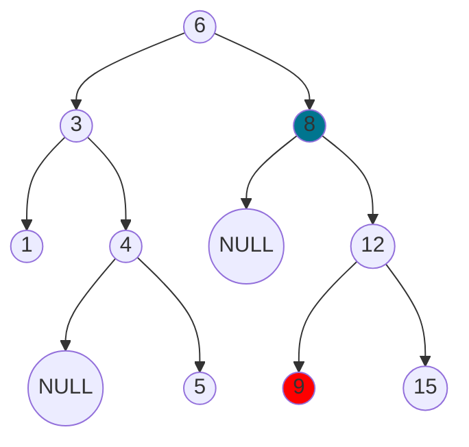
Il caso più semplice è quando il nodo $u$ ha un sottoalbero destro. In questo caso il successore è il minimo del sottoalbero destro di $u$. Semplicemente, dal nodo di partenza visito il figlio destro e poi vado più a sinistra che posso.

#### Caso 2
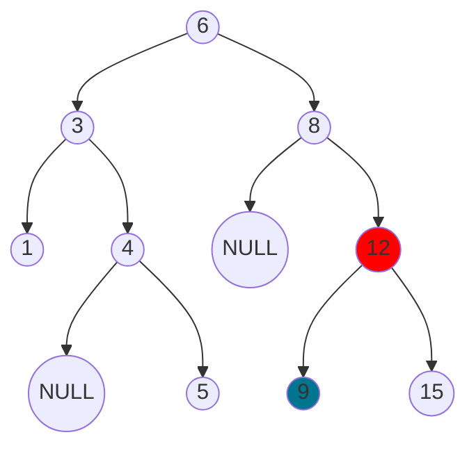
Da questo caso in poi vogliamo trovare il successore di un nodo foglia. In questo specifico caso, $u$ è figlio sinistro del nodo padre (12) e proprio per questo 12 è per forza il suo successore. 
Pensiamo infatti ai possibili padri di 12:
- O il padre di 12 è più piccolo di $u$, come in questo caso (se così non fosse 9 sarebbe un figlio sinistro del padre di 12)
- O il padre di 12 è più grande di 12, quindi non sarebbe il suo successore.
In conclusione, se $u$ è figlio sinistro il suo successore è il padre.

#### Caso 3
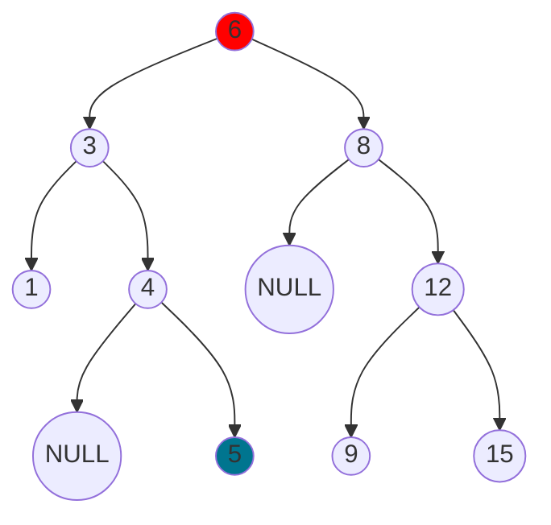
In questo caso, $u$ è figlio destro del nodo padre. A questo punto l'idea è continuare a risalire l'albero finché non troviamo un figlio che è sinistro rispetto al padre (ricongiungendosi così al caso 2). A quel punto il successore sarà il nodo padre di quel figlio.

#### Caso 4
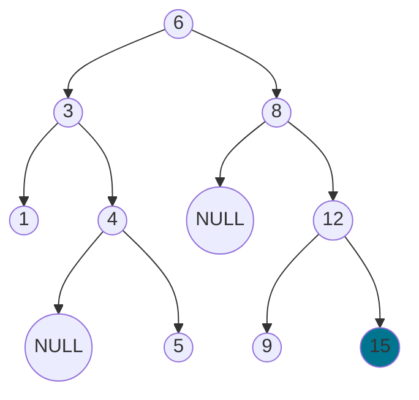
Il caso è lo stesso del precedente, dovremmo continuare a risalire l'albero nella speranza di trovare un figlio che è sinistro rispetto al padre. Il problema è che in questo caso $u$ è il massimo dell'intero albero. Arriveremo quindi a visitare il padre della radice, che è NULL, e restituiremo quello.

#### Implementazione iterativa
**Attenzione:** In questa implementazione dobbiamo per forza avere un campo `parent`all'interno del nodo, altrimenti non possiamo risalire l'albero! 
```cpp
Tree successor(Tree t) {
	if(t == NULL)
		return t;
	/* Caso 1*/
	Tree current = t;
	if(current.right != NULL)
		return min(current.right)
	else {
		Tree p = current.parent;
		/* Se p.right != t finiamo nel caso 2-3 */
		/* Se p == NULL finiamo nel caso 4 */
		while(p != NULL && p.right == current) {
			current = p;
			p = p.parent;
		}
		return p;
	}	
}
```
- Time complexity: $O(n)$ (_n_ è il numero di elementi)
- Space complexity: $O(1)$
### Predecessore di un nodo
Il predecessore di un nodo $u$ è il più grande nodo minore di $u$.

Potrei scrivere "Vedi [[👨🏼‍💻 Coding/🏗 Data Structures/Binary Search Trees (in italian)#Successore di un nodo\|#Successore di un nodo]]" visto che è la stessa cosa, ma visto che fortunatamente esiste il copia-incolla lo descriverò lo stesso.

Ci sono essenzialmente 4 casi che possono capitare quando si cerca il predecessore di un nodo.
In tutti gli esempi il nodo blu è il nodo $u$ scelto, il nodo rosso il predecessore.
#### Caso 1
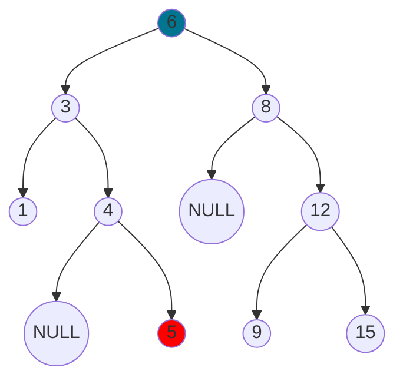
Il caso più semplice è quando il nodo $u$ ha un sottoalbero sinistro. In questo caso il successore è il massimo del sottoalbero sinistro di $u$. Semplicemente, dal nodo di partenza visito il figlio sinistro e poi vado più a destra che posso.

#### Caso 2
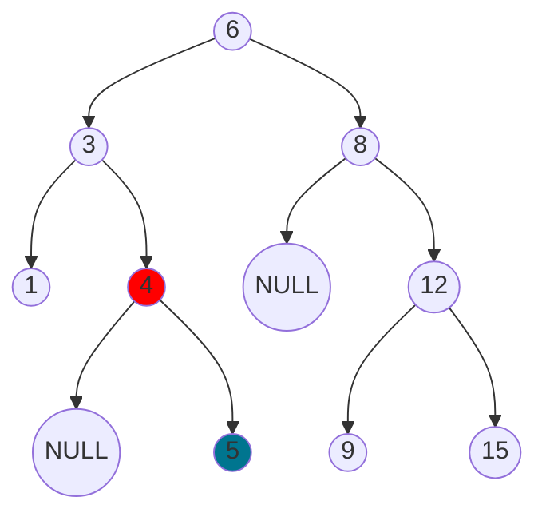
Da questo caso in poi vogliamo trovare il predecessore di un nodo foglia. In questo specifico caso, $u$ è figlio destro del nodo padre (5) e proprio per questo 5 è per forza il suo predecessore. 
Pensiamo infatti ai possibili padri di 5:
- O il padre di 5 è più piccolo di $u$, come in questo caso (se così non fosse 5 sarebbe un figlio sinistro del padre di 4)
- O il padre di 12 è più grande di 12, quindi non sarebbe il suo successore.
In conclusione, se $u$ è figlio destro il suo predecessore è il padre.

#### Caso 3
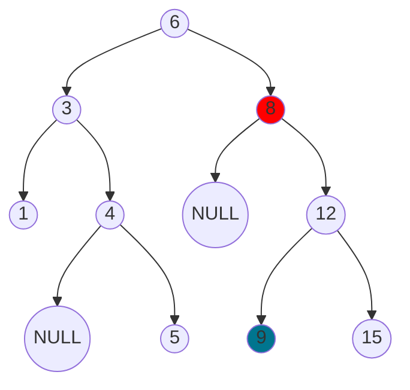
In questo caso, $u$ è figlio sinistro del nodo padre. A questo punto l'idea è continuare a risalire l'albero finché non troviamo un figlio che è destro rispetto al padre (ricongiungendosi così al caso 2). A quel punto il predecessore sarà il nodo padre di quel figlio.

#### Caso 4
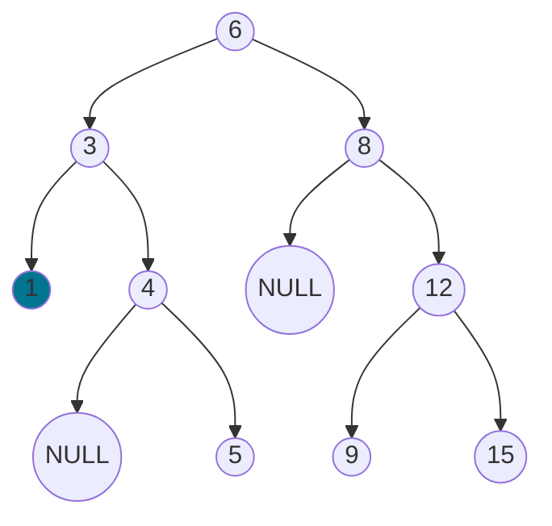
Il caso è lo stesso del precedente, dovremmo continuare a risalire l'albero nella speranza di trovare un figlio che è sinistro rispetto al padre. Il problema è che in questo caso $u$ è il minimo dell'intero albero. Arriveremo quindi a visitare il padre della radice, che è NULL, e restituiremo quello.

#### Implementazione iterativa
**Attenzione:** In questa implementazione dobbiamo per forza avere un campo `parent`all'interno del nodo, altrimenti non possiamo risalire l'albero! 
```cpp
Tree predecessor(Tree t) {
	if(t == NULL)
		return t;
	/* Caso 1*/
	Tree current = t;
	if(current.left != NULL)
		return max(current.left)
	else {
		Tree p = current.parent;
		/* Se p.left != t finiamo nel caso 2-3 */
		/* Se p == NULL finiamo nel caso 4 */
		while(p != NULL && p.left == current) {
			current = p;
			p = p.parent;
		}
		return p;
	}	
}
```
- Time complexity: $O(h)$ (_h_ è l'altezza dell'albero)
	(Worst case Time Complexity : $O(n)$)
- Space complexity: $O(1)$
### ❌ Rimozione
Rimuove il nodo contenente la chiave $k$ dall’albero $T$ e restituisce la radice dell’albero (potenzialmente cambiata).

Ci sono essenzialmente 3 casi che possono capitare quando si rimuove un nodo.

#### Caso 1
Il caso più semplice è quando il nodo da eliminare $u$ non ha figli. Semplicemente si elimina!

**Esempio**
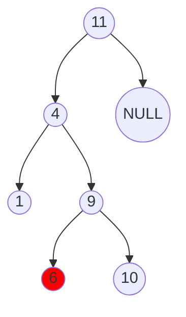

**Risultato**
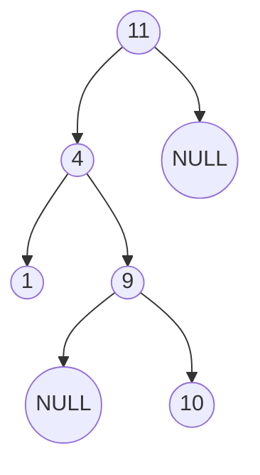

#### Caso 2
Il nodo da eliminare $u$ ha un solo figlio. In questo caso si elimina $u$ e si attacca il figlio al padre di $u$.

**Esempio**
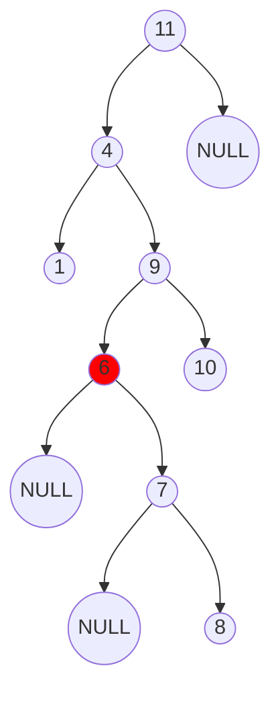

**Risultato**
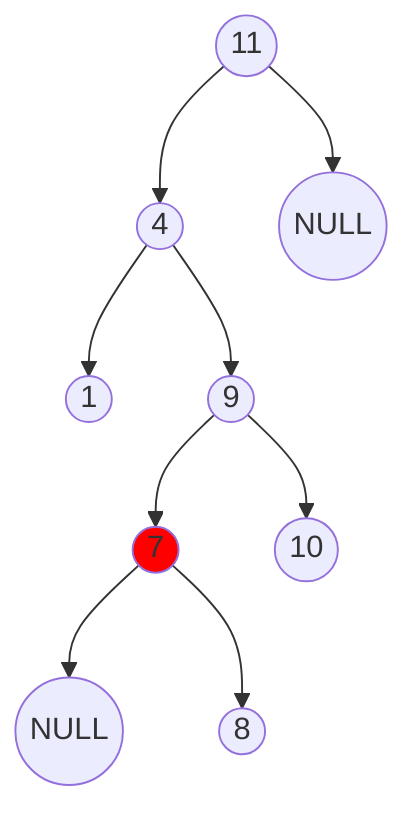

#### Caso 3
Il più complicato, quando il nodo da eliminare $u$ ha due figli.

In questo caso si procede nel seguente modo:
1. Si cerca il successore del nodo da eliminare(o il predecessore, in base a com'è fatto l'albero conviene di più rimuovere uno che l'altro, vedi qui)
2. Il successore può avere
	1. Zero figli, allora si stacca il successore e lo si sostituisce al nodo da eliminare, collegandogli i figli di $u$.
	2. Un figlio (destro, non può essere sinistro altrimenti sarebbe proprio lui il successore), allora si stacca il successore e pure il suo figlio. Il successore lo si sostituisce al nodo da eliminare (collegandogli i vecchi figli di $u$), mentre il figlio del successore si attacca al padre del successore. 

**Esempio**
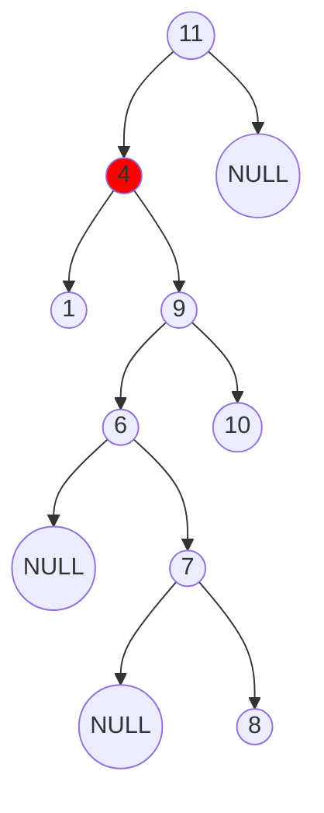

**Risultato**
Passo intermedio:
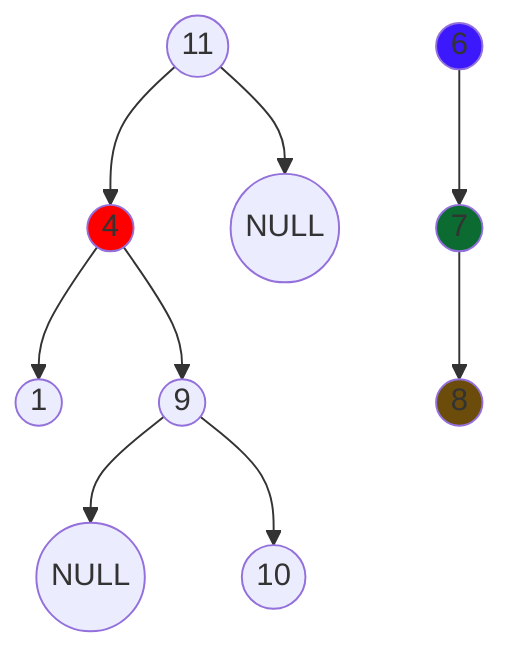

Risultato finale:
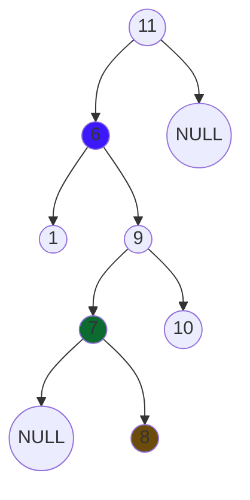

#### Implementazione iterativa
```cpp
Tree remove(Tree root, Item k) {
	Tree p = NULL;
	/* individuo il nodo da rimuovere */
	Tree u = getParent(root, key, p);
	/* se il nodo da rimuovere è presente nell’albero... */
	if(u == NULL) return;
	/* e non ha figli... */
	if(u.left == NULL && u.right == NULL) {
		if(u != root)
			unlink(p, u);
		else
			root = NULL;
	}
	/* e ha due figli... */
	else if(u.left != NULL && u.right != NULL) {
		Tree successor = u.right;
		Tree succParent = u;
		/* determiniamo il successore di u e teniamo un puntatore a suo padre*/
		while(successor.left != NULL) {
			succParent = successor;
			successor = successor.left;
		}
		if(succParent == u) {
			successor.left = u.left;
		}
		else {
			/* il padre del successore ora punta al figlio destro del successore */
			succParent.left = successor.right;
			/* il successore viene sostituito al nodo da eliminare*/
			successor.left = u.left;
			successor.right = u.right;
		} 
		if(u == p.left)
			p.left = successor;
		else
			p.right = successor;
	}
	/* e ha un solo figlio... */
	else {
		/* determiniamo se il figlio è destro o sinistro*/
		Tree childToLink = (u.left != NULL) ? u.left : u.right;
		/* verifichiamo se il nodo da eliminare è radice */
		if(u != root) {
			/* se u è figlio sinistro attachiamo al padre il nuovo figlio sinistro */
			if(u == p.left)
				p.left = childToLink;
			/* se u è figlio destro attachiamo al padre il nuovo figlio destro */
			else
				p.right = childToLink;
		}
		else
			root = childToLink;
	}
	delete u;		
}

/* Cerca un nodo e restituisce il puntatore ad esso e a suo padre */
Tree search(Tree root, Item key, Tree parent) {
    Tree current = root;
    while(current != NULL && current.key != key) {
		parent = current;
		if(current.key < key)
			current = current.left;
		else
			current = current.right;
	}
	return current;
}

/* Scollega il padre dal figlio */
void unlink(Tree p, Tree u) {
	if(u == p.left)
		p.left = NULL;
	else
		p.right = NULL;
}
```
- Time complexity: $O(h)$ (_h_ è l'altezza dell'albero)
	(Worst case Time Complexity : $O(n)$)
- Space complexity: $O(1)$
#### Implementazione ricorsiva
```cpp
Tree remove(Tree root, Item k) {
	if(k < root.key) {
		root.left = remove(root.left, k);
	else if(k > root.key)
		root.right = remove(root.right, k);
	else {
		Tree toDelete = root;
		/* Copre sia il caso di 0 figli, sia il caso di 1 figlio */
		if(root.left == NULL || root.right == NULL)
			return (root.left != NULL) ? root.left : root.right;
		else {
			Tree *succ = root.right;
			Tree *succParent = root;  
			while(succ.left) {
				succParent = succ;
				succ = succ.left;  
			}
			/* corner case, avviene quando vogliamo eliminare la radice ed è proprio il padre del successore */
			if(succParent == root) {
				/* basta collegare il sottoalbero sinistro al successore e farlo diventare radice */
				succ.left = root.left;
			}
			else {
				/* colleghiamo il padre del successore al figlio del successore */
				succParent.left = succ.right;
				/* per non fare root.key = succ.key */
				succ.left = root.left;  
				succ.right = root.right;  
			}  
			root = succ;
		}
		delete toDelete;	
	}
	return root;
}
```
- Time complexity: $O(h)$ (_h_ è l'altezza dell'albero)
	(Worst case Time Complexity : $O(n)$)
- Space complexity: $O(h)$ 

</div></div>
