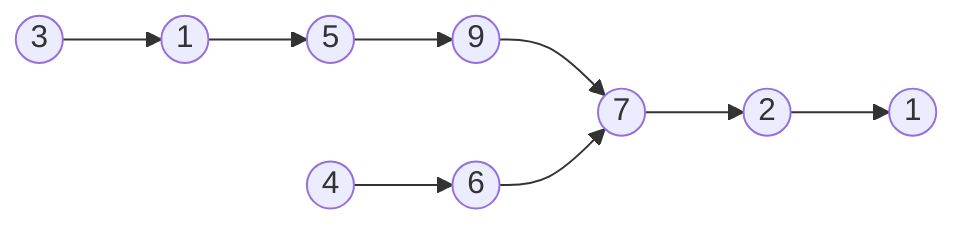
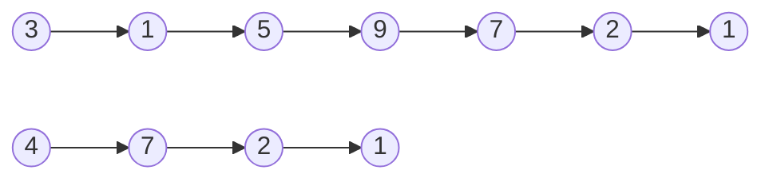

---
{"dg-publish":true,"permalink":"/coding/cracking-the-coding-interview/chapter-2/problem-7-intersection/","created":"2023-01-26T00:36:01.796+01:00","updated":"2023-01-26T00:36:01.796+01:00"}
---

# Chapter 2 - Problem 7 - Intersection
## Problem
Given two (singly) linked lists, determine if the two lists intersect. Return the intersecting node. Note that the intersection is defined based on reference, not value. That is, if the kth node of the first linked list is the exact same node (by reference) as the jth node of the second linked list, then they are intersecting.

**EXAMPLE**
_Input:_ 

_Output:_ True

_Input:_ 

_Output:_ False

#### Solution in C++
1. Run through each linked list to get the lengths and the tails (we save them in Result class).
2. Compare the tails. If they are different (by reference, not by value), return NULL immediately. There is no intersection.
3. Set two pointers to the start of each linked list.
4. On the longer linked list, advance its pointer by the difference in lengths.
5. Now, traverse on each linked list until the pointers are the same.

```cpp
template<typename T>
class Node {
    public:
        T data;
        Node* next;
        
        Node() = default;
        Node(const T& value) : data(value), next(NULL) {}
};

template<typename T>
class LinkedList {
    protected:
        Node<T>* head;
};

template<typename T>
class Result {
    public:
        Node<T> *tail;
        int length;
        Result(Node<T> *tail, int length) :  tail(tail), length(length) {}
};

template<typename T>
class Solution : public LinkedList<T> {
    private:
        Result<T> getTailLength(Node<T> *list) {
            int length = 1;
            Node<T> *curr = list;
            for (; curr->next != NULL; length++, curr = curr->next);
            return Result<T>(curr, length);
        }
    public:
        Node<T>* intersection(Node<T> *l1, Node<T> *l2) {
            if(l1 == NULL || l2 == NULL)  return NULL;

            /* Get tail and lengths */
            Result<T> res1 = getTailLength(l1);   
            Result<T> res2 = getTailLength(l2);

            /* If tail nodes are different, then there's no intersection */
            if(res1.tail != res2.tail) return NULL;

            /* Set pointers to the start of each linked list */
            Node<T> *shorter = res1.length >= res2.length ? l2 : l1;
            Node<T> *longer = res1.length < res2.length ? l2 : l1;

            /* Advance the pointer for t he longer linked list by difference in lengths */
            for(int i = 0; i < abs(res1.length - res2.length); longer = longer->next, i++);

            /* Move both pointers until you have a collision */
            while(shorter != longer) {
                shorter = shorter->next;
                longer = longer->next;
            }
            return longer; //or shorter, it's the same
        }
};
```
- **Time complexity:** $O(A + B)$ (where _A_ and _B_ are the lengths of the two linked lists)
- **Space complexity:** $O(1)$