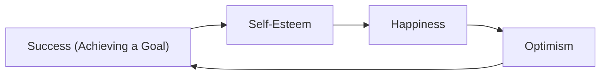

---
{"dg-publish":true,"permalink":"/quotes/quotes-that-stuck-with-me/","created":"2025-04-06T15:48:58.993+02:00","updated":"2025-10-01T02:09:03.188+02:00"}
---

# Quotes that stuck with me

## Quote 1

Alberto Montresor, Professor of Algorithm and Data Structures at UniTn talking about the results of Reply Challenge 2023 at UniTn:

Ovviamente, devo ringraziare voi per il successo della serata e non posso che essere orgoglioso di quello che avete fatto. Ho visto tutti voi, anche quelli del secondo anno, affrontare il problema fino all'ultimo. Già questo è una motivazione sufficiente per organizzare le challenge.

Ma c'è di più; per farvi capire perché organizzo questa e mille altre cose, vi racconto una storia che mi ha raccontato Francesca, la dottoranda/complice con cui gestiamo il Fablab UniTrento.

Nei corsi di participatory design, a volte si fa questo gioco: si dà ai partecipanti un incipit di una storia, tipo "andiamo a fare un picnic", e i partecipanti devono completare la storia in tre modi diversi, continuando con:
- "no, perché"
- "sì, ma"
- "sì, e..."

Ovviamente, l'esito delle storie è molto diverso.

Io non vi conosco, ma so che se siete venuti quella sera non avete detto "no, perché" e nemmeno "sì, ma". Avete sicuramente detto "sì", almeno alla pizza ;-), e forse avete detto anche "e".

Ecco, io conosco tante persone nelle prime due categorie. Molte di loro sono nella mia fascia di età - hanno smesso di crescere. Purtroppo, ce ne sono molte anche nella vostra fascia di età - ragazzi e ragazze che hanno paura di crescere, provare cose nuove. Voi non siete in questa categoria - continuate così!

Quando dici "sì, e" farai un sacco di cose inutili, che non portano a nulla. Non credo che risolvere problemi algoritmici sia la strada di 130+ persone. Ma se siete curiosi, provate tante cose, lì in mezzo a tante attività, tentativi, errori, c'è la vostra strada.

Per quello che mi riguarda, assumere un atteggiamento "sì, e" ha cambiato la mia vita. Non sono sempre stato così; forse un pochino sì, ma ultimamente ho raggiunto livelli patologici. Ieri ero all'hackathon UniTrento-Muse per l'Arduino week, e ho incontrato due persone che mi hanno raccontato cosa facevano, iniziative molto belle; e ho pensato "sì, e... come Fablab potremmo cooperare". Ora, se tutte le volte che vado a un evento ne esco fuori con due progetti, sappiamo bene che in breve avrò 2^n attività. Non va bene. Ma non importa; alcune moriranno, ma va bene così. Altre non le seguirò io; metterò insieme persone che conosco, e l'attività la faranno loro.

Vi lascio con le parole di Aaron Swartz[^1], che ho scoperto da poco, ma in cui mi ritrovo tantissimo.

Qual è il segreto? Come posso riassumere le cose che faccio in frasi sintetiche che mi facciano sembrare il più bravo possibile? – conclude Aaron – Ecco: Siate curiosi. Leggete molto. Provate cose nuove.
Credo che molto di ciò che la gente chiama intelligenza si riduca alla curiosità. Dite di sì a tutto.
Ho molti problemi a dire di no, quasi in misura patologica, sia a progetti che a colloqui, o ad amici. Di conseguenza, faccio molti tentativi, e anche se la maggior parte di essi fallisce, ho comunque fatto qualcosa. Supponiamo che anche gli altri non abbiano idea di quello che stanno facendo. Molte persone si rifiutano di provare a fare qualcosa perché ritengono di non saperne abbastanza o, perché, pensano che gli altri abbiano già provato tutto quello che è venuto loro in mente. In realtà, sono poche le persone che hanno idea di come fare le cose nel modo giusto e, ancora meno, quelle che vogliono provare cose nuove. Quindi, di solito, se si fa del proprio meglio in qualcosa, si riesce a farlo abbastanza bene. Ho seguito queste regole.
Ed eccomi qui, oggi, con una dozzina di progetti in ballo e un livello di stress ancora una volta alle stelle. Ogni mattina mi sveglio e controllo la mia e-mail per vedere quale dei miei progetti sia imploso oggi, quali scadenze siano in ritardo, quali discorsi debba scrivere e quali articoli debba modificare. Forse, un giorno, anche voi potrete trovarvi nella stessa situazione. Se è così, spero di aver fatto qualcosa per aiutarvi.

[...]

Sulla curiosità:

Prima mi sono interessato ai computer, che mi hanno portato a interessarmi a Internet, che mi ha portato a interessarmi alla costruzione di siti web di notizie online, che mi hanno portato a interessarmi agli standard (come RSS), che mi hanno portato a interessarmi alla riforma del diritto d’autore (dato che Creative Commons voleva utilizzare standard simili). E così via. La curiosità si auto-alimenta: ogni nuova cosa che s’impara, genera ogni sorta di componenti e connessioni diverse, che poi si desidera approfondire. Ben presto ci s’interessa a sempre più cose, fino a quando quasi tutto sembra interessante. E quando è così, imparare diventa davvero facile: si vuole imparare quasi tutto, perché non c’è nulla che non sembri davvero interessante.

Grazie ancora,
Alberto

[^1]: Se non conoscete Aaron Swartz, ecco alcuni link:
https://it.wikipedia.org/wiki/Aaron_Swartz
https://www.youtube.com/watch?v=9vz06QO3UkQ&ab_channel=moviemaniacsDE
https://libri.unimi.it/index.php/milanoup/catalog/book/100

## Quote 2

From Roberto Verdone, Professor at UniBO talking about Soft Skills and Human Behaviour:

The Virtuous Circle of Success:

The optimism bias makes people more successful, it's the only positive bias among all!

## Quote 3

[Mr. RIP mission described on his Notion.](https://mrrip.notion.site/Mission-Filosofia-Valori-e-Temi-che-tratto-mr-rip-mission-6a6fea1ff8674ee2857a0a9ef3279926)

